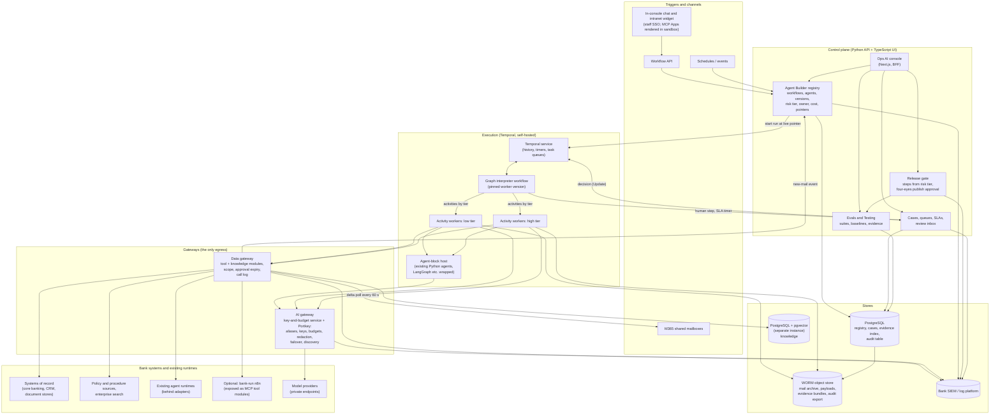
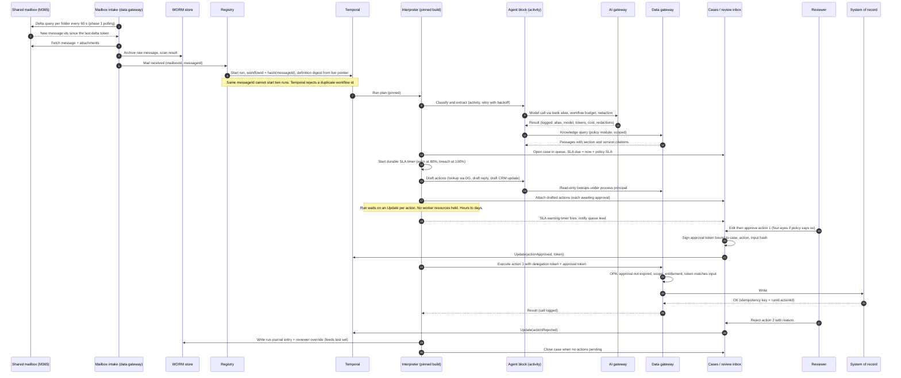

# Architecture overview

Status: draft for review. Product facts were checked on the web in October 2026; each one carries a
link in [Sources](#sources), and anything that could not be confirmed is marked **unverified**.

This document fixes the platform's shape; the topic specs (`docs/specs/01`–`04`, `07`–`09`) and the
[implementation plan](../plan/implementation-plan.md) fill it in. It implements the
[problem statement](../background/problem-statement.md), including its email-to-workflow reference
flow, and it serves the console mock's API surface (`apps/console/src/lib/api/contract.ts`,
`knowledge-contract.ts`, `cases-contract.ts`). Each decision is recorded as an ADR under
[`decisions/`](decisions/); this page holds the decisions at a glance, the reference architecture,
the evaluation criteria the ADRs share, throughput, the end-to-end flow, traceability, failure modes,
the mock mapping and open questions. Engineering lessons that shaped the decisions are in
[design lessons](../specs/design-lessons.md) and are referenced by area.

## Decisions at a glance

| # | Decision | Choice | Confidence | Phase 1 (first email workflow) |
|---|---|---|---|---|
| [ADR-0001](decisions/ADR-0001-durable-execution-runtime.md) | Durable execution runtime | Temporal (MIT), self-hosted on the bank's Kubernetes, running one generic **graph interpreter** workflow. n8n holds no run state; a bank-operated n8n instance may sit behind the data gateway as one source of tool modules. | High | Temporal cluster, interpreter with the node types the email template needs |
| [ADR-0002](decisions/ADR-0002-implementation-language.md) | Language | Python for everything that executes or judges a workflow (interpreter, activities, agent blocks, eval harness) and for the control-plane API. TypeScript for the UI and its backend-for-frontend only. The boundary is JSON Schema (definitions) plus OpenAPI 3.1 (API), with TypeScript types generated from both. | Medium-high | All of it |
| [ADR-0003](decisions/ADR-0003-workflow-definition-format.md) | Definition format and portability | A bank-owned, versioned, declarative JSON graph ("workflow definition") validated by JSON Schema and compiled to an execution plan. Workflows are created from **templates** whose settings ops teams fill in. Import and export through MCP (tools), A2A (whole workflows as agents), Open Agent Specification (agent blocks), OpenAPI (HTTP tools). AWP is tracked, not adopted. | Medium | Schema, compiler, email-intake template; MCP and OpenAPI import. Exports later |
| [ADR-0004](decisions/ADR-0004-deployment-tenancy-and-promotion.md) | Deployment and tenancy | Kubernetes on private cloud or on-prem; three environments (`dev`, `test`, `production`) on two Temporal clusters; worker pools per risk tier; default-deny egress so workers reach only Temporal, the two gateways and the object store; promotion moves a pointer in the registry, and the interpreter's own code ships through Temporal Worker Versioning with pinned runs. | High | Two clusters, pools for `low` and `medium`, pointer promotion, egress rule. Staged rollout later |
| [ADR-0005](decisions/ADR-0005-identity-and-entitlement.md) | Identity and entitlement | One registered non-human identity per workflow, plus platform identities for ingestion, playground and eval; workload identity for pods (SPIFFE or the platform's native equivalent); on-behalf-of via OAuth token exchange (RFC 8693) with an `act` claim; the data gateway authorises each call against module approval (per major version, with expiry) ∩ module scope ∩ the subject's entitlement ∩ risk-tier rules. Writes need an approval token: from a person, or a policy approval token for non-money write classes a gate policy names. | Medium-high | Workflow identity, process principal for the mailbox, approval tokens on writes, expiry checks. User delegation later |
| [ADR-0006](decisions/ADR-0006-data-stores-and-evidence.md) | Data stores and evidence | PostgreSQL as system of record for registry, versions, cases, queues, SLAs and the evidence index; WORM object storage for evidence bundles, mail archive and the audit log export; pgvector by default for knowledge, in a separate PostgreSQL database on its own instance, with a dedicated or existing enterprise search engine behind the same knowledge-module interface when measurements require it. | High | All of it; the retention owner must be named first |
| [ADR-0007](decisions/ADR-0007-build-vs-adopt.md) | Build vs adopt | Adopt the engine, gateways' proxy cores, policy engine, secret store, eval libraries and tracing; build the registry, the interpreter, the scope and approval layer, cases/queues/SLAs, and the release gate. | Medium | See the per-component phase column |
| [ADR-0008](decisions/ADR-0008-ai-gateway.md) | AI gateway | Portkey's open-source gateway (MIT) self-hosted as the data plane, behind a thin key-and-budget service we build that holds every key; configured from our registry; LiteLLM as the fallback, built from source and pinned. Needed on day one with a minimal scope; retrofitting later breaks the model-traffic mandate and agent discovery. | Medium | Yes: one endpoint, aliases, per-workflow and per-purpose keys and budgets held by the key-and-budget service, metadata logging, egress lock |
| [ADR-0009](decisions/ADR-0009-chat-experience.md) | Chat experience | Build the in-console chat on the Vercel AI SDK (`useChat`) with assistant-ui components, render MCP Apps through the MCP Apps host bridge on a separate sandbox origin, and run every chat session as a workflow run through the same gateways, entitlements and audit. Users are bank staff only; a widget deploys to the intranet behind staff SSO. LibreChat is the adopt fallback. | Medium | No. Phase 2, after the email workflow; phase 1 only builds the parts chat reuses |

## Constraints

| Constraint | Source | Where it lands |
|---|---|---|
| Workflows are the only deployable unit; agents are versioned settings pinned by a workflow at publish | `apps/console/CLAUDE.md`, `docs/ui/page-plan.md` | [ADR-0003](decisions/ADR-0003-workflow-definition-format.md), [ADR-0004](decisions/ADR-0004-deployment-tenancy-and-promotion.md) |
| Publish is requested, validated, and approved by a different person | Mock | [ADR-0004](decisions/ADR-0004-deployment-tenancy-and-promotion.md), [ADR-0005](decisions/ADR-0005-identity-and-entitlement.md) |
| Structural errors block publish; tests are advisory in the mock | Mock | [ADR-0004](decisions/ADR-0004-deployment-tenancy-and-promotion.md) (test results in the gate); `04` 5.6 |
| Suite runs in the gate on every change, read by the gate; injection cases have a blocking threshold | problem statement | [ADR-0004](decisions/ADR-0004-deployment-tenancy-and-promotion.md), `04` |
| Promotion moves a version pointer; rollback moves it back | Reason 7, Decision 3 | [ADR-0004](decisions/ADR-0004-deployment-tenancy-and-promotion.md) |
| Every model call goes through the AI gateway | Mandate | [ADR-0004](decisions/ADR-0004-deployment-tenancy-and-promotion.md) egress rule |
| Every system call goes through the data gateway, logged, scoped per workflow, approval with expiry | Component 2, Decision 1 | [ADR-0005](decisions/ADR-0005-identity-and-entitlement.md) |
| Human approval waits last hours to days; SLA timers run; each drafted action is approved separately | Flow step 4, mock `cases-contract.ts` | [ADR-0001](decisions/ADR-0001-durable-execution-runtime.md), sequence below |
| Existing agents stay on their runtimes behind adapters (discover, observe, register, instrument, adopt) | Principles | Diagram, [ADR-0003](decisions/ADR-0003-workflow-definition-format.md) |
| Greenfield: the bank runs no workflow or agent runtime today (no Camunda, Pega or similar) | Product requirement | [ADR-0001](decisions/ADR-0001-durable-execution-runtime.md) has no "coexist with incumbent" option |
| Log retention and legal-hold owner named before the first workflow | Governance | [ADR-0006](decisions/ADR-0006-data-stores-and-evidence.md), open questions |
| Optimise for the marginal cost of workflow N, not only workflow 1; ops teams configure their own path without code | Product requirement; problem statement reference flow | [ADR-0001](decisions/ADR-0001-durable-execution-runtime.md)–[ADR-0003](decisions/ADR-0003-workflow-definition-format.md) criterion, [Throughput](#throughput-the-marginal-cost-of-workflow-n) |
| End users chat with agents inside the platform and see data visualised in the chat | Product requirement | [ADR-0009](decisions/ADR-0009-chat-experience.md) |
| First delivery: email-based workflows with human approval, one or more agents and knowledge bases, as soon as possible | Product requirement | Phase line in every decision |

**Advisory versus blocking tests.** The mock makes test results advisory. The problem statement
makes the suite part of the gate and makes injection failures blocking. The gate's steps are data
derived from the risk tier, so "advisory" and "blocking" are per-tier settings: advisory at the
lowest tier with a written reason per failure from the approver, blocking at `medium` and above,
and structural errors, evidence integrity and the injection threshold blocking at every tier. The
deviation from the problem statement and its reason are in [ADR-0004](decisions/ADR-0004-deployment-tenancy-and-promotion.md); `04` 5.5 and 5.6 hold the gate data.

## Reference architecture

### Layering

Each layer has one job and one contract with the layer below it. The point of the layering is that
the bank can replace any one layer without rewriting the others.

| Layer | What it is | Who changes it | Contract with the layer below |
|---|---|---|---|
| 1 Authoring | Ops AI console: forms first, canvas in phase 2; edit classes decide what a save does | Business owners, platform team | Writes a draft definition through the control-plane API |
| 2 Workflow definition | Declarative JSON graph ([ADR-0003](decisions/ADR-0003-workflow-definition-format.md)), immutable once published, identified by `(workflowId, version, digest)` | Created by authoring, frozen at publish | JSON Schema; the compiler accepts only valid, fully pinned definitions |
| 3 Compiler and registry | Validates structure, resolves every reference to a pinned version, computes the inherited risk tier, emits an execution plan | Platform team | Execution plan (JSON) stored by digest; the interpreter reads only plans |
| 4 Execution engine | Temporal, running one interpreter workflow type that walks any plan | Platform team | Temporal activities on task queues per risk tier |
| 5 Activities | Agent blocks, tool calls, knowledge queries, case operations, evidence writes | Platform team (hosts), module owners (behaviour) | HTTP/gRPC calls to the gateways with the run's identity |
| 6 Gateways | Data gateway (tools, knowledge, mailbox), AI gateway (models) | Platform team operates; module owners publish modules | MCP, OpenAPI or native adapters to bank systems and model endpoints |

The important property is that business authors never write Temporal code. Workflow definitions are
data, so a new workflow version never changes the code Temporal replays. Only the interpreter is
code, and it changes on the platform team's release cycle. This removes most of Temporal's
determinism burden from the people least able to carry it (see [ADR-0001](decisions/ADR-0001-durable-execution-runtime.md) counter-argument).

## Evaluation criteria

Weights are for a regulated bank and are shared by [ADR-0001](decisions/ADR-0001-durable-execution-runtime.md) and, where they apply, the later records.
Scores run 1 (poor) to 5 (strong). The weighted total is the sum of weight × score divided by 100.

| Criterion | Weight | What a 5 looks like |
|---|---|---|
| Durability and auditability | 13 | A crash at any point resumes from the last completed step with no lost or duplicated side effects; full step history is queryable |
| Determinism and replay | 8 | Execution can be replayed from recorded history to reproduce decisions and test changes against real past runs |
| Human-in-the-loop waits of hours to days | 13 | A run can wait days for a person at no compute cost, with a durable timer for the SLA and escalation |
| Versioning of running instances | 13 | Old runs finish on the version they started on; new runs take the new version; rollout can be ramped and reversed |
| Security and isolation | 9 | mTLS, per-tenant or per-namespace authorisation, payload encryption the engine cannot read, SSO on the operator UI |
| Operability on-prem or private cloud | 9 | Runs on the bank's Kubernetes and databases with documented HA, no call home |
| Licence, vendor risk and cost | 9 | OSI-approved licence for production use, more than one source of support, predictable cost |
| Talent pool | 4 | The bank can hire or train people for it in a normal hiring cycle |
| Connector ecosystem | 4 | Large catalogue of maintained integrations |
| Fit for event-driven, per-item runs | 4 | Starts a run per email or request in under a second; thousands concurrent |
| Marginal effort per new workflow | 14 | Workflow N is configuration on an existing template, published through the gate by its owner, with no engine code and no platform-team ticket |

Marginal effort carries the largest single weight because the bank will need many workflows and
the problem statement's stop condition is that workflow 2 is materially faster than workflow 1. For the engine
options it is scored as the engine would be used in this architecture: whether a new workflow can
be data the engine runs, or must be new engine code.

---
## Throughput: the marginal cost of workflow N

The problem statement's stop condition is that workflow 2 is materially faster than workflow 1. The
product requirement goes further: the bank will need many workflows, so the architecture is judged on the
cost of the next one. This section states which work is paid once and which repeats.

### Paid once, repeated, or occasional

| Work | Paid once (platform) | Per new system (module owner) | Per new workflow on an existing template (ops team) |
|---|---|---|---|
| Runtime, gateways, registry, gate, cases, identity, stores | Yes | | |
| Email-intake template, mailbox intake adapter | Yes | | |
| Chat template (phase 2) | Yes | | |
| Tool or knowledge module for a system | | Yes, once, then reused by every workflow | |
| Module approval for a workflow's scope | | | Yes, a request the module owner approves in the console |
| Mailbox connection | | | Exchange admin grants the app access to the mailbox; the ops team adds it in the console |
| Intents, extraction fields, examples | | | Yes |
| Routing rules, queues, SLAs, approval rules | | | Yes |
| Choose agents and knowledge bases from the library | | | Yes |
| Test suite from sample mail | | | Yes (the largest per-workflow cost and the evidence the gate reads) |
| Publish request and approval by a second person | | | Yes |
| New agent block code | | | Only when no library agent fits |

### What never needs a platform-team ticket

| Action | Who does it |
|---|---|
| Create a workflow from a template, change its settings, save versions | Workflow owner |
| Add test cases, import sample mail, run the suite | Workflow owner |
| Request publish; approve another person's publish | Publishers |
| Promote, roll back, pause | Publishers, within the risk tier's rules |
| Request a module scope; approve or revoke it | Workflow owner; module owner |
| Add knowledge sources within the department's scope | Knowledge owner |
| Publish a new tool or knowledge module version | The system's owning team |
| Add reviewers, queues, SLAs | Ops team lead |

Changes that do go to the platform team or Risk: a new template type, a new node type, a new risk
tier, anything in the problem statement's locked edit class (model, module scopes as a policy, gate composition,
risk tier), and new gateway adapter types.

### Estimates

These are targets for the [implementation plan](../plan/implementation-plan.md); none has been measured yet.

| Workflow | Expected effort | Dominated by |
|---|---|---|
| Workflow 1 (email, first department) | The platform build in the [implementation plan](../plan/implementation-plan.md) plus the workflow itself | Runtime, gateways, registry, gate, cases, first modules |
| Workflow 2 (email, second team, mostly reused modules) | Weeks | One or two new modules, test set, approvals |
| Workflow N on the email template with library modules | Days to two weeks | Intents and test set, module scope approvals, mailbox access |
| Workflow N needing a new system | Above, plus the module's first review | Security review of the module, once |

If workflow 2 is not materially faster than workflow 1, the problem statement says to halt; the per-workflow
column above is the measure to check.

---

## End-to-end: the email-to-workflow reference flow

### Behaviour under the conditions that matter

| Condition | What happens |
|---|---|
| Same message seen twice (two polls, two folders, a re-delivered notification in phase 2) | Run id derives from the message id, so the second start is rejected; intake is idempotent |
| Intake outage or missed polls | The next poll resumes from the stored delta token per folder and backfills; a rejected token triggers a full delta from the last received time minus 24 hours, with de-duplication skipping repeats; five consecutive failed polls alert the owner team (`03` 5.6.10) |
| Model or tool call fails transiently | Activity retry with exponential backoff and a cap; each attempt logged at the gateway |
| Fails beyond the retry budget | The interpreter routes the case to the manual-handling path of its human step; the SLA timer keeps running |
| Reviewer never responds | SLA warning and breach timers escalate per gate policy (`onTimeout` in the mock: reassign, escalate or auto-reject; never auto-approve at any tier) |
| Worker crash during the wait | Nothing to lose; the run is a timer and an Update handler in Temporal history |
| Worker crash during an action | Activity retried; the system-of-record write carries an idempotency key `runId:actionId` so a retry cannot double-post. Where a system cannot accept idempotency keys, the module must declare it and the action runs with at-most-once semantics plus a reconciliation check |
| Approval submitted while Temporal is unavailable | The case service records the decision and an outbox row in one transaction, then delivers the Update when Temporal returns |
| New workflow version published mid-case | This case continues on its digest; new emails start on the new version |

### What is logged where

| Record | Store | Retention owner |
|---|---|---|
| Raw email, attachments, security scan result | WORM store | Open question 4 |
| Run steps, inputs and outputs by reference | Run journal (PostgreSQL) + Temporal history (operational) | Platform; journal retained with the case |
| Every model call: alias, provider model, tokens, cost, redaction applied, latency | AI gateway log → SIEM | Platform |
| Every tool and knowledge call: identities, module version, scope decision, input hash, result status | Data gateway call log → SIEM | Module owner reads, platform retains |
| Case, queue, SLA events, decisions, reviewer edits and reasons | Cases schema + audit log | Operations |
| Version published, approver, evidence bundle, pointer moves | Registry + audit log + WORM | Platform and Model Risk |

---

## Traceability to the problem statement

| Problem statement item | How the architecture serves it | Evidence it works |
|---|---|---|
| Reason 1: agent written from scratch | Agent blocks wrap existing Python agents; tool and knowledge modules are reused across workflows; the interpreter supplies retries, waits and handoff | Workflow 2 built mostly from modules that workflow 1 published (the problem statement's stop condition) |
| Reason 2: access request per system | A module is connected once at the data gateway; a workflow requests a scope; the module owner approves with expiry ([ADR-0005](decisions/ADR-0005-identity-and-entitlement.md)) | Time from "workflow needs system X" to approved scope, per workflow |
| Reason 3: whole codebase reviewed as one block | Security reviews module and gateway code once; a workflow is a reviewed-schema definition plus pinned reviewed modules | Security sign-off on the module review model (Decision 1) |
| Reason 4: risk review is a demo | Evidence bundle attached to each version: suite results vs baseline, injection score, approvals ([ADR-0006](decisions/ADR-0006-data-stores-and-evidence.md), `04`) | Model Risk accepts bundles (Decision 2) |
| Reason 5: testing kept nowhere | Suite stored per workflow, run by the gate on every change and on vendor model updates via the AI gateway's alias change | Gate log shows a suite run per version |
| Reason 6: servers, secrets, keys per agent | One runtime, worker pools per tier, credentials only in the data gateway, one AI gateway | Count of per-workflow infrastructure items: zero |
| Reason 7: release window | Pointer move with instant rollback ([ADR-0004](decisions/ADR-0004-deployment-tenancy-and-promotion.md)); staged ramp later, which is why `critical` waits | Change board's agreement on the tier below which pointer moves are pre-approved (Decision 3) |
| Decision 1: module reviewed once, scoped approval with expiry | Module registry, approval records with expiry checked per call | Expired approval test: calls denied, run falls to human step |
| Decision 2: evidence attached to a version | Evidence bundle by digest in WORM storage, linked from the version | Bundle retrievable for any production version |
| Decision 3: pointer promotion outside the window | Pointer table, audit record per move, risk-tier gate | Pointer moves recorded with approver and tier |
| Mandate: all model traffic through the AI gateway | AI gateway on day one ([ADR-0008](decisions/ADR-0008-ai-gateway.md)); default-deny egress makes it a network fact; discovery report finds unregistered callers elsewhere in the bank later | Network policy test: direct model call from a worker fails |
| Stop condition: workflow 2 materially faster than workflow 1 | Templates, module library, self-serve publishing ([Throughput](#throughput-the-marginal-cost-of-workflow-n)) | Elapsed time and platform tickets per workflow, tracked from workflow 2 |

## Failure modes and availability

| Failure | Blast radius | Mitigation | Degraded mode |
|---|---|---|---|
| Data gateway unavailable | Every tool and knowledge call | Run active-active across zones with availability at least that of the most demanding workflow (problem statement); activities retry with backoff | After the retry budget, the case moves to manual handling in its queue; no write happens without the gateway |
| AI gateway unavailable or provider outage | Every model call | Failover between providers by alias, **only to aliases with evidence for that workflow version**, so failover never runs an untested model | Case opens unclassified in a triage queue; people classify |
| Temporal cluster unavailable | Starts, timers, decisions | HA cluster on the bank's database; triggers buffer (mail stays in the mailbox and is backfilled by delta query); decisions held in the case outbox | Ops work cases in the console; actions wait until the cluster returns |
| PostgreSQL unavailable | Registry, cases, evidence | Bank-standard HA and backup | Runs that need a case write pause and retry |
| Bad workflow version promoted | New runs of one workflow | Suite in gate, post-promotion smoke, pointer rollback; staged ramp later | In-flight runs on the bad version can be signalled to route remaining steps to people |
| Bad module version | Workflows that pinned it on their last publish | Module revoke at the gateway | Affected calls denied; runs fall to their human step |
| Bad interpreter build | All new runs on that build | Worker Versioning ramp and rollback of the current version | Pinned runs on the previous build unaffected |
| Approval expiry missed by owners | One workflow's calls to one module | Expiry warnings at 30 and 7 days (proposed) | Calls denied with a named reason; owner alerted |
| Stale or rogue worker consuming tasks | Silent job loss in an earlier queue-based design ([design lessons](../specs/design-lessons.md)) | Temporal task queues per tier and deployment version; worker identity required by the authoriser; pollers visible per build | Unknown builds cannot poll production queues |
| Prompt injection via email | Drafted actions | Tools constrained by module scope, writes need a human token bound to the input, injection cases scored in the suite with a blocking threshold | Worst case is a bad draft a person rejects |

## Design lessons

The full list is in [design lessons](../specs/design-lessons.md). The ones that changed a decision here:

| Lesson ([design lessons](../specs/design-lessons.md) section) | Decision it shaped |
|---|---|
| Jobs silently consumed by stale workers on a shared Redis queue ("Queues, jobs and durable execution") | [ADR-0001](decisions/ADR-0001-durable-execution-runtime.md) rejects building our own queue and rejects n8n's Redis-backed queue mode as the record of execution; [ADR-0004](decisions/ADR-0004-deployment-tenancy-and-promotion.md) requires worker identity per pool |
| A partial configuration update replaced the whole configuration ("Agent configuration and versioning") | [ADR-0006](decisions/ADR-0006-data-stores-and-evidence.md): published rows immutable, edits create versions |
| Tools attached at runtime instead of pinned ("Tools, MCP and scoping") | [ADR-0003](decisions/ADR-0003-workflow-definition-format.md) and [ADR-0004](decisions/ADR-0004-deployment-tenancy-and-promotion.md): every reference pinned at publish; module revoke instead of silent swap |
| MCP toolset scoping decided too late or too loosely ("Tools, MCP and scoping", "Identity, trust and tenancy") | [ADR-0005](decisions/ADR-0005-identity-and-entitlement.md): scope enforced at the data gateway by policy, never by prompt |
| Prompt caching lost because volatile context came before the stable prompt ("Prompting and model calls") | Agent-block host composes stable instructions first, then case context; AI gateway reports cache hit rate per workflow (`03`) |
| One fact in several places drifts ("Agent configuration and versioning") | [ADR-0002](decisions/ADR-0002-implementation-language.md): one schema, generated types, CI equality check |

## How the mock's API maps onto the architecture

| Mock contract | Served by | Note |
|---|---|---|
| `overview.get` | Control plane read model over cases, runs and registry | Counts computed server-side, per the mock's rule |
| `agents.*` | Registry | `update` creates a version; `usedIn` reads pins |
| `workflows.saveDraft`, `validate`, `requestPublish`, `restore` | Registry, compiler, eval service | `requestPublish` creates a publish review; approval moves the pointer |
| `workflows.runs` | Run journal | Not Temporal visibility, so retention and scoping are ours |
| `reviews.*` | Review inbox over two kinds: run human steps and publish requests | `decide` on a run step becomes a Temporal Update with an approval token |
| `policies.*` | Registry (gate policies, versioned) | Editing a threshold is a re-approval edit class |
| `cases.*` (`cases-contract.ts`) | Cases schema + Temporal Updates | `decideAction` signs the human-approval token; actions a gate policy covers arrive already approved by policy; `editAction` invalidates any prior approval |
| `cases.testSampleMail` | Interpreter in test mode against a draft plan in `dev` or `test`, no writes | Writes are stubbed at the data gateway in test mode |
| `tools.*`, `knowledge.*` | Data gateway module registry | `tools.test` runs under the caller's identity in a non-production scope |
| `deployments.*` | Trigger bindings (email, API, intranet widget) reading the release pointer of `test` or `production` | A deployment never serves a draft. The mock's `staging` environment is `test`; its public chat widget is removed |
| `tests.*` | Eval service | `fromRun` copies a journal entry into the suite |
| `agents.test` | Agent-block host against a draft, through both gateways in test mode | The phase-1 seed of the phase-2 chat ([ADR-0009](decisions/ADR-0009-chat-experience.md)) |
| Chat (not yet in the mock) | Chat template run per conversation; Update per message; SSE stream per turn | Needs a `chat` namespace in the contract in phase 2 |

## Open questions

Questions for the bank. Numbers are stable because specs and ADRs cite them; a settled question is removed and its number is not reused.

| # | Question | Why it matters | Blocks |
|---|---|---|---|
| 1 | Which Kubernetes platform and which regions or data centres? Is any public cloud allowed for this workload? | Sets [ADR-0001](decisions/ADR-0001-durable-execution-runtime.md) (Temporal self-hosted vs Cloud) and [ADR-0004](decisions/ADR-0004-deployment-tenancy-and-promotion.md) | Phase 1 |
| 2 | Is PostgreSQL an approved operational database? If not, which? | [ADR-0006](decisions/ADR-0006-data-stores-and-evidence.md) | Phase 1 |
| 3 | Who will operate Temporal, the gateways and the registry, and on what on-call model? | Self-hosting cost is mostly people | Phase 1 |
| 4 | Who owns retention and legal hold for mail, run journals, gateway logs and evidence, and for how long? | The problem statement requires an owner before the first workflow | First workflow |
| 5 | Which WORM storage product does the bank use on-prem, and is it assessed for its record-keeping rules? | [ADR-0006](decisions/ADR-0006-data-stores-and-evidence.md) | First workflow |
| 6 | Does the IdP support token exchange with an `act` claim, and can systems of record log an actor identity? | [ADR-0005](decisions/ADR-0005-identity-and-entitlement.md) | First write action |
| 7 | Maximum expected case duration, and is continue-as-new at a decision point acceptable to Audit? | [ADR-0004](decisions/ADR-0004-deployment-tenancy-and-promotion.md) interpreter upgrade path | Phase 2 |
| 8 | Which risk tier sits below the change board's pre-approval line (Decision 3)? | Defines which pointer moves skip the window | Promotion design |
| 9 | Must an existing case system (ServiceNow, Salesforce, other) remain the record for operations cases? | Thin platform cases vs sync | `01` |
| 11 | Does the bank already run n8n, Camel or an API gateway it wants reused as connector sources? | [ADR-0001](decisions/ADR-0001-durable-execution-runtime.md) connector layer, [ADR-0007](decisions/ADR-0007-build-vs-adopt.md) | `03` |
| 12 | Which AWP specification is intended, and does the bank have a portability requirement in a policy or contract? | [ADR-0003](decisions/ADR-0003-workflow-definition-format.md) confidence | [Implementation plan](../plan/implementation-plan.md) |
| 13 | Which model providers and private endpoints are approved, and does any provider forbid prompt retention? | AI gateway aliases, failover set | `03` |
| 14 | Is the n8n Sustainable Use License acceptable to the bank's legal team for internal use? | Whether n8n is a connector source at all | `03` |
| 15 | May the AI gateway send configuration and usage metadata (no prompts) to a vendor control plane, or must everything stay inside? | Portkey open source alone vs Portkey's hybrid enterprise model ([ADR-0008](decisions/ADR-0008-ai-gateway.md)) | Phase 1 |
| 16 | Does Exchange administration allow granting an application access to specific shared mailboxes on request, and how long does that take? | The one cross-team step in adding a mailbox ([Throughput](#throughput-the-marginal-cost-of-workflow-n)) | Workflow 2 onward |
| 17 | Who are the chat users, and is Microsoft 365 Copilot (or another assistant) the bank's standard staff chat surface? | Order of [ADR-0009](decisions/ADR-0009-chat-experience.md) options A and E | Phase 2 |
| 18 | Which risk tiers allow a user to approve their own drafted action in chat? | [ADR-0009](decisions/ADR-0009-chat-experience.md) write path | Phase 2 |
| 19 | Does Security accept policy approval tokens for the write classes the first workflow's gate policy names? Without it, every write in that workflow needs a person | Approved-by-policy is a control Security has not yet reviewed | First workflow's approval rules (the workflow can launch without it) |
| 20 | Does the bank's network review allow Graph change notifications (inbound HTTPS endpoint or Azure Event Hubs) for mailboxes and SharePoint sources? | Replaces 60 s mailbox polling and periodic SharePoint delta sync | Phase 2 |
| 21 | Who names the Model Risk second-line approver group (`04` S8), and when? | `high` workflows reach production only after it exists | First `high` workflow |

## Sources

Read for this draft on 2026-10-03 and 2026-10-04. "Secondary" marks a third-party summary used
where the primary source was not reachable.

[temporal-repo]: https://github.com/temporalio/temporal
[temporal-rel]: https://github.com/temporalio/temporal/releases/latest
[temporal-timers]: https://docs.temporal.io/workflow-execution/timers-delays
[temporal-wv]: https://docs.temporal.io/production-deployment/worker-deployments/worker-versioning
[temporal-wc]: https://docs.temporal.io/production-deployment/worker-deployments/kubernetes-controller
[temporal-vis]: https://docs.temporal.io/self-hosted-guide/visibility
[temporal-sec]: https://docs.temporal.io/self-hosted-guide/security
[temporal-limits]: https://docs.temporal.io/cloud/limits
[temporal-patch]: https://docs.temporal.io/patching
[temporal-changelog]: https://temporal.io/changelog
[temporal-lg]: https://docs.temporal.io/develop/python/integrations/langgraph
[temporal-oai]: https://temporal.io/blog/announcing-openai-agents-sdk-integration
[temporal-polyglot]: https://temporal.io/blog/community-threads-is-it-possible-to-write-a-single-workflow-with-different
[n8n-lic]: https://docs.n8n.io/n8n-community-license
[n8n-repo]: https://github.com/n8n-io/n8n
[n8n-ent]: https://pipeline.zoominfo.com/sales/n8n-features
[n8n-crash]: https://community.n8n.io/t/n8n-queue-mode-what-happens-to-a-job-when-a-worker-crashes-or-restarts/314416
[n8n-pr]: https://github.com/n8n-io/n8n/pull/40166
[n8n-hitl]: https://humangent.io/blog/n8n-human-in-the-loop-guide
[n8n-mcp]: https://docs.n8n.io/integrations/builtin/core-nodes/n8n-nodes-langchain.mcptrigger
[camunda-lic]: https://docs.camunda.io/docs/reference/licenses/
[camunda-ai]: https://docs.camunda.io/docs/components/connectors/out-of-the-box-connectors/agentic-ai-aiagent-subprocess/
[airflow-hitl]: https://airflow.apache.org/docs/apache-airflow/stable/tutorial/hitl.html
[restate-lic]: https://raw.githubusercontent.com/restatedev/restate/main/LICENSE
[restate-rel]: https://github.com/restatedev/restate/releases
[restate-repo]: https://github.com/restatedev/restate
[inngest-repo]: https://github.com/inngest/inngest
[hatchet-repo]: https://github.com/hatchet-dev/hatchet
[dapr-wf]: https://docs.dapr.io/developing-applications/building-blocks/workflow/workflow-overview/
[sfn-cb]: https://docs.aws.amazon.com/step-functions/latest/dg/connect-to-resource.html
[azure-dts]: https://learn.microsoft.com/en-us/azure/azure-functions/durable/durable-task-scheduler/durable-task-scheduler
[lg-persist]: https://docs.langchain.com/oss/python/langgraph/persistence
[maf-10]: https://devblogs.microsoft.com/agent-framework/microsoft-agent-framework-version-1-0/
[maf-diagrid]: https://www.diagrid.io/blog/still-not-durable-how-microsoft-agent-framework-and-strands-agents-repeat-the-same-mistake
[awp-repo]: https://github.com/veegee82/agent-workflow-protocol
[awp-spec]: https://github.com/veegee82/agent-workflow-protocol/blob/main/spec/versions/1.0/spec.md
[awp-ietf]: https://datatracker.ietf.org/doc/html/draft-vinaysingh-awp-wellknown-00
[awp-search]: https://github.com/marcoloco23/awp
[mcp-ver]: https://modelcontextprotocol.io/specification/versioning
[a2a-status]: https://architecturediagram.ai/blog/ai-agent-interoperability-protocols
[agentspec-rel]: https://github.com/oracle/agent-spec/releases
[agentspec-paper]: https://arxiv.org/pdf/2510.04173
[owf]: https://open-workflow-specification.org/
[bpmn]: https://www.omg.org/spec/BPMN/
[arazzo]: https://spec.openapis.org/arazzo/latest.html
[ms-acs]: https://enterprisedna.co/resources/news/microsoft-acs-agent-control-specification-enterprise-2026/
[openbao]: https://openbao.org/ecosystem/news/
[rfc8693]: https://www.rfc-editor.org/rfc/rfc8693.html
[spiffe]: https://www.cncf.io/projects/spiffe/
[opa]: https://www.cncf.io/projects/open-policy-agent-opa/
[txn-tokens]: https://datatracker.ietf.org/doc/draft-ietf-oauth-transaction-tokens/
[s3-lock]: https://docs.aws.amazon.com/AmazonS3/latest/userguide/object-lock.html
[pgvector]: https://github.com/pgvector/pgvector
[envoy-aig]: https://www.truefoundry.com/blog/envoy-ai-gateway-review
[litellm-incident]: https://securitylabs.datadoghq.com/articles/litellm-compromised-pypi-teampcp-supply-chain-campaign/
[litellm-blog]: https://docs.litellm.ai/blog/security-update-march-2026
[panw-10q]: https://www.sec.gov/Archives/edgar/data/0001327567/000132756726000015/panw-20260430.htm
[kong-ai]: https://api7.ai/kong-ai-gateway-vs-litellm
[promptfoo]: https://www.promptfoo.dev/blog/promptfoo-joining-openai/
[langfuse]: https://clickhouse.com/blog/clickhouse-acquires-langfuse-open-source-llm-observability
[graph-notif]: https://learn.microsoft.com/en-us/graph/outlook-change-notifications-overview
[portkey-repo]: https://github.com/Portkey-AI/gateway
[portkey-2]: https://portkey.ai/blog/gateway-2-0/
[portkey-alt]: https://llmgateway.io/blog/portkey-alternatives
[portkey-hybrid]: https://portkey.ai/docs/self-hosting/hybrid-deployments/architecture
[litellm-repo]: https://github.com/BerriAI/litellm
[mcp-apps]: https://modelcontextprotocol.io/extensions/apps/overview
[mcp-apps-spec]: https://github.com/modelcontextprotocol/ext-apps/blob/main/specification/2026-01-26/apps.mdx
[mcp-apps-status]: https://technyanai.com/articles/en/20260126/mcp-apps-official-extension
[mcp-apps-openai]: https://mcp.directory/blog/mcp-apps-standard-vs-openai-apps-sdk-2026
[ai-sdk]: https://github.com/vercel/ai
[ai-sdk-lic]: https://raw.githubusercontent.com/vercel/ai/main/LICENSE
[ai-sdk-chat]: https://ai-sdk.dev/docs/ai-sdk-ui/chatbot
[assistant-ui]: https://github.com/assistant-ui/assistant-ui
[librechat]: https://github.com/danny-avila/LibreChat
[librechat-apps]: https://github.com/danny-avila/LibreChat/pull/13831
[openwebui-lic]: https://github.com/open-webui/open-webui/blob/main/LICENSE
[copilotkit]: https://github.com/CopilotKit/CopilotKit

| Topic | Links |
|---|---|
| Temporal | [repo][temporal-repo] · [releases][temporal-rel] · [timers][temporal-timers] · [worker versioning][temporal-wv] · [worker controller][temporal-wc] · [visibility stores][temporal-vis] · [security][temporal-sec] · [limits][temporal-limits] · [patching][temporal-patch] · [changelog][temporal-changelog] · [LangGraph plugin][temporal-lg] · [OpenAI Agents SDK][temporal-oai] · [polyglot][temporal-polyglot] |
| n8n | [licence][n8n-lic] · [repo][n8n-repo] · [enterprise features (secondary)][n8n-ent] · [crash behaviour (forum)][n8n-crash] · [PR 40166][n8n-pr] · [HITL (secondary)][n8n-hitl] · [MCP Server Trigger][n8n-mcp] |
| Other runtimes | [Camunda licences][camunda-lic] · [Camunda AI agent][camunda-ai] · [Airflow HITL][airflow-hitl] · [Restate licence][restate-lic] · [Restate releases][restate-rel] · [Restate repo][restate-repo] · [Inngest][inngest-repo] · [Hatchet][hatchet-repo] · [Dapr workflow][dapr-wf] · [Step Functions callbacks][sfn-cb] · [Azure DTS][azure-dts] · [LangGraph persistence][lg-persist] · [Agent Framework 1.0][maf-10] · [Diagrid critique][maf-diagrid] |
| Portability | [AWP repo][awp-repo] · [AWP spec][awp-spec] · [AWP IETF draft][awp-ietf] · [unrelated AWP example][awp-search] · [MCP versioning][mcp-ver] · [A2A/ACP/AGNTCY status (secondary)][a2a-status] · [Agent Spec releases][agentspec-rel] · [Agent Spec paper][agentspec-paper] · [Open Workflow Specification][owf] · [BPMN][bpmn] · [Arazzo][arazzo] · [Agent Control Specification (secondary)][ms-acs] |
| Identity and security | [RFC 8693][rfc8693] · [SPIFFE][spiffe] · [OPA][opa] · [Transaction Tokens][txn-tokens] · [OpenBao (secondary)][openbao] |
| Data | [S3 Object Lock][s3-lock] · [pgvector][pgvector] · [Graph change notifications][graph-notif] |
| Gateways and evals | [Portkey repo][portkey-repo] · [Portkey Gateway 2.0][portkey-2] · [Portkey hybrid deployment][portkey-hybrid] · [Portkey budgets (secondary)][portkey-alt] · [Palo Alto 10-Q][panw-10q] · [LiteLLM repo][litellm-repo] · [LiteLLM incident][litellm-incident] · [LiteLLM advisory][litellm-blog] · [Envoy AI Gateway (secondary)][envoy-aig] · [Kong AI (secondary)][kong-ai] · [Promptfoo][promptfoo] · [Langfuse][langfuse] |
| Chat and MCP Apps | [MCP Apps overview][mcp-apps] · [MCP Apps spec 2026-01-26][mcp-apps-spec] · [MCP Apps status (secondary)][mcp-apps-status] · [MCP Apps and OpenAI Apps SDK (secondary)][mcp-apps-openai] · [AI SDK][ai-sdk] · [AI SDK licence][ai-sdk-lic] · [useChat][ai-sdk-chat] · [assistant-ui][assistant-ui] · [LibreChat][librechat] · [LibreChat MCP Apps PR][librechat-apps] · [Open WebUI licence][openwebui-lic] · [CopilotKit][copilotkit] |