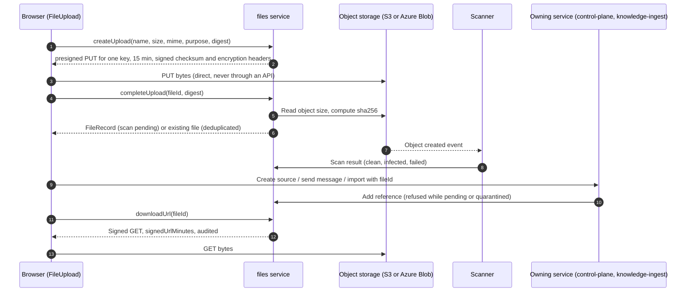
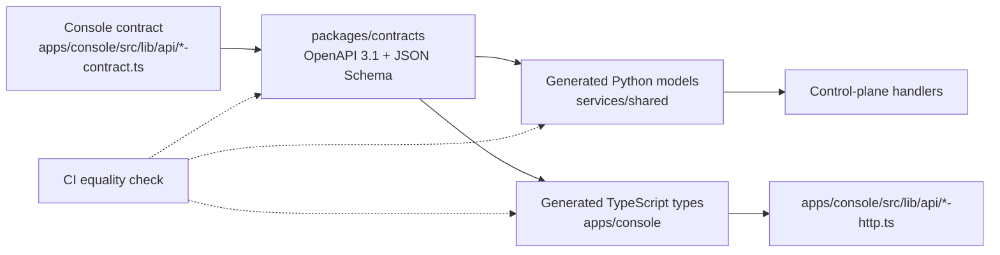
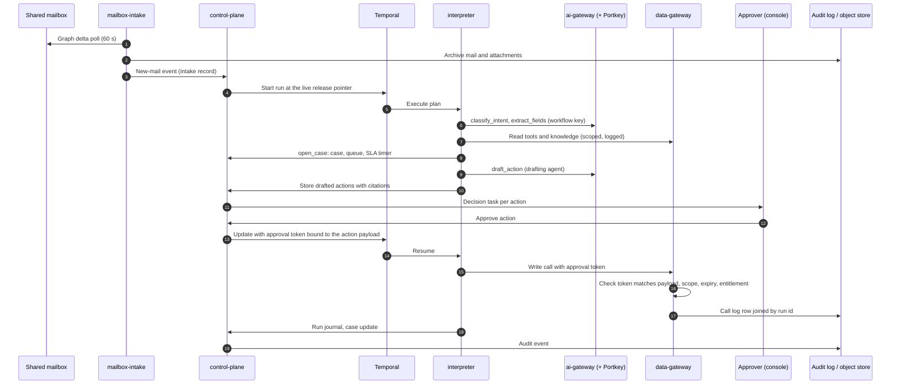

# Backend overview

Status: draft for review. No backend code exists yet. This document describes the services, repo
layout, contracts and standards the backend will follow, so that work can start from one agreed
shape. The console in `apps/console/` runs against an in-memory mock until these services exist.

Binding decisions are in `docs/architecture/decisions/` (ADR-0001 to ADR-0010). Behaviour is
specified in `docs/specs/`. Timing comes from `docs/plan/implementation-plan.md`.

## 1. Service map

| Service | Folder | What it owns | Data stores | Spec |
|---|---|---|---|---|
| Control-plane API | `services/control-plane/` | Registry (workflows, agents, versions, risk tier, owner, cost, release pointers), drafts and edit classes, publish requests and the release gate, cases, queues and SLAs, reviews, governance (teams, roles, audit, notifications, API keys, usage). Serves the OpenAPI contract the console calls. Holds `fileId`s, never file bytes | PostgreSQL (system of record); files through the files service | `01` 4–6, `04` 4.5–4.7 and 5.5–5.7, `08`, `09`; ADR-0004, ADR-0006 |
| Files | `services/files/` | Every file byte: presigned upload and download URLs, completion with size and digest checks, dedupe per team, malware scan results and quarantine, references, retention, legal hold, WORM evidence, previews. The only holder of storage credentials | PostgreSQL schema `files` (metadata, references, versions); object storage through the adapter of ADR-0010 (S3 or Azure Blob) | `10`; ADR-0006, ADR-0010 |
| Workflow interpreter | `services/interpreter/` | One Temporal workflow type that walks any compiled execution plan, the node-type implementations, activity workers per risk tier, the agent-block host | Temporal history (owned by Temporal); writes run journal rows and payloads through the control plane and object store | `01` 4.6, 5.6, 5.7; ADR-0001, ADR-0003 |
| Data gateway | `services/data-gateway/` | Tool and knowledge modules, module versions and approvals with expiry, the per-call policy decision (OPA), credential resolution from the secret store, subject binding, approval-token checks on writes, the call log | PostgreSQL (modules, approvals, call log), secret store (credentials), pgvector database (read path for knowledge) | `03` 4.1–4.5, 5.1–5.5; ADR-0005 |
| Key-and-budget service (AI gateway front) | `services/ai-gateway/` | Model aliases, per-workflow and per-purpose keys and budgets, metadata logging, failover rules, agent discovery from traffic. Holds every model key; Portkey's open-source gateway runs behind it as the data plane | PostgreSQL (aliases, budgets, usage), secret store (provider keys) | `03` 4.8, 5.8–5.10; ADR-0008 |
| Mailbox intake | `services/mailbox-intake/` | Shared-mailbox polling (Microsoft Graph delta every 60 s per folder), archive, the new-mail event that starts a run, daily reconciliation. Attachments are written through the files service, which scans them | PostgreSQL (mailbox state, intake records); mail archive and attachments through the files service | `03` 4.6, 5.6; ADR-0007 |
| Knowledge ingestion | `services/knowledge-ingest/` | Source sync, required-metadata checks, chunking, embedding through the AI gateway under the ingestion identity, indexing, freshness and staleness, the citation index | pgvector database (separate PostgreSQL instance); source files and fetched originals through the files service by `fileId` | `02` 4, 5.1–5.8, 5.13; ADR-0006 |
| Eval runner | `services/eval-runner/` | Suite runs on publish requests, agent evals, model-update runs, scoring against baselines, injection thresholds, sealing evidence bundles | PostgreSQL (runs, results, baselines); evidence bundles sealed through the files service into a WORM class | `04` 4.1–4.6, 5.1–5.4, 5.8–5.10 |
| Shared libraries | `services/shared/` | Generated models from `packages/contracts`, settings loading, logging and tracing setup, run-context and identity types, gateway clients | none | Section 3 below |

All services are Python (ADR-0002). The console's backend-for-frontend stays in TypeScript inside
`apps/console/`.

## 2. Layout

```text
services/
  control-plane/        FastAPI app: registry, gate, cases, governance
  interpreter/
    nodes/              one module per node type (classify_intent, extract_fields, open_case, ...)
    agent_host/         wrapper that runs existing Python agents as agent blocks
  data-gateway/
    modules/            adapters per tool-module kind (MCP, OpenAPI, native)
    policy/             OPA policies and their tests
  ai-gateway/           key-and-budget service; Portkey configuration generated from the registry
  mailbox-intake/
  knowledge-ingest/
  eval-runner/
  files/                files service: storage adapters (S3, Azure Blob, local), scanning hook, retention, holds
  shared/               generated contract models, settings, logging, tracing, clients
packages/
  contracts/            OpenAPI 3.1 and JSON Schema, generated TS and Python types
deploy/
  compose/              local development stack (planned)
```

| Thing | Lives in | Notes |
|---|---|---|
| Node types | `services/interpreter/nodes/` | Each node type has a JSON Schema for its settings in `packages/contracts`; the interpreter refuses a plan whose node settings fail validation |
| Tool modules | Published as data (module definitions and versions) in the data gateway's store; adapter code per module kind in `services/data-gateway/modules/` | A new tool module for an existing kind (MCP, OpenAPI) is configuration, with no code change |
| Knowledge modules | Served by the data gateway; built by `services/knowledge-ingest/` | Same approval model as tool modules |
| Agent blocks | Packaged agent code run by `services/interpreter/agent_host/` | Every model call goes through the AI gateway |
| Storage adapters | `services/files/src/ops_files/storage/` | One protocol, S3 and Azure Blob backends (ADR-0010); a third backend is a new adapter with the same tests |

### Files: a service, not a control-plane module

The files layer is its own service (`services/files/`) rather than a module inside the control plane.

| Reason | Detail |
|---|---|
| Storage credentials in one place | Only the files service can sign URLs or write objects, the same pattern as the data gateway holding system credentials. A control-plane module would put storage credentials in the process that serves the whole console API |
| Callers other than the console | Mailbox intake, knowledge ingestion and the eval runner write and read files. They call the files service with their service identity instead of going through the control plane |
| Different scaling and failure profile | Signing is cheap but bursty (mail with many attachments, bulk source uploads); scan results arrive as storage events. A slow scanner or retention run does not slow case or review writes |
| Bytes never pass through it either | The service signs and records; browsers PUT and GET directly against storage (`10` 5.1, 5.4), so being separate adds no extra hop to the byte path |

The cost is one more deployable and a call from the control plane to add or check a reference when a
record takes a `fileId`. References are written by the service that owns the using record, through the
files service's internal API (`10` F18), so no service reads the `files` schema directly.

### Upload and download flows



| Flow | Who writes the bytes | Notes |
|---|---|---|
| Console upload (sources, chat, imports, tool specs) | Browser, on a presigned PUT | `10` 5.1 |
| Mail attachment | Mailbox intake through the files service's internal write (`10` F19) | Scanned before the agent reads it (Flow step 1) |
| Evidence bundle | Eval runner through the internal write, into a WORM class | `04` 4.6, `10` 5.7 |
| Audit and inventory exports | Control plane through the internal write, purpose `export` | `10` F14 |

## 3. Contract flow

The console's TypeScript contract (`apps/console/src/lib/api/*-contract.ts` and
`apps/console/src/lib/types/`) is the starting point, because the screens already exercise it.



| Step | What happens |
|---|---|
| 1 | The contract is moved into `packages/contracts` as OpenAPI 3.1 (operations) and JSON Schema (domain types and workflow definitions) |
| 2 | Python models for the services and TypeScript types for the console are generated from it and committed |
| 3 | CI regenerates both and fails if either differs from what is committed, so a hand-edited generated type fails the build |
| 4 | The control plane serves the OpenAPI operations with the `{ success, data }` envelope the HTTP client expects |
| 5 | The console switches from mock to HTTP when `NEXT_PUBLIC_OPS_API_URL` is set (`apps/console/src/lib/api/index.ts:8`). No other console file changes |

## 4. One run end to end

The phase-1 email workflow, from arrival to audit. Module names in the last column are the planned
Python packages.



| Step | Service | Planned module |
|---|---|---|
| Mail polled, scanned, archived | mailbox-intake | `mailbox_intake.graph_delta`, `mailbox_intake.scan`, `mailbox_intake.archive` |
| Run started at the live pointer | control-plane | `control_plane.registry.pointers`, `control_plane.runs` |
| Classify and extract | interpreter, ai-gateway | `interpreter.nodes.classify_intent`, `interpreter.nodes.extract_fields` |
| Case opened, routed, SLA started | interpreter, control-plane | `interpreter.nodes.open_case`, `control_plane.cases` |
| Actions drafted | interpreter, ai-gateway, data-gateway | `interpreter.nodes.draft_action`, `interpreter.agent_host` |
| Approval token issued | control-plane | `control_plane.approvals.tokens` |
| Approved write executed | interpreter, data-gateway | `interpreter.nodes.per_action_approval`, `data_gateway.calls`, `data_gateway.policy` |
| Audit and evidence | all, via control-plane; bytes via the files service | `control_plane.audit`, `shared.logging`, `ops_files.service` |

## 5. Local development (planned)

One compose file at `deploy/compose/compose.yaml` will start the dependencies; the services run on
the host with hot reload. None of this exists yet.

| Container | Purpose |
|---|---|
| Temporal (with its own PostgreSQL) | Durable execution |
| PostgreSQL `ops` | System of record |
| PostgreSQL `knowledge` with pgvector | Knowledge index, separate database as in ADR-0006 |
| Object store (LocalStack for S3, Azurite for Azure Blob) | Files through the files service: mail archive, uploads, payloads, evidence bundles |
| ClamAV | Malware scanning for the files service |
| Portkey gateway | AI gateway data plane |
| OPA | Policy decisions for the data gateway |

Planned commands:

```bash
docker compose -f deploy/compose/compose.yaml up -d
uv sync
uv run --package control-plane uvicorn control_plane.app:app --reload
uv run --package interpreter python -m interpreter.worker
```

## 6. Standards

| Area | Standard |
|---|---|
| Language and tooling | Python 3.12, uv workspaces, ruff (lint and format), pyright (strict on `shared` and gateway code), pytest |
| Tests | Unit tests for pure logic; integration tests against the compose stack for each service's store and gateway calls; end-to-end tests that drive a real email through intake to an audited write in `test`. One test per failure mode, each seen failing once before it is trusted. No tests that only exercise a third-party library |
| Config | Settings loaded once into a validated settings object at start-up; a missing or malformed value stops the service at boot. No `.env` files in the repo; secrets come from the secret store |
| Logs and traces | Structured JSON logs with run id, workflow id, version and subject on every line; OpenTelemetry traces across services, with the run id as a span attribute |
| API | OpenAPI 3.1 from `packages/contracts`; `{ success, data }` envelope; idempotency keys on writes |
| Data access | Each service owns its tables; no service reads another service's tables |

## 7. Security boundaries

| Boundary | Rule |
|---|---|
| Trust facts | Identity, team, subject and tier come from platform context (run context, tokens). Message text, email bodies and model output never set them |
| Keys | Workers and agent blocks hold no model keys and no system credentials. The key-and-budget service holds model keys; the data gateway resolves system credentials from the secret store |
| Egress | Worker pods reach only Temporal, the two gateways and the files service. Every model call goes through the AI gateway, every system call through the data gateway, and every file through the files service |
| Files | No API accepts or returns file bytes; they take `fileId`s. Only the files service holds storage credentials. Nothing reads a file before its scan passes |
| Writes | A write needs an approval token bound to the exact action payload; the data gateway rejects a token whose payload digest differs |
| Records | The model does not choose which record a write touches; the subject binding comes from the case |
| Fail closed | Each control declares whether it fails open or closed; approval, scope and egress checks fail closed |

## 8. Walking skeleton versus phase 1 production

| Capability | Walking skeleton (week 8, `test` only) | Phase 1 production (week 20, pilot to week 24) |
|---|---|---|
| Intake | One test mailbox polled every 60 s | The first real shared inbox, with scan, archive and daily reconciliation |
| Interpreter | Plan with the email-intake node types, one worker pool | Pools for `low` and `medium`, pinned worker versions |
| AI gateway | Portkey behind a first cut of the key-and-budget service, one alias | Aliases, per-workflow and per-purpose keys and budgets, metadata logging, egress lock |
| Data gateway | OPA with one allow and one deny rule, stubbed send | Approvals with expiry, credential resolution, call log, approval-token checks on writes |
| Cases | Case, queue and SLA timer created | Queues, SLAs, calendars, approval rules and the review workbench |
| Knowledge | none | One knowledge base with metadata checks, citations and a golden set |
| Evals | none | Suite in the gate, injection threshold, evidence bundles sealed per version |
| Files | Presigned upload, completion, download against the bank's storage in `test`; EICAR scan fake | Scanner, references, retention run, legal hold, WORM evidence on the bank's cloud of choice (ADR-0010) |
| Release | `test` pointer table | Production pointer, four-eyes publish, rollback by pointer |
| Contracts | Generated OpenAPI, JSON Schema and types with the CI equality check | Same, covering every phase-1 operation |

## Open questions

| # | Question |
|---|---|
| 1 | Whether the control plane is one deployable or splits cases and governance into their own services once load is known |
| 2 | Which S3-compatible store with object lock the bank runs on-premises, and whether the local stack can use the same product (ADR-0010 requires Object Lock compliance mode) |
| 4 | Whether browsers can reach the storage endpoint from the bank's network; if not, the files service fronts storage with a streaming proxy (`10` Q1) |
| 3 | Whether the contract moves to `packages/contracts` by generation from the TypeScript types or by hand-writing OpenAPI first and generating the console types from it |
