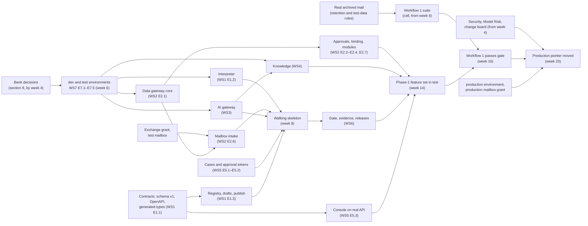

# Implementation plan

Status: draft for review. Builds on the architecture overview (`docs/architecture/overview.md`), the
decision records ADR-0001 to ADR-0009 (`docs/architecture/decisions/`), specs `01` to `04` and `07`
to `09` (`docs/specs/`), the design lessons (`docs/specs/design-lessons.md`) and the problem
statement (`docs/background/problem-statement.md`). Durations are in weeks from the start of phase 0
(week 0) and carry no calendar dates. Every estimate is a target; section 11 says how each one is
measured.

## 1. Summary

The goal has two parts. First, put an email workflow with per-action human approval, one or more
agents and a knowledge base into production on one real shared inbox as soon as possible. Second,
make each later workflow cheap enough that the bank can run many of them, which means the effort
for workflow N has to fall with N. Phase 1 is sized for the first part; phases 2 and 4 test and
exploit the second; phase 3 adds chat and canvas authoring.

**Critical path to the first email workflow in production.**

| # | Step | Ends (week) | Why it is on the path |
|---|---|---|---|
| 1 | Bank decisions on platform, database, WORM store, model endpoints and the first mailbox (section 8, items due by week 4) | 4 | Nothing reaches a bank environment without them |
| 2 | `dev` and `test` environments: Kubernetes namespaces, default-deny egress, Temporal, PostgreSQL (two instances, ADR-0006), WORM bucket, secret store, SIEM export | 6 | Every workstream deploys here; egress is what makes the gateways the only door (ADR-0004) |
| 3 | Walking skeleton in `test`: a test mailbox polled every 60 s → run → classify through the AI gateway → open case → drafted reply → human approval token → stubbed send, all logged | 8 | Proves the seams between all seven workstreams before features pile on them |
| 4 | Phase-1 feature set complete in `test`: data gateway policy and binding, knowledge with citations, gate with evidence, console screens on the real API | 14 | The gate cannot pass workflow 1 until all of these exist |
| 5 | Workflow 1's suite passes its gate in `test` on real archived mail (built in parallel from week 6) | 16 | The evidence Model Risk reads |
| 6 | Security review of the gateways and first modules, penetration test, Model Risk acceptance of the evidence bundle, change-board agreement on pointer moves (started at week 4, closed here) | 19 | The problem statement's three decisions; production cannot open without them |
| 7 | `production` environment ready, production mailbox granted, production pointer moved, pilot starts | 20 | First email workflow in production |
| 8 | Four weeks of stable production against the phase-1 exit criteria | 24 | Phase 1 exit |

**Estimate.** First email workflow in production in **18 to 22 weeks, central estimate 20**, with
phase 1 exiting at week 24. The estimate holds under these assumptions; each one that fails moves
the date by about the delay shown.

| Assumption | If it fails |
|---|---|
| Bank decisions in section 8 land by their week | Day for day on the critical path for items marked critical |
| `dev` and `test` namespaces, PostgreSQL and egress policy provisioned by week 6 | Day for day; mitigated by building against a bank-approved sandbox with synthetic data until then |
| The seven workstreams staffed at the phase-1 range (23 to 32 engineers; 28 to 37 with leadership and the embedded solutions engineer, section 4) by week 2 | Roughly proportional |
| One approved model endpoint and a test-data rule allowing real archived mail in suites by week 6 | Suite work slips; step 5 moves |
| Exchange administration grants app access to a test mailbox within 2 weeks of request and to the production mailbox by week 14 (`03` Q1) | Step 3 or step 7 moves day for day |
| No external case system must remain the record of operations cases (overview open question 9) | Add 4 to 6 weeks for case sync as a tool module |
| Redaction is not required on day one (overview open question 13) | Add 2 to 3 weeks to the AI gateway workstream, off the critical path if decided by week 4 |
| Workflow 1 has no `money_movement` action, so its effective tier is `low` or `medium` (ADR-0004) | A money action makes it `high`, which cannot reach production in phase 1 |
| Security and Model Risk book review capacity from week 4 and review incrementally | Reviews started after week 14 add 4 to 8 weeks |

## 2. Scope of this plan

| In | Out |
|---|---|
| Phases 0 to 4, team shape, workstream backlogs for phase 1, dependencies, bank decisions, the move from mock to production API, throughput targets, stop condition | Calendar dates, budget in currency, vendor contracts, the bank's own system-team roadmaps beyond the modules this plan needs |

## 3. Phases

### Phase overview

| Phase | Weeks | Outcome | Production tiers |
|---|---|---|---|
| 0 Foundations | 0–8 | Environments, contracts, walking skeleton in `test` | none |
| 1 First email workflow | 4–24 | One real shared inbox in production, one or more agents, one knowledge base, per-action approval | `low`, `medium` |
| 2 Workflows 2 and 3 | 20–32 | Two more email workflows built from the template and the module library, with materially less effort | `low`, `medium`; `high` once the Model Risk second-line group exists (overview open question 21) |
| 3 Chat and canvas | 26–44 | Chat for staff (`07` phase 2a, then 2b); editable canvas for builders (`01` 5.10) | as above |
| 4 Scale | 36 onward | `critical` tier with staged rollout, more connectors, more departments, automated model-update runs | all |

Overlaps are deliberate: phase 1 starts while foundations finish, and the workflow 2 department
starts its suite while workflow 1 is in pilot.

### Phase 0: Foundations (weeks 0–8)

| Item | Content |
|---|---|
| Deliverables | `dev` and `test` environments per ADR-0004; CI with generated JSON Schema, OpenAPI 3.1 and TypeScript types and the equality check (ADR-0002); definition schema v1 with the 31 node types (ADR-0001); walking skeleton (critical path step 3); `test` pointer table; Portkey OSS behind a first cut of the key-and-budget service (ADR-0008); OPA at the data gateway with one allow and one deny policy; audit table with hash chain exporting to the SIEM; threat model; first mailbox (lending servicing) connected in `test` |
| Exit criteria (each can fail) | (1) A test email in the test mailbox produces exactly one case with a drafted reply, and a stubbed send only after a person approves, with run journal, data gateway and AI gateway log rows joined by run id. (2) A direct model call from a worker pod fails (`03` G-A18). (3) A committed TypeScript type edited by hand fails CI. (4) A worker built from an unknown build id cannot poll the `test` task queue (architecture overview, failure modes, stale workers). (5) Each of these checks has been seen failing once (design lessons, "Verification culture") |
| Dependencies | Section 8 decisions due by week 4; bank infrastructure tickets raised in week 0 |
| Risks | Environment lead time in the bank (mitigation: sandbox with synthetic data, same manifests); egress policy not enforceable per namespace (ADR-0004 "what would change our mind": move enforcement to a mesh, +2 to 4 weeks); team not yet staffed |

### Phase 1: First email workflow (weeks 4–24)

| Item | Content |
|---|---|
| Deliverables | The phase-1 rows of every spec: 49 operations in `01`, 39 in `02`, 44 in `03`, 33 in `04`, 10 in `08`, 31 in `09` (204 distinct; `09` L1–L2 repeat `03` G3–G4); the email-intake template; three to four tool modules (`m365-mail`, a CRM or core-banking read module with one note-writing operation, a document-store read module); one knowledge base for the first department; the injection library (≥ 30 cases, `04` 5.4); evidence bundles; agent evals on every save with the agent gate rules (`04` 5.10); the model inventory with workflow 1 and its agents tiered `medium` and validated by Model Risk before the production promote (`08`); the audit log, tool-call log, access, team scoping, members, notifications and usage screens (`09`); promote, rollback and smoke; console screens for every phase-1 route (section 5, WS5); the items chat reuses (`07`, "Phase 1 work that chat reuses"); `production` environment; workflow 1 in production on one real shared inbox |
| Workflow 1 | **Lending servicing inbox** (`lendingservicing@`, mock `wf_lending_inbox`): hardship and payment-deferral requests, payoff statement requests, change of address. Actions: read the loan account, draft the reply, open the hardship case for a specialist, update the mailing address (the one non-money write). No money movement, so the workflow is `medium` tier. Card disputes (`wf_card_inbox`) need provisional credit and follow in phase 2 once `high` opens |
| Workflow 1 selection rules | One shared inbox with steady volume (≥ 50 mails a day) and three to six intents; actions are reads, a reply and at most one non-money write, so its effective tier is `medium` or `low` (`01` 5.2, ADR-0004); one department with a named knowledge owner and approver groups whose members are entitled in the systems the actions touch (`01` Q2); a manual baseline (handling time, SLA breach rate) measurable for four weeks before go-live |
| Exit criteria (each can fail) | (1) Acceptance suites green in `test` and each test seen failing once: `01` A1–A22, `02` A1–A17, `03` G-A1–G-A28, `04` E1–E27, `08` MR1–MR12, `09` GV1–GV15. (2) Four weeks in production with: zero write calls without a valid approval token in the data gateway call log; every mail in the watched folders accounted for by an intake record (daily reconciliation against the mailbox count shows zero lost and zero duplicate runs); mail-to-case p95 within `01` 9; SLA breach rate no worse than the manual baseline; data gateway and AI gateway availability ≥ 99.9% in business hours. (3) The production version's evidence bundle is retrievable and its digest verifies (`04` E7). (4) A production rollback and re-promote rehearsed during the pilot, with smoke results. (5) Workflow-specific effort for workflow 1 recorded by role (section 10), so phase 2 has a baseline |
| Dependencies | Phase 0 exit; section 8 decisions due by week 16; Security, Model Risk and change board engaged from week 4 |
| Risks | Security review starts late (mitigation: design review at week 4, module reviews per version as they land, pen test booked for weeks 16–18); real mail cannot be used in suites (`04` Q4) (mitigation: redacted copies, decided by week 6); first department's documents lack effective dates and supersedes fields and most items are `held` (`02` Q3) (mitigation: metadata mapping and owner backfill sprint in weeks 8–12); policy approval tokens not accepted by Security (overview open question 19) (mitigation: launch with every write approved by a person; the feature stays off by gate data); Graph throttling at polling rate (mitigation: backoff per `03` 5.6.13, measured in the skeleton) |

**Pilot shape.** Weeks 20 to 24 run workflow 1 in production with every write approved by a person
(policy approval tokens off), the manual-handling queue staffed, and a daily review of rejected and
edited actions turned into suite cases (`04` 5.1.5). The workflow owner may turn policy approval on
for named write classes only after Security confirms (overview open question 19) and through a publish.

### Phase 2: Workflows 2 and 3 (weeks 20–32)

| Item | Content |
|---|---|
| Deliverables | Workflows 2 and 3 in production in two further teams or departments, built from the email-intake template, library agents and existing modules, by the departments' own editors; at most one new module per workflow, built by the owning system team; renewal flow for approvals (`03` A6) and the candidate list of corrected cases (`04` 5.1.5 later) if workflow 1 showed they are needed; continue-as-new for long cases if overview open question 7 requires it; `high` tier opened (`04` S13) once the Model Risk S8 group is named, with four-eyes money actions allowed from then; validation of workflows 2 and 3 and periodic review dates for workflow 1 (`08`); findings in the console; approvals from Teams if not in phase 1 (`09` Q3) and from email (`09` Q4); webhooks and API keys for the first external caller (`09`); agent eval case editing and rubric scoring once judge agreement is measured (`04` 5.10.8) |
| Exit criteria (each can fail) | (1) Workflow 2's workflow-specific effort is at most 50% of workflow 1's, and its elapsed time from kickoff to production at most 6 weeks (section 10). (2) Workflow 3 needs zero platform-team tickets, apart from module work done by system teams. (3) Someone outside the platform team builds workflow 3's draft from the documentation alone and records every point where they needed help (design lessons, "Verification culture": a cold first run). (4) Workflows 1 to 3 run together with per-workflow budgets, call logs and evidence separated |
| Dependencies | Phase 1 exit; Exchange grants for two more mailboxes; knowledge owners for the new departments |
| Risks | Exit criterion (1) fails: this is the problem statement's stop condition (section 11); a new department needs a new collection and IdP mapping, which is a platform and Risk step (`02` "Marginal effort"); suite building dominates and does not shrink |

### Phase 3: Chat and canvas (weeks 26–44)

| Item | Content |
|---|---|
| Deliverables | Chat phase 2a (`07` Scope): thread API, stream relay, `ops-views` with native renderers, host-native approvals and confirmations, user delegation (ADR-0005 phase 1 vs later), sandbox origin with App Bridge, feedback to test candidates; chat template with its suite. Then 2b: sharing, attachments, custom MCP Apps, export, the intranet widget behind staff SSO (ADR-0009), exposure to the bank's assistant over MCP and A2A. Editable canvas for the builder role over the same server check (`01` 5.10), further node types from the palette as workflows need them, API trigger (`01` row 2) |
| Exit criteria (each can fail) | (1) `07` acceptance tests 1–15 green in `test`, test 16 once sharing ships. (2) A second chat agent is created from the chat template by a department with no front-end change. (3) A builder creates a canvas workflow with no template, and it publishes through the same gate and server check, with the first-publish platform review (`01` 5.10.2). (4) A chat write and a case action use the same review and token path, proven by the audit log (`07` CD-6) |
| Dependencies | `07` open questions 1, 3, 5, 6, 8 by week 20; overview open question 18 by week 28; IdP token exchange with `act` claim (overview open question 6) |
| Risks | Bank proxies buffer server-sent events (`07` Q5) (fallback: chunked fetch with the same parts); the bank standardises on Microsoft 365 Copilot (ADR-0009 "what would change our mind"): then exposure over MCP and A2A moves first and the console chat shrinks; user delegation not supported by the IdP (ADR-0005 fallback: gateway-minted delegation tokens, needs Security sign-off) |

### Phase 4: Scale (week 36 onward)

| Item | Content |
|---|---|
| Deliverables | Staged percentage rollout (`04` operation 25, ADR-0004), then `critical` opened (`04` S11, S13); automated model-update runs and drift checks (`04` 5.8.3, 5.8.5); module revoke and deprecate in the console; dedicated department pools where regulation requires; Graph change notifications if the network review allows (overview open question 20); more connector types (`02` "later" sources, code modules, bank-run n8n via MCP if overview open questions 11 and 14 allow); discovery of unregistered model traffic (`03` 5.10); further templates (`01` 4.3); department onboarding as a routine; model risk monitoring thresholds that raise findings, drift and decommissioning records, inventory export to the bank's model risk system (`08` R11); Slack and further notification channels; signed audit export (`09` L4); team creation in the console |
| Exit criteria (each can fail) | (1) A `critical` workflow ramps 5% → 50% → 100% and a ramp is withdrawn once in `test` without affecting in-flight cases. (2) An alias change runs every affected suite automatically and refuses the move on one failing version. (3) Workflow N on existing modules reaches production in at most 3 weeks elapsed and 3 person-weeks, measured over the last five workflows. (4) The discovery report finds at least one known unregistered caller planted for the test |
| Dependencies | Change board agreement on pointer moves for `critical` (overview open question 8); Model Risk acceptance of ramp evidence |
| Risks | Platform team becomes the bottleneck for module creation (mitigation: system teams own modules, `03` "Marginal effort"); catalogue sprawl (curate before adding a second module per system, design lessons, "Lessons that do not transfer") |

## 4. Team shape

### Problem-statement teams mapped to workstreams

The problem statement assigns ownership: the platform team owns the runtime, the gateways and the gate mechanics;
modules are owned by the teams that wrote them; Security, Model Risk and the change board take the
three decisions; each operations team configures its own path (problem statement, flow).

| Team | Workstreams it staffs or owns | Role in phase 1 |
|---|---|---|
| Platform team | WS1 runtime and registry, WS2 data gateway and mailbox, WS3 AI gateway, WS4 knowledge (platform side), WS5 cases and console, WS6 evals and gate, WS7 infra and security engineering | Builds and operates all platform components; one solutions engineer embedded with workflow 1 |
| System teams (CRM, core banking, document store, Exchange) | Their own tool modules inside WS2's model | Publish and own the first three to four modules; approve scope requests; Exchange administration grants mailbox access |
| Department operations team (first workflow) | Workflow 1 cell | Intents, examples, fields, queues, SLAs, approval rules, suite, pilot staffing, approvers |
| Knowledge owner per department | WS4 content side | Collections, metadata backfill, golden set, curation queue |
| Security | WS7 reviews | Threat model, module review model (Decision 1), pen test, policy approval tokens (overview open question 19) |
| Model Risk | WS6 gate data | Gate composition and thresholds, evidence acceptance (Decision 2), deviation acknowledgement (ADR-0004) |
| Change board | WS6 releases | Pointer moves outside the window below an agreed tier (Decision 3, overview open question 8) |

### Roles and headcount by phase

Ranges are full-time equivalents on the platform team unless marked. Bank-side roles are part-time
and listed separately because they gate the critical path more than they add capacity.

| Workstream | Phase 0 | Phase 1 | Phase 2 | Phase 3 | Phase 4 | Main skills |
|---|---|---|---|---|---|---|
| WS1 Runtime and registry | 3–4 | 4–5 | 3–4 | 4–5 (canvas) | 3–4 | Python, Temporal, schema and compiler design |
| WS2 Data gateway and mailbox | 2–3 | 4–5 | 3–4 | 3–4 (MCP Apps serving) | 3–4 | Python, MCP, OAuth, OPA, Microsoft Graph |
| WS3 AI gateway | 1 | 1–2 | 1 | 1–2 | 1–2 | Python, Portkey, metering |
| WS4 Knowledge | 1–2 | 3–4 | 2–3 | 2–3 | 2–3 | Python, PostgreSQL, pgvector, document parsing, retrieval evaluation |
| WS5 Cases, HITL and console UI | 2–3 | 5–7 | 4–5 | 6–8 (chat UI) | 4–5 | Python (cases), TypeScript, Next.js, shadcn, design |
| WS6 Evals and release gate | 1–2 | 3–4 | 2–3 | 2–3 | 2–3 | Python, evaluation design, test automation |
| WS7 Platform, infra and security | 3–4 | 3–5 | 3–4 | 3–4 | 3–4 | Kubernetes, network policy, PostgreSQL operations, secrets, CI supply chain, SRE |
| Leadership (product owner, architect, delivery lead, QA lead) | 3–4 | 4 | 4 | 4 | 4 | |
| Embedded solutions engineers (with department cells) | 0 | 1 | 2 | 2 | 1 per 3 departments | Template configuration, suite building, coaching |
| **Platform total** | **16–23** | **28–37** | **24–30** | **27–35** | **22–29**, plus embedded engineers | |
| Department cell per workflow (bank, part-time) | 1 (selection) | 3–5 | 2–3 each | 2–3 each | 1–2 each | Operations SME, workflow editor, approvers, queue lead |
| System team per new module (bank, part-time) | 0 | 1–2 per module | 1 per module | 1 per module | 1 per module | The system's API, its entitlements |
| Security, Model Risk, change board (bank, part-time) | 1–2 | 2–3 | 1–2 | 2 | 1–2 | Reviews and decisions |

The seven workstreams alone need 23–32 engineers in phase 1; leadership and the embedded solutions
engineer bring the platform total to 28–37.

### Who owns what after phase 1

| Platform team owns (tickets come here) | Department operations teams own (no platform ticket) |
|---|---|
| Runtime, interpreter, worker pools, Temporal | Create a workflow from a template, change its settings, save versions (architecture overview, throughput) |
| Data gateway core, OPA policies, mailbox intake adapter | Add test cases, import sample mail, run the suite (`04` "Marginal effort") |
| AI gateway, key-and-budget service, aliases (locked class) | Request publish; approve another person's publish |
| Gate mechanics, injection library (with Security), evidence | Promote, roll back, pause within the tier's rules |
| Templates, node types, agent packages (after code review) | Request module scopes; module owners approve or revoke them |
| Collections and required-metadata profiles (with Risk) | Add knowledge sources within the department's scope; curate; golden sets |
| Console and BFF | Add queues, members, SLAs, approver groups; set budgets within the tier ceiling (`03` 5.8.6) |
| New connector types and adapter types | Bind a connected mailbox as a deployment (after Exchange grants access) |

The platform ticket list is closed: a new template type, a new node type, a new agent package, a new
model alias, a declared tier or gate composition change, a new department collection, and a new
adapter type (`01` "Marginal effort", `02` "Marginal effort", `03` "Marginal effort"). Anything else
that reaches the platform team is a defect in the self-service path and is logged as such (section
11 metric).

## 5. Workstreams and phase-1 backlogs

Each story's acceptance test points at the spec test that proves it, so "done" means that test is
green in `test` and has been seen failing once. Mock routes are the screens the story serves
(`apps/console/src/app/**`); "API only" marks stories with no screen.

### WS1 Runtime and registry

Mission: the definition, compiler, interpreter, registry and pointers (ADR-0001 to ADR-0004, `01` 4–6).

| Epic | Story | Acceptance (fails if) | Spec | Mock route |
|---|---|---|---|---|
| E1.1 Definition and compiler | Pydantic models for definition v1 and every phase-1 API; generated JSON Schema, OpenAPI 3.1, TypeScript types; CI equality check | A hand-edited generated type passes CI | ADR-0002 | API only |
| | Compiler expands template settings into a full graph and a plan stored by digest; every reference pinned | An unpinned reference passes the server check | `01` 4.2, 5.5.2 | `/workflows/[id]` Canvas tab |
| | Server check with CEL shared by check and interpreter; effective tier and the pins that raised it | Adding a write tool does not raise the tier or the check does not name the pin | `01` 5.2, 5.6 | Canvas, Approval rules tab |
| E1.2 Interpreter | Interpreter workflow running phase-1 node types (ADR-0001) with Worker Versioning, pinned runs from the first release | A version 1 case runs later steps on version 2 (`01` A11, `04` E8) | ADR-0001, ADR-0004 | `/workflows/[id]` Runs tab |
| | Retry budget then manual-handling path | Data gateway stopped during drafting and the case is not in the manual-handling queue (`01` A19) | `01` 5.6 row 28 | `/cases` |
| | Run journal with `workflowId`, version, digest, `channel` per step | A step has no journal row, or `channel` is empty (`07` phase-1 reuse) | `01` 5.1.3, ADR-0006 | Run sheet |
| | Replay tests against recorded histories in CI | A non-deterministic interpreter change passes replay | ADR-0001 counter-argument | API only |
| E1.3 Registry and drafts | Workflows from the email template; drafts with `If-Match`; edit classes; annotations | `01` A8 or A18 | `01` 5.3, 5.4 | `/workflows`, Create workflow dialog, Intents, Routing & SLAs, Settings tabs |
| | Publish requests with maker-checker over requester and authors; human sessions only | `01` A1 or A20 | `01` 5.5 | Request publish dialog, `/reviews` |
| | Versions and restore-to-draft | `01` A17 | `01` 5.5.10 | Versions tab, Restore version dialog |
| | Agents with typed version changes, agent packages, effective tools | `01` A10 | `01` 4.5, 6.3 | `/agents`, `/agents/[id]`, Grant tools dialog |
| E1.4 Pointers and triggers | Release pointers for `test` and `production`; triggers read them at run start; pause holds mail | `01` A15 or `04` E9 | `04` 4.7, `01` 5.9.6 | Settings tab, Versions tab |
| | Phase-1 production restriction by tier (S13) | `01` A22 or `04` E17 | ADR-0004 | Versions tab |
| | Nightly drift check between loaded plans and registry digests | A plan altered outside the registry raises no alert | `01` 5.1.1 | API only |

### WS2 Data gateway and mailbox

Mission: the one door to bank systems and mail (`03` 3–5.7, ADR-0005).

| Epic | Story | Acceptance (fails if) | Spec | Mock route |
|---|---|---|---|---|
| E2.1 Gateway core | MCP endpoint; workload identity and run-context token; one OPA decision per call; fail closed | `03` G-A1 or G-A8 | `03` 5.3 | API only |
| | Call log written before every response; SIEM stream | A call returns without a log row, or the log store being down lets a call through | `03` 5.5.1 | Module page call log (new), Run sheet |
| | Listing by principal type with CI diff | `03` G-A9 | `03` 5.5.3 | API only |
| | `_meta` passed through untouched; optional `uiResources` in the manifest | A test tool's `_meta` is altered or dropped (`07` phase-1 reuse) | `03` 4.1 | API only |
| E2.2 Modules | Catalog, discovery (MCP, OpenAPI, HTTP) without saving, create as draft; staged operation edits published as minor or major versions, a security review per major; reachability per environment; idempotent create and publish | `03` G-A10, G-A23, G-A24, G-A27, G-A28, or a twice-run publish ends in a different state | `03` 4.1, 5.1 | `/tools` Modules and Catalog tabs, Add module dialog, `/tools/[id]` Operations, Approval, Versions |
| | Test console with run-as context, stub or sandbox, gateway decision; activity chart | `03` G-A25 or G-A26 | `03` 5.3a, 4.4a | `/tools/[id]` Test console, Activity |
| | MCP drift detection | `03` G-A11 | `03` 5.1.7 | Module page |
| | Module revoke through the API as a runbook | A revoked version still serves calls | `03` 5.1.9 | API only |
| E2.3 Approvals | Request, decide, revoke; major-version scope (ADR-0005); expiry per call; publish refuses approvals valid under 14 days | `03` G-A2, or a minor module release forces a new approval | `03` 4.2, 5.2 | `/tools/[id]` Access tab; `/access` Grants tab; `/reviews` kind `module_access` later |
| E2.4 Binding and tokens | Subject binding from run context; resolution step for accounts | `03` G-A3 or G-A4 | `03` 4.3, 5.3.4 | `/cases/[id]` |
| | Human and policy approval token verification; idempotency keys | `03` G-A5, G-A6, `01` A6, or a policy token accepted for `money_movement` | `03` 5.3.5–5.3.6, ADR-0005 | `/cases/[id]` action card |
| E2.5 Credentials | Vault references (`vault://…`) per module and environment; no API returns a value; literal credential headers refused | `03` G-A7 or G-A27 | `03` 4.4, 5.4 | `/tools/[id]` Credentials tab |
| E2.6 Mailbox intake | Connect with canary read; folder picker; delta polling every 60 s; de-duplication | `03` G-A12, G-A13, `01` A3 | `03` 5.6.1–5.6.4, ADR-0007 | `/deployments` New deployment wizard |
| | Security scan and quarantine; archive to WORM before the run; loop prevention | `03` G-A14, G-A15, G-A16 | `03` 5.6.5–5.6.8 | Deployment sheet intake log |
| | Reconnect and backfill; error state | `03` G-A17, `01` A16 | `03` 5.6.10 | Deployment sheet |
| E2.7 First modules (with system teams) | `m365-mail` with `mail.send_reply`; a CRM or core-banking read module with one note-writing operation; a document-store read module | A module reaches production without a review record, reachability, or test stubs for writes | `03` 4.1, 5.1.5 | `/tools` |

### WS3 AI gateway

Mission: the one door to models, with keys held only by the key-and-budget service (ADR-0008, ADR-0005;
`03` 5.8).

| Epic | Story | Acceptance (fails if) | Spec | Mock route |
|---|---|---|---|---|
| E3.1 Portkey data plane | Portkey OSS built from a pinned commit; configuration generated from the registry only | A hand edit to Portkey configuration survives the next sync without an alert | `03` 5.8.3, ADR-0008 | API only |
| E3.2 Key-and-budget service | Authenticates workload identity and run context; keys per workflow and environment and per platform identity; ledger with per-run and monthly caps | `03` G-A20, or a worker can read any model key | `03` 4.8, 5.8.5–5.8.6, ADR-0005, ADR-0008 | Workflow cost column on `/workflows` |
| E3.3 Aliases | Alias versions with cleared sensitivity; callers name aliases only; alias move refused without passing runs | `03` G-A19, or an alias moves with a failing affected version | `03` 5.8.3–5.8.4, `04` 5.8.2 | `/agents/[id]` model select (aliases only) |
| E3.4 Metadata log | Model call log per request to SIEM; cache hit rate; usage API | `03` G-A21 | `03` 5.8.7, M7 | `/workflows` cost column, `/` overview |
| E3.5 Egress lock | Network policy and CI lint on provider hosts | `03` G-A18, `02` A15 | `03` 5.8.2 | API only |
| E3.6 Sensitivity | Sensitivity ceiling per alias version; redaction only if overview open question 13 requires | `03` G-A22 | `03` 5.8.9 | API only |

### WS4 Knowledge

Mission: sources, ingestion, the knowledge module with citations, and curation (`02`).

| Epic | Story | Acceptance (fails if) | Spec | Mock route |
|---|---|---|---|---|
| E4.1 Collections and scope | Collections with required-metadata profile, knowledge owner and IdP group mapping | `02` A3 or A5 | `02` 4.3, 5.3 | Create knowledge base dialog |
| E4.2 Sources and ingestion | Upload, SharePoint (delta every 5 minutes, `02` 5.5.1), intranet crawl; sync runs on Temporal in the gateway zone; held on missing metadata | `02` A1, A2 or A16 | `02` 5.1, 5.5 | `/sources`, Add source wizard, `/sources/[id]` |
| E4.3 Index | pgvector on its own PostgreSQL instance (ADR-0006); hybrid search; index generations with atomic switch | `02` A4 or A17 | `02` 5.2, 5.13 | `/knowledge/[id]` Overview |
| E4.4 Query path | Module `search` with pre-filter, precedence, supersedes, citations, table values | `02` A6, A7, A10 or A11 | `02` 5.3–5.7, M1–M2 | `/knowledge/[id]` Playground tab |
| E4.5 Freshness | Stale flag; knowledge-change suite re-runs for workflows that cited a changed item (built with WS6) | `02` A8 or A9 | `02` 5.5 | `/workflows/[id]` Versions tab ("knowledge regression") |
| E4.6 Quality | Golden set per knowledge base, metrics against a baseline, empty set fails | `02` A12 or A13 | `02` 5.9 | `/knowledge/[id]` Retrieval tab |
| E4.7 People and curation | Playground on the same door under the user's entitlements; curation queue | `02` A14, or a held item missing from the queue | `02` 5.10–5.11 | Playground tab, `/knowledge/curation` (new) |

`04` 2 lists knowledge-change re-runs as later; `02` 5.5.6 and test A8 make them phase 1. This plan
follows `02` because Knowledge requirement 4 applies to the first knowledge base; `04` needs the
matching edit.

### WS5 Cases, HITL workbench and console UI

Mission: cases, queues, SLAs and per-action approval (`01` 4.7–4.8, 5.7–5.8), and every phase-1
screen on the real API.

| Epic | Story | Acceptance (fails if) | Spec | Mock route |
|---|---|---|---|---|
| E5.1 Cases and SLAs | Cases, queues, calendars; SLA deadline in PostgreSQL, timer in Temporal; pause on `waiting_customer` | `01` A2, A13 or A14 | `01` 4.8, 5.8 | `/cases`, `/cases/[id]` |
| | Inbound reply on the thread attaches to the open case; reopen window | A reply starts a second run, or a reply after 14 days reopens | `01` 5.8.4 | `/cases/[id]` |
| E5.2 Per-action approval | Drafted actions with full payload and citations; edit clears approvals; four-eyes; only humans decide; outbox when Temporal is down | `01` A4, A5, A12, or an approval during a Temporal outage is lost | `01` 5.7 | `/cases/[id]` action card |
| | Policy approval tokens behind gate data, off until overview open question 19 is answered | `01` A7 or A21 | `01` 5.7.6, ADR-0005 | Approval rules tab |
| | Case to test case | `04` E14 | `04` 5.1.5 | `/cases/[id]` "Add to test suite" |
| E5.3 Console on the real API | BFF with bank SSO; per-namespace switch from mock to HTTP in `apps/console/src/lib/api/index.ts` (section 9) | A namespace marked real still serves mock data, or the browser calls the Python API directly | ADR-0002 | All |
| | Workflow page tabs on phase-1 APIs: field contract (type, unit, format, sensitivity); approval form refuses auto-approve on money tools; edit class shown before save | Gaps listed in `01` 7 remain | `01` 7 | `/workflows/[id]` |
| | Request publish dialog shows gate steps per tier, suite changes, injection score; review detail takes override reasons | `04` E5 or E15 | `04` 7 | Request publish dialog, `/reviews` review sheet |
| | Versions tab with releases panel, promote, rollback, evidence export | `04` E9 or E10 | `04` 7 | Versions tab |
| | Deployments: save a mailbox in `awaiting_consent`; folder picker; reconnect with progress; intake log; `staging` renamed `test`; public widget removed | Gaps listed in `03` 7 remain | `03` 7, ADR-0004, ADR-0009 | `/deployments`, wizard, sheet |
| | Tool modules on the real API (the mock already has the module model) | Gaps listed in `03` 7 remain | `03` 7 | `/tools`, `/tools/[id]` |
| E5.4 Governance and admin | Team switcher and `X-Team-Id` scoping checked against membership; 403 names the owning team | `09` GV1 or GV2 | `09` 5.1 | Shell team switcher, every list |
| | Audit log with views; tool-call log over both gateways with detail | `09` GV10 or GV11 | `09` 5.3 | `/logs/audit`, `/logs/tool-calls` |
| | Access: identities, grants (expiry required), extend, revoke, role assignments | `09` GV4 or GV5 | `09` 5.4 | `/access` |
| | Members, notification routing (in-console and email), bell feed; Teams approvals if `09` Q3 is answered yes | `09` GV3, GV6–GV9 | `09` 5.2, 5.5 | `/settings/members`, `/settings/notifications`, bell |
| | Usage and cost per team and workflow; ⌘K search; run-as principals | `09` GV14 or GV15 | `09` 4.9, 5.7 | `/settings/usage`, ⌘K palette, run-as bar |
| | Knowledge change review | `09` GV12 or GV13 | `09` 5.8 | `/knowledge/changes` |
| | Later: webhooks, API keys, email approvals, Slack, team creation, audit export | | `09` 2 | `/settings/webhooks`, `/settings/api-keys` |
| | Knowledge and sources screens per `02` 7, including versions, citations and curation | Gaps listed in `02` 7 remain | `02` 7 | `/knowledge`, `/knowledge/[id]`, `/sources`, `/sources/[id]` |
| | Agent page: typed changes, alias list, Test sheet on `useChat` and the UI message stream protocol | The Test sheet uses a different streaming path from `07` CD-11 | `07` CD-12, `01` 6.3 | `/agents/[id]` Test sheet |
| | Policies page read-only with "Edit in draft" | Policy edit from the page changes gate behaviour | `01` 6.4 | `/reviews/policies` |
| | Overview counts computed server-side | Any count aggregated in a component (`apps/console/CLAUDE.md`) | `01` 5.1.2 | `/` |

### WS6 Evals and release gate

Mission: suites, eval runs, the gate, evidence, promotion (`04`).

| Epic | Story | Acceptance (fails if) | Spec | Mock route |
|---|---|---|---|---|
| E6.1 Suites | Suite versions; cases from CSV, `.eml`, mailbox archive, runs, case corrections; weakening listed in the next request | `04` E14 or E15 | `04` 5.1 | Tests tab, Import dialog, Run sheet "Add as test" |
| E6.2 Eval runs | Paired candidate and production runs on the interpreter in `test`; repeats; incomplete on double error; bound to digest | `04` E2, E3 or E4 | `04` 5.2–5.3 | Tests tab, Request publish dialog |
| E6.3 Injection | Library of ≥ 30 email cases with `targetsWrite`; threshold blocks at every tier | `04` E6 | `04` 5.4 | Request publish dialog |
| E6.4 Gate | Gate data per tier S1–S13; evaluation per request; override reasons from the approver only | `04` E1, E5, E11 or E17 | `04` 5.5–5.6 | `/reviews` review sheet; gate settings page (new, read-only) |
| E6.5 Evidence | Bundle sealed to WORM at approval; entries appended; export with signature | `04` E7 | `04` 4.6, 8.3 | Versions tab |
| E6.6 Releases | Promote, rollback, post-promotion smoke with three kinds of evidence | `04` E8, E9, E10 or E12 | `04` 5.7 | Versions tab releases panel |
| E6.7 Self-test | Canary definitions per blocking step on every platform release | `04` E16 | `04` 5.9 | API only |
| E6.8 Model updates | Manual alias-change runs with overrides by platform role only | `04` E13 | `04` 5.8.2 | API only |
| E6.9 Agent evals | Agent test sets and platform injection, leakage and refusal sets; run on every save compared with the live version; AG1–AG5 in the workflow gate; gate frozen on decision | `04` E18–E27 | `04` 5.10 | `/agents/[id]` Evals tab, Test sheet, `/reviews` publish request |
| E6.10 Model inventory and validation | Inventory entries for every agent and workflow; tier changes (to or from `high` and `critical` through Model Risk); `model_validation` reviews with conditions and no self-approval; next review dates; evidence and monitoring v1 (pass rate per version, override rate). Phase 1 target: workflow 1 and its agents at `medium`, validated before the production promote | `08` MR1–MR12 | `08` | `/model-risk`, `/model-risk/[id]`, `/reviews` |
| | Later: findings in the console, monitoring thresholds, decommissioning, inventory export | | `08` 2 | `/model-risk/[id]` |

### WS7 Platform, infra and security

Mission: environments, network, identity, stores, supply chain, operations, and the reviews that
open production (ADR-0004 to ADR-0006, failure modes).

| Epic | Story | Acceptance (fails if) | Spec | Mock route |
|---|---|---|---|---|
| E7.1 Environments | `dev`, `test`, `production` (ADR-0004); pools for `low` and `medium`; Temporal HA on PostgreSQL; payload codec; claim-check storage | Plaintext customer data found in Temporal's database in a sampled run | ADR-0004 | API only |
| E7.2 Network | Default-deny egress per namespace; only gateways route to bank systems and model endpoints | A worker reaches a system of record or model endpoint directly | ADR-0004 | API only |
| E7.3 Identity | Workflow identities and platform identities (ADR-0005) in the IdP; process principal per mailbox; workload identity; OPA bundle pipeline | A platform identity can write through the data gateway, or an unregistered workload can call a gateway | ADR-0005 | API only |
| E7.4 Stores | Main PostgreSQL and the separate pgvector instance (ADR-0006); WORM bucket in compliance mode; hash-chained audit with SIEM export | Deleting or shortening retention on a WORM object succeeds, or an edited audit row passes chain verification | ADR-0006 | API only |
| E7.5 Secrets | Bank secret store (or OpenBao or Vault); secret reads audited | `03` G-A7 | ADR-0004, `03` 5.4 | API only |
| E7.6 Delivery pipeline | Builds from pinned sources with SBOM and signing; Worker Versioning deploys; every job asserts its target environment and store | A job pointed at the wrong store runs (design lessons, rank 9) | ADR-0004, design lessons | API only |
| E7.7 Operations | OpenTelemetry ids across run, case and gateways; SLOs; on-call per component; backups verified by restoring content | A restore test returns an empty or wrong database without failing | architecture overview, failure modes, problem statement, Operations | API only |
| E7.9 Files service | `services/files/` behind its API (`10` F1–F19): presigned upload and download against the bank's cloud of choice (ADR-0010), completion with size and digest checks, team dedupe, PostgreSQL `files` schema for metadata and references | `10` A1, A3, A5 or A6 | `10` 5.1, 5.2, ADR-0010 | Every upload point (`FileUpload`), `/files` |
| | Scanner (B14) on storage events; quarantine; blocked references; re-scan on signature update | `10` A4 | `10` 5.3 | `/files` Quarantined view, case attachments |
| | Retention classes, nightly retention run, legal hold in the service and in storage, WORM class for evidence | `10` A8, A9, A10 or A12 | `10` 5.6, 5.7 | `/files` bulk actions, `/settings/storage` |
| | Callers move from bytes to `fileId`: mailbox intake attachments, knowledge sources, chat attachments, eval and test imports, evidence bundles, exports; each adds its reference | A service stores or accepts file bytes outside the files service, or a record holds a storage key | `10` 6, `02` S3, `07`, `04` 4.6 | Add source, chat composer, Import CSV dialogs, Model risk and review Export |
| | Storage settings and connection test; download links audited | `10` A7, A11 or A13 | `10` F16, F17, 8.3 | `/settings/storage` |
| E7.8 Reviews that open production | Threat model; module review model (decision 1); pen test; evidence pack for Model Risk (decision 2); change-board agreement (decision 3) | Production opens without a signed record for each | problem statement decisions, architecture overview, traceability | API only |

### Workflow 1 cell (department, with one embedded solutions engineer)

The department's cell sits outside the platform team and is on the critical path from week 6.

| Story | Acceptance (fails if) | Spec | Mock route |
|---|---|---|---|
| Pick the inbox and intents by the selection rules (phase 1); measure the manual baseline for four weeks | No baseline exists at go-live | Phase 1 selection rules | none |
| Pull 200 or more archived mails, including the worst content; label intents; define fields with units and formats | The suite lacks the longest thread, largest attachment or an empty body seen in the archive | `04` 5.1.7, `01` 4.4 | Intents tab |
| Queues, SLAs, calendars, approval rules, approver groups with entitled members | An approver cannot act in the system the action writes to | `01` 5.8, Q2 | Routing & SLAs, Approval rules tabs |
| Knowledge base with metadata backfill and a 30-question golden set | Held rate above 10% at go-live, or golden set under 30 | `02` 5.1, 5.9 | `/knowledge/[id]`, `/sources/[id]` |
| Suite at the tier minimum (`medium`: 30 cases, 3 per intent) plus below-threshold mail and one case per approval rule | S3 fails at publish | `04` 5.5 | Tests tab |
| Scope requests on each module; publish; pilot staffing | A module approval expires within the pilot | `03` 5.2 | `/reviews` |

## 6. Parallelism

What can start in week 1 with no dependency on bank environments:

| Track | Week-1 start | Runs against |
|---|---|---|
| Contracts (WS1 E1.1): Pydantic models from the specs' API sections, generated OpenAPI and types | Yes | Developer machines and CI |
| Interpreter and compiler (WS1 E1.2, E1.3) on a local Temporal | Yes | Local Temporal, synthetic plans |
| Console screens against the mock reshaped to the spec contract (WS5 E5.3) | Yes | The mock, then the real API namespace by namespace |
| Data gateway core and OPA policies (WS2 E2.1) with a fake module | Yes | Local OPA, a stub MCP server |
| Key-and-budget service and Portkey configuration generator (WS3) | Yes | A local Portkey and a stub model endpoint |
| Knowledge ingestion and query path (WS4) on uploads | Yes | Local PostgreSQL with pgvector, public sample documents |
| Gate data, evidence manifest, injection library drafting (WS6) | Yes | Fixtures |
| Infrastructure requests, threat model, review booking (WS7, Security) | Yes | Bank processes |
| Workflow 1 selection and baseline measurement (cell) | Yes | The department |

What cannot start until a dependency lands: anything against real mail (Exchange grant, retention
and test-data rules), real systems of record (module credentials, system-team time), real model
endpoints (approved provider), and production (Decisions 1 to 3 in the problem statement).

## 7. Adapting existing code

The problem statement maps existing code onto modules so it is adapted rather than rewritten. The bank has no workflow runtime
(problem statement), so adaptation is about connectors, retrieval, agents and tests.

| Existing asset | Becomes | Who | When |
|---|---|---|---|
| Connector classes in existing agents | Tool modules from their OpenAPI or as MCP servers (`03` 5.1) | System team, reviewed once by Security | As workflows need them |
| Retrieval scripts | Knowledge bases over sources, served as knowledge modules (`02` 5.12) | Knowledge owner with WS4 | Phase 1 for the first department |
| Agent graphs (LangGraph or plain Python) | Agent packages run on the agent-block host (`01` 4.5) | Platform team after code review | When a library agent does not fit |
| Prompt files | Versioned prompt fragments, stable first (`01` 4.5, design lessons, prompting) | Agent author | With the agent |
| Retry, error and handoff code | Interpreter retries and the manual-handling path (`01` 5.6) | Deleted from the agent | With the agent |
| Test scripts | Suite cases (`04` 5.1) | Workflow editor | With the workflow |
| Deploy scripts | Retired; promotion moves a pointer (`04` 5.7) | | With the workflow |
| Existing agent runtimes the bank keeps | Behind adapters: discover, observe, register, instrument, adopt (`03` 5.10) | Platform with the owning team | Phase 4 |
| Code from earlier internal platforms | Design reused, code not: a thin workflow wrapper so flows never import Temporal (ADR-0002), retrieval evaluation and pre-filter (design lessons, knowledge), approvals that refuse agents and self-approval (design lessons, human-in-the-loop) | Platform team | Phase 0–1 |
| The Ops AI mock | The console itself, moved onto the real API (section 9) | WS5 | Phase 0–1 |

## 8. Bank decisions needed, and by when

Week numbers are the latest date that keeps the summary estimate; "critical" marks those on the
critical path.

| # | Decision | Owner (role) | By week | Blocks | Source |
|---|---|---|---|---|---|
| B1 | Kubernetes platform, regions, public-cloud allowance | Infrastructure | 2 (critical) | Environments | overview Q1 |
| B2 | PostgreSQL approved as operational database (two instances) | Infrastructure, architecture board | 2 (critical) | All stores | overview Q2, ADR-0006 |
| B3 | Lending operations as first department, confirmation of the lending servicing inbox and its mailbox owner team | Operations leadership | 2 (critical) | Workflow 1 cell, Exchange request | `01` Q2 |
| B4 | Exchange app-access mechanism (RBAC for Applications or Application Access Policies) and lead time; grant for a test mailbox | Exchange administration | Request week 2, grant week 6 (critical) | Walking skeleton | overview Q16, `03` Q1 |
| B5 | External case system as record of operations cases, yes or no | Operations, architecture | 3 | Case scope | overview Q9 |
| B6 | Approved model providers and private endpoints; prompt retention terms; whether redaction is needed day one | Model Risk, Security, procurement | 3 (critical) | AI gateway, every model call | overview Q13, `03` Q6 |
| B7 | Portkey vendor control plane allowed or not | Security | 3 | AI gateway configuration | overview Q15 |
| B8 | Existing API gateway or n8n to reuse | Architecture | 3 | Data gateway transport | overview Q11, `03` Q7 |
| B9 | WORM storage product and its record-keeping assessment | Infrastructure, Compliance | 4 (critical) | Archive, evidence | overview Q5 |
| B10 | Retention and legal-hold owner, and periods for mail, run journals, gateway logs, evidence | Compliance, Legal | 6 (critical) | Real mail in the platform | overview Q4 |
| B11 | Real customer mail allowed as test cases, retention, redaction | Compliance, Model Risk | 6 (critical) | Workflow 1 suite | `04` Q4 |
| B12 | IdP group to department and collection mapping, and its maintainer | Identity team | 6 | Knowledge scope | `02` Q1 |
| B13 | Entitlement data source OPA reads | Identity team, system teams | 6 | Gateway decisions | `03` Q3 |
| B14 | Anti-malware interface for attachments and every upload (Defender for Storage, ICAP or ClamAV) | Security | 6 | Intake, files service | `03` Q2, `10` Q2 |
| B38 | Object storage cloud for phase 1 (S3 or Azure Blob), its region, the bank KMS key, and whether browsers may reach the storage endpoint for presigned uploads | Infrastructure, Network security | 4 (critical) | Files service, every upload | ADR-0010, `10` Q1 |
| B15 | Where the first department's policies live, and their metadata quality | Knowledge owner | 4 | Connector choice, held rate | `02` Q2, Q3 |
| B16 | Knowledge owner for the first department; monthly review accepted | Department head | 6 | Curation | `02` Q5 |
| B17 | Who operates Temporal, the gateways and the registry, and the on-call model | Technology operations | 12 | Production readiness | overview Q3 |
| B18 | Systems of record that accept idempotency keys | System teams | 8 | Write modules | `03` Q4 |
| B19 | Security accepts the module review model (Decision 1) and the maximum approval length | Security | 10 | Module approvals in production | Problem statement, `03` Q5 |
| B20 | Change board lets pointer moves skip the window below an agreed tier (Decision 3) | Change board | 12 | Production promotion | overview Q8 |
| B21 | Injection thresholds and library ownership | Security, Model Risk | 12 | Gate S4 | `04` Q2 |
| B22 | Suite minimums per tier and S5 thresholds | Model Risk | 10 | Gate S3, S5 | `04` Q5, Q1 |
| B23 | Model Risk accepts evidence attached to a version (Decision 2) and acknowledges the `low`-tier deviation | Model Risk | 16 (critical) | First production publish | overview Q10, ADR-0004 |
| B24 | Security accepts policy approval tokens for named write classes | Security | 20 (optional) | Policy approval in workflow 1 | overview Q19 |
| B25 | Whether SLAs for the first queue are regulatory, and the business calendar | Operations, Compliance | 8 | SLA edit class | `01` Q4 |
| B26 | Model Risk second-line (S8) group named | Model Risk | Phase 2 | `high` tier | overview Q21, `04` Q6 |
| B27 | Maximum case duration; continue-as-new acceptable to Audit | Audit | Phase 2 | Long cases | overview Q7 |
| B28 | Network review for Graph change notifications | Network security | Phase 2 | Replacing polling | overview Q20, ADR-0007 |
| B29 | Chat users and departments; M365 Copilot as the staff chat surface; SSE through proxies; stream relay product; sandbox domain | Operations, workplace technology, network | 20 | Phase 3 start | `07` Q1, Q3, Q5, Q6, Q8; overview Q17 |
| B30 | Chat retention class and self-approval tiers | Compliance, Model Risk | 28 | Chat writes | `07` Q2, Q4; overview Q18 |
| B31 | IdP token exchange with `act` claim; systems that log an actor | Identity team | 24 | Chat user delegation | overview Q6 |
| B32 | n8n licence acceptable; portability requirement in policy; where "AWP" was seen | Legal, architecture | Phase 4 | Connector sources, portability | overview Q12, Q14 |
| B33 | IdP groups that map to teams and to roles (member roles; author, approve, publish capabilities; Model Risk and Security as platform roles), and who maintains the mapping; one role model or two | Identity team, operations leadership | 6 (critical) | Team scoping, maker-checker | `09` Q1, Q8 |
| B34 | Notification channels in phase 1: Ops AI app with actionable approvals in the bank's Teams tenant; approval links by email; Slack in use or not | Workplace technology, Security | 10 | Approvals outside the console | `09` Q3, Q4 |
| B35 | Every access grant expires; API key expiry maximum | Security | 10 | `/access`, API keys | `09` Q5, Q6 |
| B36 | Who may change a tier between `low` and `medium`; whether a `medium` workflow must be validated before publishing; whether agents and workflows are models under the bank's policy (OSFI E-23) | Model Risk | 12 (critical) | Workflow 1 production promote | `08` Q1–Q3 |
| B37 | Model Risk accepts the agent gate rules (any failing agent case blocks at `medium`; one reason at `low`) | Model Risk | 12 | Gate S16 | `04` Q7 |

## 9. From mock to production API

The mock's contract is the requirements list for the console; the specs are the requirements list
for the backend. The move happens one namespace at a time, so the console never has a day where
half the screens are broken.

| Step | What happens | Owner | Proof |
|---|---|---|---|
| 1 | Freeze the mock's interfaces (`apps/console/src/lib/api/contract.ts`, `knowledge-contract.ts`, `cases-contract.ts`, `chat-contract.ts`) as contract v0 and list every operation against the spec operation that replaces it (table below) | WS1, WS5 | No mock operation without a mapping or a "removed" entry |
| 2 | Write the Pydantic models and routes from the specs' API sections (phase-1 rows: 204 operations). The specs win where they reshape the mock (typed agent versions, restore-to-draft, read-only policies, modules instead of tools, pointers instead of deployment versions) | WS1–WS6 | Generated OpenAPI lists every phase-1 row |
| 3 | Generate OpenAPI 3.1 and TypeScript types in CI from the Python models; fail CI when committed types differ (ADR-0002) | WS1 | The equality check has been seen failing once |
| 4 | Update `apps/console/src/lib/types/*` to re-export the generated types, and reshape the contract interfaces to the spec operations. Update the mock to the new contract so it stays the UI's development backend and the source of `?mock=slow`, `?mock=error`, `?mock=empty` states | WS5 | `pnpm verify` passes; every screen renders against the reshaped mock |
| 5 | Implement `http.ts` (and the knowledge, cases, chat clients) over the generated client. Settle one error envelope first: `01` 6 uses RFC 9457 problem details, `02`/`03` use `{code, message, details}`, `07` and the mock's `http.ts` use `{error: {code, message}}`. This plan proposes RFC 9457 with a stable `code` everywhere and a mapping in `http.ts` | WS1, WS5 | One envelope in the OpenAPI document |
| 6 | Put a BFF in the Next.js app: bank SSO (OIDC), same-origin `/api`, user token forwarded to the Python API; the browser never calls the Python API or the gateways directly | WS5, WS7 | No browser request leaves the console origin, except the chat sandbox origin in phase 3 and presigned PUT and GET to the storage endpoint for file bytes (`10` 5.1) |
| 7 | Swap per namespace in `apps/console/src/lib/api/index.ts`: today it chooses all-mock or all-HTTP from `NEXT_PUBLIC_OPS_API_URL`. It gains a list of namespaces served by HTTP, so `cases` can be real while `chat` stays mock; nothing outside this one file knows which is in use (`apps/console/CLAUDE.md`) | WS5 | A namespace listed as real makes no mock call (browser network log) |
| 8 | Contract tests: one scenario suite runs against the mock and against the real API for each namespace; a difference fails CI | WS5, WS6 | A deliberate field rename in the mock fails the suite |
| 9 | When every phase-1 namespace is real in `test`, the mock is used only for UI development and for phase-2 namespaces (`chat` until phase 3) | WS5 | Production build has no mock namespace |

| Mock namespace | Spec operations | Change |
|---|---|---|
| `overview.get` | `01` op 58 | As is, with the `cases` block |
| `agents.*` | `01` ops 23–31 | `update` becomes typed version creation (op 26); `setStatus`, `remove` and bulk removed; `test` moves to the stream protocol (`07` CD-12) |
| `workflows.*` | `01` ops 1–18; `04` ops 11, 13 | `validate`/`lastValidation` become eval runs; `requestPublish` freezes the saved draft server-side; `restore` becomes restore-to-draft; `remove` becomes archive |
| `reviews.*` | `01` ops 33–37 | Decisions take `overrideReasons`; case actions leave Reviews; module approvals join as a kind |
| `policies.*` | `01` op 38 | Read-only; edits happen in workflow drafts |
| `cases.*` | `01` ops 39–49 | `testSampleMail` becomes draft sample mail (op 10); action decisions carry tokens |
| `tools.*`, `toolModules.*` | `03` T1–T18, A1–A5 | The mock already serves modules; `tools.*` remains for agent grants |
| `evals.*` | `04` ops 31–44 | As is |
| `modelRisk.*` | `08` R1–R11 | Findings write (R10) added |
| `governance.*`, `settings.*`, `notifications.*`, `search.*`, `runAs.*`, `knowledgeChanges.*`, `teams.*` | `09` | Webhooks and API keys later; channel callbacks added |
| `deployments.*` | `01` ops 51–57, `03` X1–X10, D1–D5 | No per-deployment version; `promote` removed; `staging` is `test`; mailboxes become their own resource; widget is intranet only |
| `tests.*` | `04` ops 1–9 | Suite with versions; remove becomes retire |
| `knowledge.*` | `02` K1–K19, S1–S17, I1–I8, C1–C4 | Config versions, held items, citations, curation |
| `chat.*` | `07` API | Phase 3 |
| `lookups.get` | `01` op 59 | Models become aliases |
| New | `03` A1–A6 (approvals), M1–M9 (AI gateway); `04` ops 15–26 (baseline, gate, evidence, releases); `01` ops 19–21 (templates, node types), 47–50 (queues, calendars); `03` G3–G4 (call logs) | New hooks and screens listed in WS5 |

## 10. Throughput model

### Once-paid versus per-workflow work

| Work | Paid | Size (target) | Who |
|---|---|---|---|
| Runtime, gateways, registry, gate, cases, identity, stores, console | Once | Phases 0–1: about 28–37 people for 24 weeks | Platform team |
| Email-intake template, mailbox intake adapter, injection library | Once | Inside phase 1 | Platform team |
| Chat template, canvas | Once | Phase 3 | Platform team |
| Tool module for a new system | Once per system | 2–4 person-weeks for the system team, one Security review | System team |
| Knowledge base for a new department | Once per department | 1–2 weeks: collection, IdP mapping, sources, metadata backfill, golden set | Platform (collection) and knowledge owner |
| Mailbox access | Per workflow | Exchange lead time (B4); minutes of console work | Exchange administration, ops lead |
| Intents, examples, fields, routes, queues, SLAs, approval rules | Per workflow | 3–5 days | Department editor |
| Suite (the largest per-workflow cost, architecture overview, throughput) | Per workflow | 4–8 days for 30–50 cases from the archive, with proposed expectations | Department editor |
| Module scope approvals | Per workflow | Hours to days elapsed | Module owners |
| Publish, second approval, promote | Per workflow | Under a day | Publishers |
| Pilot and corrections into the suite | Per workflow | 2 weeks elapsed, part-time | Department |

### Target effort for workflow N

Workflow-specific effort counts everything in the per-workflow rows above, by role, including
platform-team hours spent on that workflow. It excludes once-paid platform work.

| Workflow | Elapsed, kickoff to production | Department effort | Platform-team effort | Platform tickets |
|---|---|---|---|---|
| 1 | Weeks 6–20, alongside the build | 10–14 person-weeks | One solutions engineer full time | Not counted (the platform is being built) |
| 2 | ≤ 6 weeks | ≤ 50% of workflow 1 | ≤ 1 person-week | 0, except module work by system teams |
| 3 | ≤ 4 weeks | ≤ 4 person-weeks | ≤ 0.5 person-week | 0 |
| N on the email template with library modules | ≤ 3 weeks, mostly waiting on the Exchange grant and scope approvals | 2–3 person-weeks | 0 | 0 |
| N needing a new system | Above plus the module's first review | Above plus the system team's 2–4 person-weeks | 0 | 0 (system team work) |

Measurement starts at week 0: every person on workflow 1 books time to a workflow code by activity
(intents, suite, knowledge, approvals, pilot, platform help). Without that baseline the phase-2 gate
cannot be judged.

## 11. Stop condition and phase-gate metrics

**Stop condition.** The problem statement says to halt if workflow 2 is not materially faster than workflow 1.
This plan defines "materially faster" as both: workflow 2's elapsed time from kickoff to production
is at most half of workflow 1's workflow-specific elapsed time, and its workflow-specific effort
(section 10) is at most half of workflow 1's. If either fails at the phase-2 gate, onboarding of new
workflows and new platform features stop. The platform team then breaks down workflow 2's effort
by activity against workflow 1's, fixes the largest cause (for example suite import, module
approval lead time, knowledge setup) and re-measures on workflow 3. If workflow 3 also fails, the
steering group decides whether to continue the programme.

**Metrics reviewed at each phase gate.**

| Metric | How measured | Target | Gates |
|---|---|---|---|
| Elapsed time per workflow, kickoff to production | Registry timestamps and the workflow code | Section 10 | 2, 4 |
| Workflow-specific effort by role | Time booking by workflow code | Section 10 | 1 (baseline), 2, 4 |
| Platform tickets per workflow outside the closed list | Ticket system | 0 | 2, 3, 4 |
| Mail-to-case latency p95 | Intake record to case routed | `01` 9 | 1, 2 |
| Lost or duplicate mail | Daily reconciliation of mailbox counts to intake records | 0 | 1, 2, 4 |
| Writes without a valid token | Data gateway call log | 0 | every gate |
| Drafted actions approved without edit, edited, rejected | Case decisions | Rising approved-without-edit share; rejected cases all turned into suite candidates | 1, 2 |
| SLA breach rate against the manual baseline | Case SLA clocks | No worse than baseline | 1, 2 |
| Override rate at `low` | Gate evaluations | Under 20% of publishes over 30 days; alert on three consecutive | 1, 2, 4 |
| Injection pass rate, `targetsWrite` pass rate | Eval runs | `04` 5.4 thresholds | every gate |
| Suite size and coverage by intent and approval rule | Suite API | Tier minimums met | 1, 2 |
| Knowledge recall@5 against baseline; held items; stale share | Golden-set runs, curation queue | No drop over 3 points; held under 10%; stale under 10% | 1, 2 |
| Cost per case and per workflow per month | AI gateway ledger | Within budget; trend reported | 1, 2, 4 |
| Gateway availability in business hours | SLO monitoring | ≥ 99.9% | 1, 2, 4 |
| Escaped defects by severity | Incident log | No severity-1 caused by the platform in the pilot | 1 |
| Gate self-test result on each platform release | Self-test runs | Every canary fails at its step | every gate |
| Help requests in the cold first run | Notes from the outside builder | Each one fixed in docs or product before phase 3 | 2 |

## 12. Open questions

| # | Item | Proposal |
|---|---|---|
| 1 | `04` §2 lists knowledge-change re-runs as later; `02` 5.5.6 and test A8 make them phase 1 | This plan schedules them in phase 1 (WS4 E4.5 with WS6); `04` needs the matching edit |
| 2 | The specs use three error envelopes (`01` RFC 9457; `02`, `03` `{code, message, details}`; `07` and the mock `{error: {code, message}}`) | Settle on RFC 9457 with a stable `code` in week 2 (section 9 step 5) |
| 3 | The headcount ranges assume a bank that can staff Python, Temporal and Kubernetes skills in two weeks | If the bank must hire, phase 0 lengthens by the hiring time; a delivery partner can cover phase 0–1 with handover in phase 2 |
