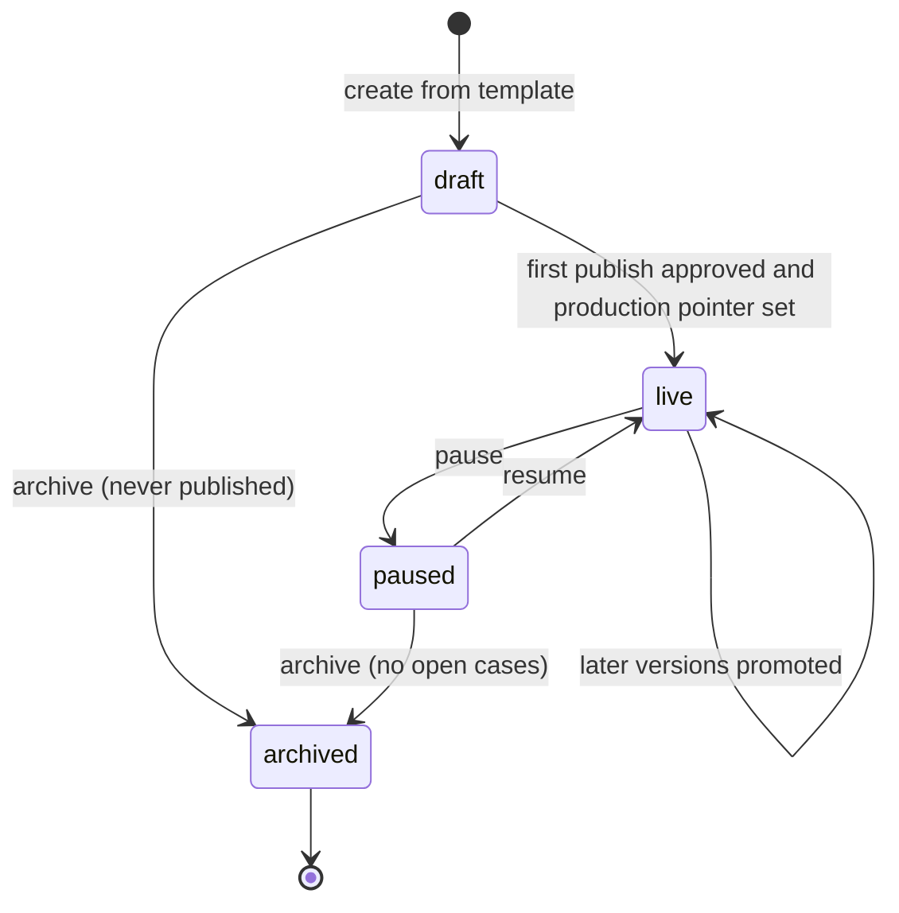
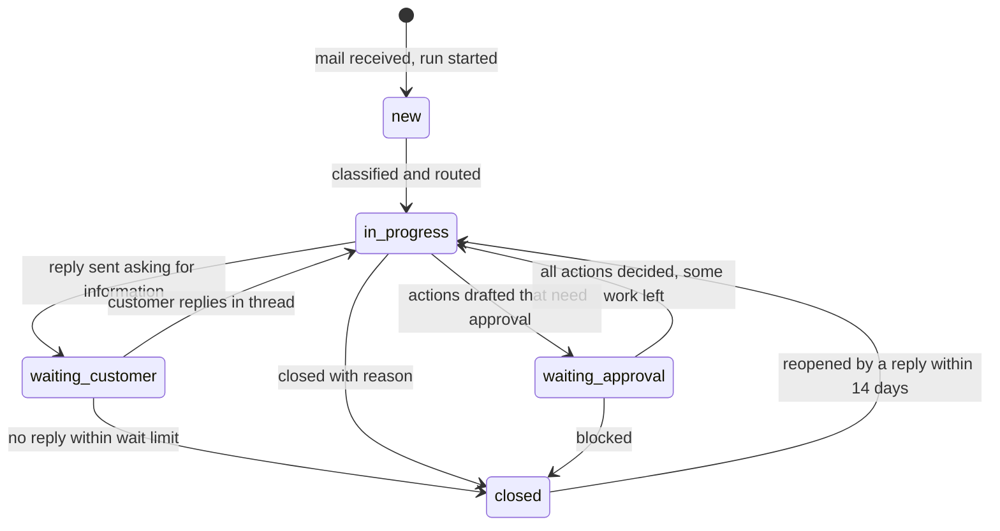
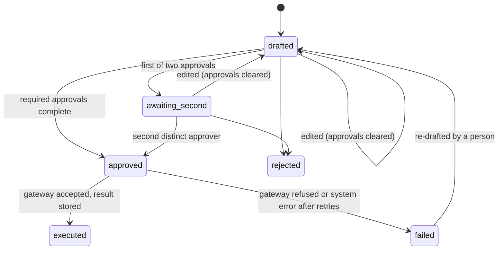
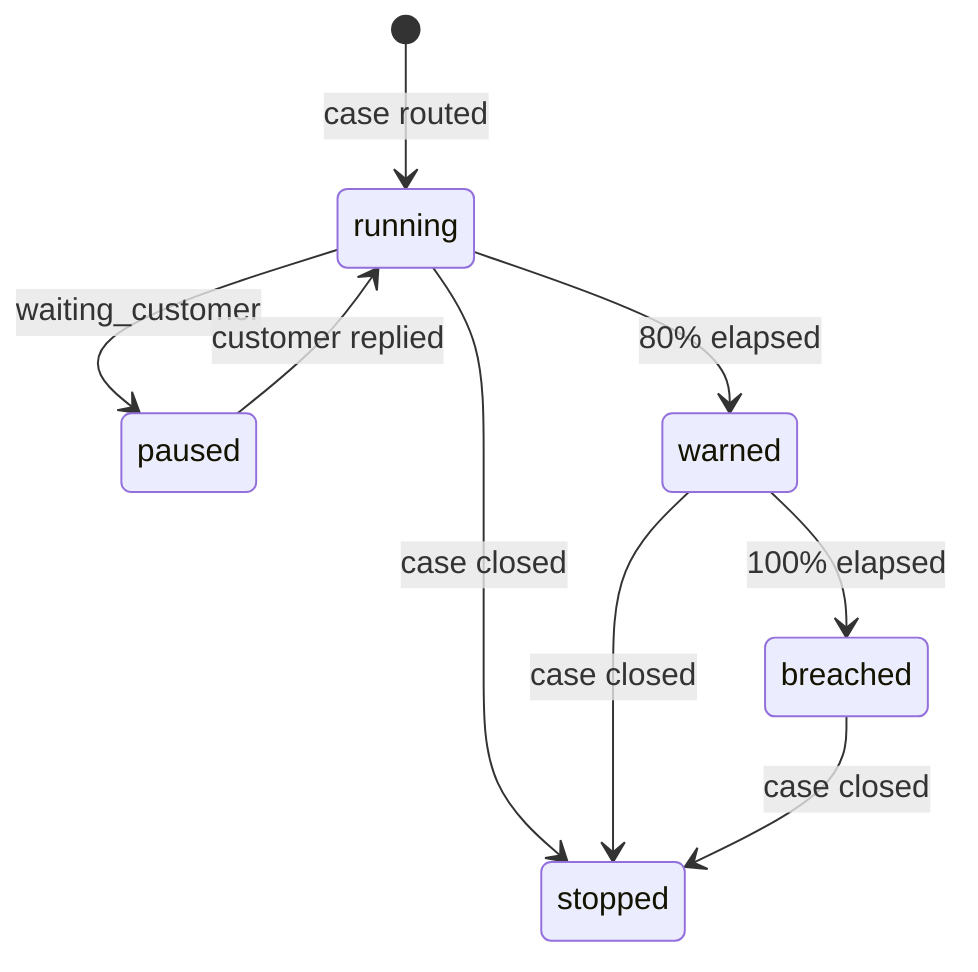

# 01 Agent Builder

Status: draft for review. Binding inputs: the architecture decision records ADR-0001 to ADR-0009
(`docs/architecture/decisions/`) and the problem statement (`docs/background/problem-statement.md`),
including its email-to-workflow reference flow. Lessons are cited from `docs/specs/design-lessons.md`
by section.

## 1. Summary

The Agent Builder is the registry and authoring layer of the platform. It holds every workflow,
agent, template, draft, version and release pointer, and it is the only write path for them. A
workflow is the only deployable unit. An agent is a versioned bundle of settings (instructions,
model alias, tool and knowledge grants, guardrails) that a workflow pins at publish. Ops teams
create workflows from templates, starting with the email-intake template: they define intents with
example emails, routing to queues with SLAs, and approval rules, test the draft on sample mail, and
send it for publish. Every save is classified into one of the problem statement's four edit classes, which decides
whether it applies at once, re-runs the suite, or goes back through the risk-tier gate. A publish
request goes to the Reviews queue and a different person approves it. At run time the human-in-the-loop
model is per action: each drafted write is shown as its exact payload, approved separately (by two
people when it moves money), bound to that payload by a signed token, and tracked against an SLA in
the cases workbench. Deployments bind a published workflow to a mailbox first, then the API and the
intranet chat widget behind staff SSO (no public deployment, ADR-0009). The editable canvas is phase 2
and is for platform builders; ops teams work in forms.

Release mechanics, the test suite, evidence and promotion are specified in `04-evals-and-release.md`;
this spec references them where a builder operation depends on them.

## 2. Scope

| In (this spec) | Phase |
|---|---|
| Registry: workflows, agents, agent packages, templates, node types, versions, drafts, annotations | 1 |
| Email-intake template: intents, extraction fields, routing, queues, SLAs, approval rules, sample-mail test | 1 |
| Edit classes and how each field is classified | 1 |
| Publish requests through the Reviews queue with maker-checker | 1 |
| Human-in-the-loop: per-action approval, four-eyes, approval tokens, SLA timers, timeouts | 1 |
| Cases, queues and SLA workbench | 1 |
| Mailbox deployments | 1 |
| Read-only canvas of any version (graph view of the expanded template) | 1 |
| API and intranet widget deployments (staff SSO only; public deployment is out of scope, ADR-0009) | Later (API phase 1.5; widget phase 2 with ADR-0009) |
| Editable canvas for builders, the full 28-node palette, further templates | Phase 2 |

| Out (owned elsewhere) | Spec |
|---|---|
| Test suites, baselines, evidence bundles, risk-tier gate composition, promotion and rollback | `04` |
| Knowledge sources, ingestion, scopes, citations | `02` |
| Tool modules, module scopes and approvals, mailbox intake adapter, AI gateway aliases | `03` |
| Chat sessions, MCP Apps | `07` |
| Delivery plan and team split | implementation plan |

## 3. Traceability

| Problem statement item | How this spec serves it | Section |
|---|---|---|
| Reason 1: agent written from scratch | Templates plus library agents, tool and knowledge modules; existing Python agents registered as agent packages | 4, 5.1, 5.3 |
| Reason 3: whole codebase reviewed as one block | A workflow is a schema-valid definition plus pinned, separately reviewed modules and agent packages | 4.3, 5.2 |
| Reason 4: risk review is a demo | Publish request carries the gate result and evidence reference; approver sees it in Reviews | 5.5, `04` |
| Reason 6: servers and keys per agent | Workflows hold no infrastructure; deployments bind to shared intake and the run identity from ADR-0005 | 5.9 |
| Reason 7: release window | Approval moves a pointer (`04`); no deploy step exists in the builder | 5.5 |
| Decision 1: module reviewed once, scoped approval | Tool and knowledge grants on an agent are scope requests resolved by the module owner (`03`); the builder refuses a publish whose scopes are unapproved | 5.4 |
| Decision 3: pointer promotion below a tier | Inherited risk tier computed per version; gate steps derive from it | 5.2 |
| Component: Agent Builder ("registry first, editor second") | Owner, version, risk tier and cost on every workflow; forms first, canvas phase 2 | 4.1, 7 |
| Edit classes: free, re-test, re-approval, locked | Every settable field carries a class; the save path follows it | 5.4 |
| Governance: human review is a block; reviewer overrides feed the test set | Per-action approval as a platform node; rejected and edited actions become suite candidates | 5.7, `04` |
| Governance: tool calls constrained by scope, not prompt | Classification selects queue and case type only; writes need a token bound to the payload | 5.7 |
| Operations: degraded mode fails into the human step | `error` node and manual-handling path are mandatory in every template | 5.6 |
| Knowledge requirement 5: citations logged with the decision | Each drafted action stores the citations the agent used; the approval record keeps them | 4.8 |
| Flow steps 1–4 and the versioning rule | Email-intake template; every configuration change is versioned, tested on sample mail, then published | 5.3, 5.5 |

## 4. Domain model

Identifiers are opaque strings with a type prefix (`wf_`, `ag_`, `cs_`). Times are UTC ISO 8601.
Every published or sealed row is immutable; edits create rows (design lessons, "Agent configuration and
versioning").

### 4.1 Workflow (registry entry)

| Field | Type | Notes |
|---|---|---|
| `id` | string | Stable for the workflow's life; the ADR-0005 workflow identity is registered against it |
| `name`, `description` | string | Free edit class (annotation) |
| `ownerRole`, `ownerGroup` | string | Owning ops team and accountable role; free edit class, but changing the owning group is logged with a reason |
| `kind` | `email_intake` \| `standard` \| `chat` | From the template; immutable |
| `templateRef` | `{templateId, version}` | Null for canvas-built workflows (phase 2) |
| `riskTier` | `low` \| `medium` \| `high` \| `critical` | Effective tier of the live production version: the higher of the declared tier and the inherited tier (5.2) |
| `declaredTier` | tier | Locked edit class: platform and Risk only |
| `status` | `draft` \| `live` \| `paused` \| `archived` | See state diagram |
| `pointers` | `{environment, versionNumber}[]` | Read model of the release pointers in `04` |
| `draft` | `DraftRef` \| null | At most one draft per workflow |
| `openPublishRequest` | `{reviewId, candidateDigest, requestedBy}` \| null | At most one open request per workflow |
| `costPerRun30d`, `runs24h`, `reviewed24h`, `openCases` | numbers | Computed server-side from the run journal and AI gateway log |
| `identityId` | string | Non-human identity in the bank IdP (ADR-0005) |

A workflow is never deleted once it has run. Archive stops triggers and hides it from lists; its
versions, runs, cases and evidence stay under the retention owner's rule (architecture overview open question 4).

### 4.2 Definition, draft and version

| Entity | Fields | Rules |
|---|---|---|
| `Definition` | `schemaVersion`, `templateRef`, `settings` (template settings object) or `graph` (nodes, edges), `pins` (resolved references, see below) | JSON, validated by the published JSON Schema (ADR-0003). Addressed by SHA-256 `digest` of its canonical form |
| `Draft` | `workflowId`, `definition`, `revision` (integer, increments per save), `savedAt`, `savedBy`, `authors[]` (everyone who saved since the live version), `baseVersion`, `check` (last server check result) | One per workflow. Saves need `If-Match: revision`. Not addressable by triggers or deployments |
| `Candidate` | `digest`, `definition`, `plan` (compiled execution plan digest), `createdFrom` (draft revision) | Frozen when a publish request is created; immutable |
| `Version` | `workflowId`, `number`, `digest`, `planDigest`, `inheritedTier`, `effectiveTier`, `note`, `changes[]`, `requestedBy`, `approvedBy[]`, `approvedAt`, `evidenceDigest`, `pins` | Created when a publish request is approved; numbers are assigned at approval, so a rejected request consumes none |
| `Pins` | `agents: {agentId, version}[]`, `modules: {name, version, scopeId}[]`, `knowledge: {moduleName, version}[]`, `aliases: string[]`, `template: {id, version}`, `nodeTypes: {id, version}[]` | Every reference pinned (ADR-0003). An unpinned reference fails the server check |
| `Annotation` | `targetType`, `targetId`, `path`, `value`, `updatedBy`, `updatedAt` | Holds free-class values (labels, descriptions, notes) outside the digest so they change without a version. Every write is an audit event |

Annotations are a decision this spec makes beyond the ADRs: free-class fields cannot live inside
an immutable digest and also be "saved, logged" without a version, so they sit beside it. The
interpreter never reads annotations.

### 4.3 Template

| Field | Type | Notes |
|---|---|---|
| `id`, `version` | string, integer | Templates are versioned and immutable per version |
| `kind` | `email_intake` (phase 1); `chat`, `approval`, `triage`, `document_intake`, `scheduled_review` later | |
| `structure` | graph with named slots | Locked structure; ops teams fill slots, never edit edges |
| `settingsSchema` | JSON Schema | What the forms render; validated server-side |
| `editClasses` | map of JSON Pointer → edit class | Classifies every settable path (5.4) |
| `defaults` | object | Includes the mandatory manual-handling and error paths |
| `owner` | platform team | New template types are a platform ticket (architecture overview, throughput) |

A workflow made from a template stores `templateRef` and `settings`. The compiler expands both into
a full graph before planning. A new template version never changes existing workflows; an owner
takes it by opening a draft, which the server check marks "template upgrade available".

### 4.4 Email-intake template settings

| Path | Type | Rules | Edit class |
|---|---|---|---|
| `intents[].id` | string | Stable; referenced by routes and tests | Locked after first publish (renaming breaks tests and history) |
| `intents[].name`, `.description` | string | Description is part of the classifier prompt | Name free; description re-test |
| `intents[].examples[]` | string[] | 2 to 20 example emails; fewer than 5 shows a warning | Re-test |
| `intents[].fields[]` | `{key, label, type, format, unit, description, required, sensitivity}` | `type` one of `string`, `number`, `money`, `date`, `account_ref`, `enum`; `money` needs `currency`; `unit` and `format` required for numbers (design lessons, "Evals and testing": units decide extraction accuracy) | Label free; everything else re-test; `sensitivity` re-approval |
| `intents[].actions[]` | `{actionId, tool or "send_reply", draftingAgentRef}` | Tool must be granted to the drafting agent | Re-approval when it adds a write or money-movement tool; otherwise re-test |
| `routes[]` | `{intentId, queueId, priority, slaHours, businessHours}` | One route per intent; queue must exist | Queue and priority re-test; `slaHours`, `businessHours` re-test |
| `fallbackQueueId` | string | Required; receives below-threshold and unclassified mail | Re-test |
| `confidenceThreshold` | number 0–1 | Below it no intent is chosen and no write action is drafted | Re-approval when lowered, re-test when raised |
| `approvals[]` | `{id, action, approverGroup, fourEyes, autoApproveBelow, currency}` | See 5.7 for the rules the server enforces | Re-approval |
| `agents.classifier`, `agents.drafter` | `{agentId, version}` | Library agents; versions pinned at publish | Re-test |
| `knowledge[]` | `{moduleName, version}` | Within the owning department's scope (`02`) | Re-test (document selection, problem statement) |
| `replyTemplate` | `{greeting, signature, disclaimer}` | Customer-facing wording | Re-test |
| `manualHandling` | `{queueId, notifyGroup}` | Where cases go when a step exhausts retries or a gateway is down | Re-test |

`IntentField` in `apps/console/src/lib/types/cases.ts` has `key`, `label`, `required` only; the added fields are
a gap the mock needs to close (section 7).

### 4.5 Agent, agent version and agent package

| Entity | Fields | Rules |
|---|---|---|
| `Agent` | `id`, `slug`, `name`, `role`, `ownerGroup`, `kind` (`configured` \| `packaged`), `latestVersion`, `archived` | `slug` immutable. An agent has no live/paused state of its own; "in production" is derived from pins (gap with mock `Agent.status`) |
| `AgentVersion` | `agentId`, `number`, `instructions` (ordered prompt fragments, stable first, design lessons "Prompting"), `modelAlias`, `toolGrants[]` (`{module, version, operations}`), `knowledge[]`, `guardrails` (`redactPii`, `maxToolCallsPerTurn`, `whenUnsure`, `blockedTopics`), `packageRef` (packaged only), `parameters` (packaged only), `note`, `savedBy`, `savedAt`, `promptTokens`, `effectiveTools[]` | Every save creates a version. `effectiveTools` is computed by the server from grants, module manifests and memory or knowledge settings, and shown in the builder (design lessons, "Tools, MCP and scoping": attaching a tool does not mean the agent will use it) |
| `AgentPackage` | `id`, `name`, `version`, `artifactDigest` (container or wheel), `entrypoint`, `parametersSchema`, `declaredTools[]`, `sourceRepo`, `reviewedBy`, `reviewedAt` | An existing Python agent (LangGraph or plain code) wrapped to run on the agent-block host (ADR-0003). Registered by the platform team after code review; reviewed once, reused by any workflow |
| `AgentUsage` (read model) | `workflowId`, `workflowName`, `pinnedVersion`, `environment`, `status` | The mock's `usedIn` |

### 4.6 Node type

| Field | Notes |
|---|---|
| `id`, `version` | The 28 ids from `apps/console/src/components/workflows/node-types.ts`, plus three platform nodes (5.6) |
| `group` | trigger, ai, tool, human, logic, output |
| `configSchema` | JSON Schema for the inspector; required fields fail the server check |
| `editClasses` | Per config path |
| `availability` | `template_only` \| `palette` \| `not_built` and the phase |
| `sideEffects` | `none` \| `read` \| `write` \| `money_movement`; drives inherited tier and the approval rules |

### 4.7 Human steps and decision tasks

| Entity | Fields | Rules |
|---|---|---|
| `HumanStepPolicy` | `id`, `nodeId` or `approvalRuleId`, `condition` (CEL expression), `approverGroup`, `fourEyes`, `slaMinutes` or `slaHours`, `businessHours`, `onTimeout` (`reassign` \| `escalate` \| `reject`), `escalateTo` | Part of the definition, so re-approval class. The mock's `GatePolicy` is a read projection of these |
| `DecisionTask` | `id`, `kind` (`publish_request` \| `gate_approval` \| `exception` \| `escalation` \| `case_action`), `subjectRef`, `workflowId`, `versionNumber`, `risk`, `assignee`, `approverGroup`, `approvals[]` (`{by, role, at}`), `requiredApprovals` (1 or 2), `status`, `slaDueAt`, `decidedAt`, `decisionReason` | One table for every pending human decision. Reviews lists all kinds except `case_action`, which is decided in the case so the approver sees the thread (5.8) |

`DecisionTask.status`: `pending` → `in_review` (assigned or first of two approvals) → `approved` \|
`rejected` \| `returned` \| `expired`. `returned` applies to publish requests only.

### 4.8 Case, queue, action, SLA

| Entity | Fields | Rules |
|---|---|---|
| `Queue` | `id`, `name`, `ownerGroup`, `members[]`, `leadRole`, `calendarId` | Created by the ops team lead; no platform ticket |
| `Calendar` | `id`, `timezone`, `businessHours[]`, `holidays[]` | Phase 1: one bank calendar per region; editable calendars later |
| `Case` | the mock's `CaseDetail` plus `runId`, `versionNumber`, `definitionDigest`, `threadKey`, `slaClock` | One active run per case (design lessons, "Queues, jobs and durable execution") |
| `CaseField` | `key`, `label`, `value`, `extractedValue`, `edited`, `editedBy` | Original extraction kept; edits are logged and become test-case candidates |
| `CaseAction` | the mock's `CaseAction` plus `payload` (exact tool input or reply MIME), `payloadHash`, `citations[]` (`{source, section, version}`), `approvalRuleId`, `editedBy[]`, `idempotencyKey` (`runId:actionId`), `executionAttempts` | The payload is what the tool will receive, verbatim (design lessons, "Human-in-the-loop") |
| `ApprovalToken` | `caseId`, `actionId`, `payloadHash`, `approvers[]`, `ruleVersion`, `issuedAt`, `expiresAt`, signature | Signed by the case service; verified by the data gateway (ADR-0005) |
| `SlaClock` | `startedAt`, `dueAt`, `warnAt` (80%), `state`, `pausedMinutes`, `breachedAt` | Deadline stored in PostgreSQL, enforced by a Temporal timer (ADR-0006) |

`waiting_approval → closed` is not allowed while any action is pending (mock rule in
`cases/index.ts`).

## 5. Behaviour

Each statement is testable; section 10 lists the end-to-end checks.

### 5.1 Registry

1. The registry is the only write path for workflows, agents, templates and pointers. Config-as-code
   imports call the same API and create drafts or versions; a nightly drift check compares the
   compiled plans the interpreter has loaded with registry digests and alerts on any difference
   (design lessons, "a second write path silently undoes the first").
2. Every list and count shown in the console is computed by the API (mock rule, `apps/console/CLAUDE.md`).
3. Every log line, run journal entry and gateway call carries `workflowId`, `versionNumber` and
   `definitionDigest` (design lessons, "Release, deploy and environments").
4. A workflow cannot be archived while it has open cases or an open publish request.

### 5.2 Risk tier

1. Inherited tier is the highest of: each pinned tool operation's side effect (`read` → low,
   `write` → medium, `money_movement` → high), each pinned agent package's declared tier, each
   knowledge module's sensitivity tier (`02`), and each node type's minimum tier.
2. Effective tier = max(declared tier, inherited tier). A draft cannot lower the effective tier;
   only the platform team with Risk can change the declared tier (locked class).
3. The server check reports the effective tier and which pin raised it, so an owner sees why
   adding a tool moved the workflow to `high`.
4. Gate steps for a publish are read from the effective tier of the candidate (`04`).
5. In phase 1 only `low` and `medium` versions can be promoted to production (ADR-0004). A version
   at `high` or `critical` can be drafted, tested and published to `test`; promote to production
   returns 422 with the tier and the condition that lifts it. Because `money_movement` raises the
   inherited tier to `high`, the first email workflow drafts no money-movement action.

### 5.3 Templates and the email-intake flow

1. `POST /workflows` with `template: email_intake` creates a draft whose settings hold the
   template defaults, the mandatory manual-handling path and an `error` node. The workflow is in
   `draft` and nothing runs.
2. The compiled email-intake graph is fixed: email trigger → extract text and attachment summaries
   → classify (intents) → condition (confidence ≥ threshold) → extract fields for the intent →
   open case (queue, priority, SLA) → knowledge search → draft actions → per-action approval →
   execute approved actions → end; below threshold → open case in fallback queue with no write
   actions drafted; any step past its retry budget → manual handling.
3. Classification selects an intent, queue and case type and nothing else. It cannot add an
   approval, remove one, or change who may approve (design lessons, "Identity, trust and tenancy": a classifier
   that picks a route makes a privilege decision when routes carry different access).
4. Sender claims, forwarded approvals and header-shaped text in the body are data. No setting or
   prompt variable is filled from email content except the fields the intent extracts, and those
   are typed values, never instructions (design lessons top lesson 1).
5. The sample-mail test runs the draft's compiled plan in test mode through both gateways with
   writes stubbed at the data gateway (architecture overview, mock API mapping). It returns the intent, confidence,
   extracted fields, queue, priority, SLA, the drafted action payloads, which actions need approval
   and by whom, citations, model cost and latency. It opens no case and sends no mail.
6. A sample-mail result can be saved as a suite case in one call, with the current result as the
   proposed expectation for the owner to correct (`04`).

### 5.4 Drafts and edit classes

1. Saving a draft requires `If-Match` with the current revision; a stale revision returns 409 with
   the newer revision's author and time. Two editors never overwrite each other silently.
2. The server classifies each saved change by the template's or node type's edit-class map and
   returns the classes present. The highest class in a draft decides what the publish request needs.

| Class | What it covers (email template and agents) | What a save does |
|---|---|---|
| Free | Workflow name and description, intent names, field labels, queue display names, notes, version notes | Writes an annotation at once; logged; no version, no publish, digest unchanged |
| Re-test | Intent descriptions and examples, extraction fields and formats, reply template, agent instructions and fragments, knowledge selection, routing (queue, priority, SLA hours), fallback queue, raising the confidence threshold, agent version bumps, guardrail `blockedTopics`, `whenUnsure`, `maxToolCallsPerTurn` | Saved to the draft; the suite runs when a publish is requested; the gate for the effective tier applies (`04`) |
| Re-approval | Approval rules (group, four-eyes, auto-approve limit), human-step conditions and timeouts, lowering the confidence threshold, adding a write or money-movement action to an intent, a new tool grant on an agent (a scope request to the module owner), field sensitivity, turning `redactPii` off | As re-test, plus the gate's approval steps for the tier (for `high` and above a second-line approver, `04`) and any module scope approval (`03`) must complete before the version can be promoted |
| Locked | Model alias on an agent, module scope definitions, gate composition per tier, declared risk tier, intent ids after first publish, template structure | Not editable by ops roles; the API returns 403 with the owning role. Platform and Risk change these through their own audited operations |

3. The problem statement lists "module scope" under re-approval and "module scopes" under locked. This spec reads
   them as: requesting an existing scope for a workflow is re-approval (the module owner approves,
   `03`); changing what a scope permits is locked.
4. A draft that touches only free-class paths is rejected with 422 "nothing to publish" if sent as
   a publish request.
5. Discarding a draft deletes the draft row and keeps its revisions in the audit log.

### 5.5 Versions and publish requests (maker-checker)

1. A publish request freezes the draft into a candidate (digest), runs the server check, and starts
   the eval run for that digest (`04`). The request is created even while the eval run is still
   going; the approver sees it complete.
2. Structural errors block the request: missing trigger, unconnected steps, unchosen agent or tool,
   unassigned reviewers, an unpinned reference, a schema violation, a money-movement step reachable
   without a four-eyes approval, a write step reachable without any approval step, an approval rule
   that breaks 5.7, an unapproved module scope, an expired module approval. The mock treats
   "money step reachable without a gate" as a warning (`graph-checks.ts`); here it is an error.
3. One open publish request per workflow; a second returns 409 (mock behaviour).
4. The approver must be a different person from the requester and from every author in the draft's
   `authors[]`. Self-approval returns 409 (mock rejects the requester only; this spec extends it to
   authors, since the person who wrote the change is the maker).
5. Only a human session can decide a publish request. Service identities and agents receive 403 on
   the decision endpoint (design lessons, "agents must not decide approvals").
6. Approval assigns the next version number, seals the evidence bundle (`04`), writes the version,
   and moves the `test` pointer (ADR-0004). The production pointer moves in the same transaction when
   the request asked for it and the tier's gate allows promotion on approval (`04`, "promotion by
   pointer"); otherwise the version waits for a promote call.
7. Rejecting or returning requires a reason. Returning keeps the draft for the requester to change;
   rejecting keeps it too but closes the request.
8. Requests expire after the publish policy SLA (default one business day, mock `PUBLISH_POLICY`)
   with status `expired`; the draft stays.
9. A new version never changes a run that has started. A case keeps the digest it started with to
   the end; new mail starts on whatever the pointer says when it arrives (architecture overview, end-to-end flow).
10. Restoring an older version creates a draft from that version's definition with the current pins
    re-resolved and flagged; it does not publish. The mock's `restore` publishes directly, which
    bypasses maker-checker (gap, section 7). Moving production back to an earlier version is a
    rollback (`04`), which needs no new draft.
11. Agent saves never change a published workflow. A workflow takes a new agent version only
    through its own publish; the agent page shows each workflow's pinned version and "newer
    version available".

### 5.6 The 28-node catalog

The mock's palette (`apps/console/src/components/workflows/node-types.ts`) has 28 node kinds. The interpreter
builds only the node types the email template needs in phase 1 (ADR-0001). ADR-0001 names the six
phase-1 template types and maps them onto this table: `classify_intent` (row 9), `extract_fields`
(row 10) and `send_reply` (row 26) are configurations of existing nodes; `open_case` (P1),
`draft_action` (P2) and `per_action_approval` (P3) are new platform nodes. Expressions in `condition`,
`switch`, `set` and gate conditions use CEL (Common Expression Language): non-Turing-complete,
deterministic, with a maintained Python implementation, so the same expression is evaluated by the
server check and the interpreter (ADR-0002 "one implementation of validation"). The ADRs do not
make this choice; this spec does.

| # | Node | Group | Phase | Interpreter behaviour | Notes and gaps |
|---|---|---|---|---|---|
| 1 | Chat message | trigger | 2 | One run per conversation, Update per message (ADR-0009) | |
| 2 | API call | trigger | Later (1.5) | Authenticated request under ADR-0005 delegation; returns output | |
| 3 | Email received | trigger | 1 | Started by intake with the run id derived from message id | Mock stores the inbox on the node; the mailbox belongs to the deployment (5.9) |
| 4 | Event / webhook | trigger | Later | Event from a module subscription | |
| 5 | Schedule | trigger | Later | Temporal schedule | |
| 6 | Batch file | trigger | Later | One child run per row | |
| 7 | Agent | ai | 1 | Runs a pinned agent version on the agent-block host | |
| 8 | Prompt | ai | Later | One model call through the AI gateway, no tools | |
| 9 | Classify and route | ai | 1 | Classifies into labelled paths; in the email template the labels are intents | Phase-1 configuration `classify_intent` (ADR-0001) |
| 10 | Extract | ai | 1 | Typed fields per the field contract (4.4) | Phase-1 configuration `extract_fields` |
| 11 | Knowledge search | tool | 1 | Scoped query through the data gateway; citations kept on the run | |
| 12 | Tool | tool | 1 | Read operations run directly; write and money operations only as drafted actions behind approval | |
| 13 | HTTP request | tool | Not built | | Ad-hoc HTTP bypasses the module model (ADR-0005, `03`). An owner imports the API as an OpenAPI module instead. Remove from the palette |
| 14 | Code | tool | Later | Sandboxed Python, platform-reviewed per use | Mock says JavaScript; ADR-0002 makes executing code Python. Re-approval class |
| 15 | Run workflow | tool | Later | Child run of a pinned version | |
| 16 | Approval gate | human | 1 | Pauses into a decision task with SLA | |
| 17 | Two-person approval | human | 1 | Same node type with `fourEyes: true` | Kept as a palette entry; one node type in the schema |
| 18 | Ask the customer | human | 1 (template only) | Drafts a reply (approved like any reply), sets `waiting_customer`, pauses the SLA, waits for an inbound mail on the thread | Palette entry phase 2 |
| 19 | Hand off to person | human | 1 (template only) | Routes the case to a queue for manual handling; run ends or waits for a manual-complete Update | |
| 20 | Condition | logic | 1 | CEL boolean | |
| 21 | Switch | logic | Later | CEL value to labelled path | |
| 22 | Loop | logic | Later | Per-item iteration with a cap | |
| 23 | Wait | logic | Later | Durable timer or event | |
| 24 | Set fields | logic | Later | CEL assignments to run variables | |
| 25 | Reply | output | 2 | Reply on the triggering chat channel | |
| 26 | Send email | output | 1 | Drafted reply action through operation `mail.send_reply` of module `m365-mail`; needs a human-approval token, or a policy approval token where the gate policy names `send_reply` (5.7.6) | Phase-1 configuration `send_reply` |
| 27 | End | output | 1 | Terminal outcome label | |
| 28 | On error | output | 1 | Path for any step past its retry budget; mandatory in every template | |
| P1 | Open case (`open_case`) | human | 1 (template only) | Creates the case, routes to queue, starts the SLA timer | Not in the mock palette; the email graph implies it |
| P2 | Draft actions (`draft_action`) | ai | 1 (template only) | Runs the drafting agent (row 7) per intent action; stores full payloads and citations; no side effects | Not in the mock palette |
| P3 | Approve each action (`per_action_approval`) | human | 1 (template only) | One decision task per action needing a person, using the machinery of rows 16 and 17; actions a gate policy covers get a policy approval token (5.7.6); executes each when its approvals complete | The mock draws this as a review node with condition "per action" |

Phase 1 builds 14 of the 28 plus the three platform nodes, 31 node types in the schema.

### 5.7 Human-in-the-loop

1. A drafted action holds the complete payload the tool will receive. The approver sees it
   verbatim; approval binds to its hash (design lessons, "Human-in-the-loop").
2. Editing an action replaces the payload, clears every prior approval and returns the action to
   `drafted` (mock behaviour, `cases/index.ts`). The edit is logged with the before and after
   payloads.
3. A tool input must validate against the module's input schema; a reply must be a valid message
   from an approved sender. Invalid edits return 400 (the mock checks JSON only).
4. Four-eyes means two distinct people from the approver group. The second approver cannot be the
   first, and neither can be anyone who edited the payload since the draft was produced. A
   repeated approval by the same person returns 409.
5. Every action whose tool operation is `money_movement` requires four-eyes; a rule that sets
   `fourEyes: false` for it fails the server check (the mock's form enforces this in
   `approvals-tab.tsx`; the server must too).
6. `autoApproveBelow` is a **policy approval** (ADR-0005, ADR-0005). It is refused for
   `money_movement` operations, and allowed only for the `write` operations the approval rule names,
   in workflows at effective tier `low` or `medium`. When it applies, the case service issues a
   policy approval token: the same token shape, bound to the same payload hash, with
   `approvedBy = policy`, the approval rule id and the version that sealed it, which was approved
   through the publish four-eyes. The case shows the action as "Approved by policy vN" and the audit
   log records it. A policy approval is never issued on an SLA timeout (5.8.3). The mock seeds an
   auto-approve limit on `issue_provisional_credit` (a money movement); that seed becomes invalid.
   Security confirms the token type before the first workflow uses it (architecture overview open question 19).
7. On approval the case service signs an `ApprovalToken` and sends a Temporal Update; the
   interpreter calls the data gateway with the delegation token and the approval token; the gateway
   refuses the call if the payload hash differs or the token has expired (ADR-0005). Token lifetime is
   24 hours; an expired token sends the action back to `drafted`.
8. Execution uses the idempotency key `runId:actionId`; a retried execution cannot double-post (architecture overview,
   failure modes).
9. Rejection requires a reason. The rejected action, its reason and the case become a suite
   candidate for the owner to accept (`04`).
10. A case action can only be decided by a human session whose user is a member of the approver
    group and is entitled (ADR-0005) to the operation on that account. The UI hides actions the user
    cannot approve; the API enforces it.
11. If approval arrives while Temporal is unavailable, the decision and an outbox row commit in one
    transaction and the Update is delivered later (architecture overview, failure modes).

### 5.8 Cases, queues and SLAs

1. The SLA due time is computed at routing from the route's `slaHours` and the queue calendar when
   `businessHours` is true. The deadline lives on the case row; a Temporal timer fires the warning at
   80% and the breach at 100%.
2. `waiting_customer` pauses the clock; the paused minutes extend `dueAt` when the customer replies.
   No other status pauses it.
3. On breach the case appears in the `breaching` view and the human-step policy's `onTimeout`
   applies: `reassign` to the queue lead, `escalate` to a named group, or `reject` the pending
   actions with reason "SLA expired". Auto-approval on timeout is not an option at any tier; the
   mock's "Auto-approve if confidence ≥ 0.9" timeout on a disputes gate becomes invalid.
4. An inbound mail on the same thread (`threadKey` from the conversation and references headers)
   attaches to the open case and never starts a second run. A reply to a case closed less than 14
   days ago reopens it; later replies start a new case linked to the old one.
5. A case can be closed only when no action is pending; closing needs a reason (mock behaviour).
6. Correcting an extracted field keeps the extracted value, logs the edit, and offers the case as a
   suite candidate. Field edits do not re-run drafting automatically; a person can ask the run to
   re-draft, which produces new action rows.
7. Views: `mine`, `team`, `breaching`, `awaiting_me` (actions the current user may approve now),
   `closed`, with server-side counts and stats (mock `CaseViewCounts`, `CaseStats`).
8. Case-action approvals are decided in the case only. Reviews lists publish requests, canvas gate
   approvals, exceptions and escalations; Overview counts both sources without double counting.

### 5.9 Deployments

1. A deployment binds a workflow to a channel in an environment. It never serves a draft (mock rule).
2. A deployment does not pin a version. It follows the workflow's release pointer for its
   environment (`04`), so every channel of a workflow runs the same version and evidence applies to
   all of them. The mock's per-deployment `version`, "Move to vN" and deployment `promote` become
   pointer operations on the workflow (gap, section 7). The ADRs leave this open; this spec decides it.
3. A mailbox deployment needs: the shared mailbox address, folders to watch, reply-from address,
   security scan on, archive on. Connecting it registers the folders with the intake adapter, which
   polls Graph delta every 60 s per folder in phase 1 (`03` 5.6.3, ADR-0007); the mailbox's process
   principal is created with the entitlements the owning team approved (ADR-0005).
4. A mailbox address can be bound to one active deployment per environment; a second returns 409.
5. When Graph consent is revoked or polling fails past its retry budget, the deployment shows `error` with the
   reason, the owning team is alerted, mail stays in the mailbox, and reconnecting backfills by delta
   query with no duplicate runs (architecture overview, failure modes).
6. Pausing a workflow stops new runs for every deployment; arriving mail is held and processed in
   arrival order on resume. Open cases continue.
7. `repliesNeedReview: false` on a mailbox deployment is refused unless the workflow's approval
   rules allow auto-approval for `send_reply` (5.7.6); the setting is a projection of the rule, not
   a second control.

### 5.10 Canvas (phase 2)

1. Phase 1 shows a read-only graph of any version, expanded from the template, with run traces
   overlaid (mock Runs tab).
2. Phase 2 opens the editable canvas to the builder role: the full palette of built node types,
   the inspector driven by `configSchema`, and the same server check as forms. Canvas-built
   workflows carry `templateRef: null` and need a platform-team review on first publish.
3. A field declared in a node's config that no downstream step reads is flagged by the check
   (design lessons, "a documented contract with no consumer").

## 6. API

Language-neutral HTTP API under `/v1`, described in OpenAPI 3.1 and generated from the Python
models (ADR-0002). Conventions for every endpoint:

| Concern | Rule |
|---|---|
| Lists | `page`, `pageSize` (max 100), `search`, `sortBy`, `sortOrder`, `filter[<key>]=a,b`; response `{data, pagination, facets}` (mock `ListResult`) |
| Errors | RFC 9457 problem details with a stable `code`; 400 invalid input, 403 not permitted (with `requiredRole`), 404 not found or not visible (same response, design lessons existence oracle), 409 conflict, 412 stale `If-Match`, 422 rule violation |
| Idempotency | Every `POST` that creates or decides accepts `Idempotency-Key`; replays within 24 hours return the first response |
| Concurrency | Drafts, agent saves and settings use `ETag` / `If-Match` |
| Bulk | `{updated[], skipped[{id, reason}]}`; nothing is dropped silently (mock `BulkResult`) |
| Identity | Every call carries the user session; decisions refuse service identities |

### 6.1 Workflows, drafts, versions

| # | Operation | Request | Response | Errors | Phase |
|---|---|---|---|---|---|
| 1 | `GET /workflows` | list params; filters `status`, `kind`, `ownerGroup`, `riskTier` | `ListResult<Workflow>` | | 1 |
| 2 | `POST /workflows` | `name`, `templateId`, `templateVersion?`, `ownerGroup`, `agentSlug?` (chat) | `Workflow` with `draft` | 422 unknown template | 1 |
| 3 | `GET /workflows/{id}` | | `WorkflowDetail`: workflow, live definition per environment, draft, open request, effective tier | 404 | 1 |
| 4 | `PATCH /workflows/{id}` | free-class fields only (`name`, `description`, `ownerGroup` with `reason`) | `Workflow` | 422 non-free field | 1 |
| 5 | `POST /workflows/{id}/status` | `status: live \| paused` | `Workflow` | 422 draft cannot go live by status | 1 |
| 6 | `POST /workflows/{id}/archive` | `reason` | `Workflow` | 409 open cases or request | 1 |
| 7 | `PUT /workflows/{id}/draft` | `If-Match`, `definition` | `Draft` with `check` and `editClasses[]` | 412, 400 schema | 1 |
| 8 | `DELETE /workflows/{id}/draft` | `If-Match` | 204 | 409 request open | 1 |
| 9 | `POST /workflows/{id}/draft/check` | none (checks the saved draft) | `{issues[{path, nodeId, severity, code, message}], effectiveTier, tierRaisedBy[], editClasses[], pins}` | | 1 |
| 10 | `POST /workflows/{id}/draft/sample-mail` | `from`, `subject`, `body`, `attachments[]` (refs) | `SampleMailResult` plus `actions[].payload`, `citations[]`, `costUsd`, `runJournalRef` | 422 draft has structural errors | 1 |
| 11 | `GET /workflows/{id}/versions` | | `Version[]` with pointer positions | | 1 |
| 12 | `GET /workflows/{id}/versions/{n}` | | `Version` with definition, pins, evidence digest | 404 | 1 |
| 13 | `POST /workflows/{id}/versions/{n}/restore-to-draft` | `If-Match` of current draft or none | `Draft` | 409 request open | 1 |
| 14 | `POST /workflows/{id}/publish-requests` | `note`, `promoteToProduction: bool`, `changeReference?` | `Review` (kind `publish_request`) with `candidateDigest`, `evalRunId`, `gate` | 409 one open; 422 structural errors or free-only draft | 1 |
| 15 | `POST /publish-requests/{reviewId}/withdraw` | `reason` | `Review` | 403 not requester | 1 |
| 16 | `POST /workflows/bulk` | `ids`, `status?`, `ownerGroup?` | `BulkResult` | | Later |
| 17 | `GET /workflows/{id}/runs` | list params; filter `status`, `version` | `ListResult<WorkflowRun>` from the run journal | | 1 |
| 18 | `GET /runs/{runId}` | | `WorkflowRun` with steps, gateway call refs, cost | 404 | 1 |

The mock's `validate` and `lastValidation` move to `04` (eval runs). The mock's `requestPublish`
takes the graph and a client-computed `checksFailing`; here the server freezes the saved draft and
computes checks itself.

### 6.2 Templates and node types

| # | Operation | Response | Phase |
|---|---|---|---|
| 19 | `GET /templates` | `{id, version, kind, name, description}[]` | 1 |
| 20 | `GET /templates/{id}/versions/{v}` | `settingsSchema`, `editClasses`, `defaults`, read-only `structure` | 1 |
| 21 | `GET /node-types` | `NodeType[]` with `configSchema`, `editClasses`, `availability`, `sideEffects` | 1 |
| 22 | `POST /templates`, `POST /templates/{id}/versions` | platform role only | Later |

### 6.3 Agents and packages

| # | Operation | Request | Response | Errors | Phase |
|---|---|---|---|---|---|
| 23 | `GET /agents` | list params; filters `ownerGroup`, `kind`, `inProduction` | `ListResult<Agent>` with `tasks24h`, `autoResolvedRate` | | 1 |
| 24 | `POST /agents` | `name`, `role`, `ownerGroup`, `kind`, `modelAlias`, `packageRef?` | `Agent` (version 1) | 403 alias not allowed for role | 1 |
| 25 | `GET /agents/{id}` | | `Agent` with latest version, `effectiveTools`, `usedIn` | | 1 |
| 26 | `POST /agents/{id}/versions` | `If-Match: latestVersion`, typed `changes` (`instructions`, `toolGrants`, `knowledge`, `guardrails`, `parameters`), `note` | `AgentVersion` with `editClasses[]`, `scopeRequests[]` created | 412; 403 locked field (`modelAlias`) | 1 |
| 27 | `GET /agents/{id}/versions` | | `AgentVersion[]` | | 1 |
| 28 | `POST /agents/{id}/versions/{n}/restore` | `note` | new `AgentVersion` copied from n | | 1 |
| 29 | `POST /agents/{id}/test` | `version` or unsaved `changes`, `message`, `seedContext?` | `AgentTestTurn` (mock) plus `costUsd`, `gatewayCallRefs` | | 1 |
| 30 | `POST /agents/{id}/archive` | `reason` | `Agent` | 409 pinned by a pointed version | Later |
| 31 | `POST /agent-packages` | `artifactDigest`, `entrypoint`, `parametersSchema`, `declaredTools`, `sourceRepo`, `reviewRef` | `AgentPackage` | 403 platform role only | 1 |
| 32 | `POST /agents/{id}/model-alias` | `alias`, `reason` | `AgentVersion` | 403 unless platform or Risk role | Later |

The mock's `agents.update` (PATCH) is replaced by operation 26. Clients send typed changes against
a base version, never a whole configuration (design lessons, PATCH-clobber lesson). The mock's
`agents.setStatus` has no equivalent; an agent's production status is derived from pins.

### 6.4 Reviews and human-step policies

| # | Operation | Request | Response | Errors | Phase |
|---|---|---|---|---|---|
| 33 | `GET /reviews` | list params; `view` (`mine`, `open`, `overdue`, `resolved`, `all`); filters `risk`, `workflowId`, `kind` | `ListResult<Review>` with `viewCounts`, `stats` | | 1 |
| 34 | `GET /reviews/{id}` | | `Review`; publish requests include `publish.changes`, `gate`, `evalRun` summary, `candidateDigest` | 404 | 1 |
| 35 | `POST /reviews/{id}/decisions` | `decision` (`approved`, `rejected`, `returned`), `reason?`, `overrideReasons?` (for advisory gate steps, `04`) | `Review` | 409 self-approval, author approval, already decided, same approver twice; 400 missing reason; 422 gate step blocking | 1 |
| 36 | `POST /reviews/assign` | `ids`, `assignee?` | `BulkResult` | | 1 |
| 37 | `POST /reviews/bulk-decisions` | `ids`, `decision`, `reason?` | `BulkResult`; skips publish requests, four-eyes items and `high`/`critical` risk (mock rules) | | Later |
| 38 | `GET /human-step-policies` | list params; filter `workflowId` | Read projection of human steps in pointed versions, with `hits7d` | | 1 |

The mock's `policies.create`, `update`, `remove` and bulk edits change gate behaviour immediately.
Here those are re-approval edits made in a workflow draft; the policies page becomes a read view
with "Edit in draft" links (gap, section 7).

### 6.5 Cases and queues

| # | Operation | Request | Response | Errors | Phase |
|---|---|---|---|---|---|
| 39 | `GET /cases` | list params; `view`; filters `queue`, `intentId`, `status`, `priority` | `ListResult<CaseRow>` with `viewCounts`, `stats` | | 1 |
| 40 | `GET /cases/{id}` | | `CaseDetail` with actions (payload, citations, approvals), events, SLA clock | 404 | 1 |
| 41 | `PUT /cases/{id}/fields/{key}` | `value` | `CaseDetail` | 400 type mismatch | 1 |
| 42 | `POST /cases/assign` | `ids`, `assignee` | `BulkResult` | | 1 |
| 43 | `POST /cases/close` | `ids`, `reason` | `BulkResult` (skips cases with pending actions) | | 1 |
| 44 | `POST /cases/{id}/actions/{actionId}/decisions` | `decision` (`approve`, `reject`), `reason?` | `CaseAction` | 409 same approver, editor approving, not pending; 403 not in group or not entitled | 1 |
| 45 | `PUT /cases/{id}/actions/{actionId}/payload` | `payload`, `If-Match` | `CaseAction` (approvals cleared) | 400 schema; 409 not drafted | 1 |
| 46 | `POST /cases/{id}/redraft` | `reason` | `CaseDetail` with new action rows | 409 actions pending | Later |
| 47 | `GET /queues` | | `{queues[], assignees[], approverGroups[]}` (mock `cases.queues`) | | 1 |
| 48 | `POST /queues` | `name`, `ownerGroup`, `members[]`, `calendarId` | `Queue` | 403 not queue lead | 1 |
| 49 | `PATCH /queues/{id}` | `name?`, `members?`, `calendarId?` | `Queue` | | 1 |
| 50 | `GET/PUT /calendars/{id}` | business hours, holidays | `Calendar` | | Later |

Run-side service operations (not HTTP; Temporal Updates and activities, ADR-0001):

| Operation | Caller | Effect | Phase |
|---|---|---|---|
| `actionDecided(caseId, actionId, token)` | Case service via outbox | Interpreter executes or records rejection | 1 |
| `customerReplied(caseId, messageRef)` | Intake | Resumes a `waiting_customer` run | 1 |
| `manualComplete(caseId, outcome)` | Case service | Ends a manual-handling wait | 1 |
| `slaTimerFired(caseId, kind)` | Temporal timer | Warning or breach handling (5.8) | 1 |

### 6.6 Deployments, overview, lookups

| # | Operation | Request | Response | Errors | Phase |
|---|---|---|---|---|---|
| 51 | `GET /deployments` | list params; filters `channel`, `environment`, `workflowId`, `status` | `ListResult<Deployment>` with the served version from the pointer | | 1 |
| 52 | `POST /deployments` | `name`, `workflowId`, `channel: email`, `environment`, `email{inboundAddress, folders[], replyFrom, securityScan, archive}` | `Deployment` (`sync.status: syncing`) | 422 workflow never published; 409 mailbox bound | 1 |
| 53 | `PATCH /deployments/{id}` | `name?`, `status?`, `email.folders?`, `email.replyFrom?` | `Deployment` | 422 `version` field (pointer owns it) | 1 |
| 54 | `POST /deployments/{id}/reconnect` | none | `Deployment` with backfill progress from the stored delta tokens | 502 Graph refused | 1 |
| 55 | `POST /deployments` with `channel: api`; `POST /deployments/{id}/rotate-key` | API config | key shown once | | Later |
| 56 | `POST /deployments` with `channel: widget` | widget config; intranet origins only, staff SSO required | | 422 public origin or anonymous access | Later (phase 2) |
| 57 | `DELETE /deployments/{id}` | | 204 | 409 active production | Later |
| 58 | `GET /overview` | | `Overview` with `cases` block | | 1 |
| 59 | `GET /lookups` | | `Lookups` (mock), plus `modelAliases`, `riskTiers` | | 1 |

**Phase-1 count for this spec: 49 operations** (numbered rows marked phase 1: 1–15, 17–21, 23–29,
31, 33–36, 38–45, 47–49, 51–54, 58, 59), plus four run-side service operations.

## 7. UI mapping

| Route or dialog | API | Gaps between mock and spec |
|---|---|---|
| `/` Overview | 58 | None beyond server-computed counts already in the mock |
| `/agents` list, Create agent dialog | 23, 24 | Model select must list bank aliases, and only roles allowed to set aliases may choose; drop `status` facet |
| `/agents/[id]` settings, Save as version | 25, 26 | Save sends typed changes with `If-Match`; show `editClasses` and any scope requests created; model field read-only for ops roles; show `effectiveTools` |
| Grant tools dialog | 26 | Granting a write tool creates a scope request to the module owner (`03`); show pending state |
| History sheet, restore | 27, 28 | None |
| Test sheet | 29 | Show cost and gateway refs; runs through both gateways in test mode |
| `/workflows` list, Create workflow dialog | 1, 2 | Template choice lists `GET /templates`; phase 1 offers email intake only. Mock `WorkflowInput.template` values `approval`, `triage`, `blank` are phase 2 |
| `/workflows/[id]` Canvas tab | 3, 21, 7, 9 | Read-only in phase 1; checks come from operation 9, replacing client-side `graph-checks.ts`; money step without four-eyes becomes an error |
| Intents, Routing & SLAs, Approval rules tabs | 7, 9, 47 | Field contract needs `type`, `format`, `unit`, `sensitivity`; approval form must refuse auto-approve on money tools; show the edit class of each change before save |
| Tests tab, sample-mail tester | 10, `04` | Show drafted payloads and citations; "Save as test case" |
| Request publish dialog | 14, 9, `04` | Server freezes the saved draft; dialog shows gate steps per tier (blocking, advisory with override, passed), not only "advisory"; add `promoteToProduction` and change reference for tiers that need one |
| Runs tab, Run sheet | 17, 18 | None |
| Versions tab, Restore version dialog | 11, 12, 13 | Restore creates a draft; dialog copy must say nothing is published; pointer positions per environment shown |
| Deployments tab | 51 | Version column shows the workflow's pointer for that environment; deployments carry no version of their own |
| Settings tab | 4, 5, 6 | Delete becomes Archive |
| `/deployments`, New deployment wizard, Deployment sheet | 51–54 | Remove "Move to vN" and staging-to-production `promote`; replace with a link to the workflow's releases (`04`). Environment `staging` is renamed `test` (ADR-0004). Add Reconnect for mailbox errors. Widget and API channels hidden in phase 1; the public website widget and its allowed-domains field are removed (ADR-0009) |
| `/reviews`, Review detail sheet | 33–36 | Publish requests show the gate result and evidence link; approver records override reasons for advisory failures; case actions no longer appear here |
| Bulk decision dialog | 37 | Later |
| `/reviews/policies`, gate dialogs | 38 | Read-only; create and edit move into workflow drafts |
| `/cases`, `/cases/[id]`, action card | 39–45, 47 | Action card shows payload hash state, approver group, who may still approve, citations with versions; editing shows that approvals were cleared |
| `/tools` | `03` | Tool access level drives tier and approval rules here |

## 8. Security, audit and evidence

### 8.1 Roles

| Role | May | May not |
|---|---|---|
| Workflow editor (ops team) | Create workflows from templates, edit drafts, run sample mail, add test cases, request publish | Approve own or co-authored publish; change locked fields |
| Publisher | Approve another person's publish request; promote and roll back within the tier's rules (`04`); pause and resume | Approve a request they requested or authored |
| Workflow owner | All editor rights; change owner group with reason; archive | Change declared tier |
| Queue lead | Create and edit queues, assign cases, receive SLA escalations | Approve actions outside their approver group |
| Approver (per approver group) | Decide case actions and gate approvals for their group, within their own entitlements | Approve an action they edited; give both approvals of a four-eyes action |
| Agent author | Create agents and save versions | Change model alias |
| Module owner | Approve or revoke scope requests (`03`) | Edit workflows that consume the module |
| Platform team | Templates, node types, agent packages, model aliases, declared tiers with Risk | Decide publish requests for workflows they authored |
| Model Risk, second line | Second-line approval on `high` and `critical` publishes (`04`); declared tier with platform | |
| Auditor | Read everything, including the audit log and evidence | Write anything |

Roles come from the bank IdP groups; the registry stores group ids, not people.

### 8.2 Audit events

Every event goes to the append-only, hash-chained audit table and the SIEM export (ADR-0006):
annotation writes, draft saves (revision, author, edit classes), publish request created,
withdrawn, decided (with override reasons), version sealed, pointer moves (`04`), status changes,
archive, agent versions, agent package registration, model alias changes, queue changes, case field
edits, action edits (before and after payload hashes), action decisions, approval tokens issued,
SLA warnings and breaches, timeout handling, deployment create, change, reconnect.

### 8.3 What becomes evidence on a version

The builder contributes to the bundle `04` seals: the definition and plan digests, pins, effective
tier with the pins that raised it, the server check result, the change list against the previous
version with edit classes, the publish note, requester, authors, approvers with roles and times,
and the change reference where required.

### 8.4 Trust rules carried from design lessons

| Rule | Where enforced |
|---|---|
| No trust fact from message text | Template prompt variables come from platform context; extracted fields are typed values (5.3) |
| The model never chooses the record it writes to | Subject of a call bound from case context by the gateway (`03`); drafted payloads show the bound subject |
| Not-found equals not-permitted | API errors (6) |
| Only humans decide | Decision endpoints refuse service identities (5.5, 5.7) |

## 9. Non-functional

| Concern | Target (phase 1 assumption unless measured) |
|---|---|
| Scale | 1 workflow and 1 to 3 mailboxes at launch; 50 workflows and 100 mailboxes in year one; 2,000 mails per mailbox per day peak; cases open up to 30 days; 200 concurrent console users |
| Mail to case | p95 under 2 minutes from arrival in the mailbox to run start with 60 s polling (`03` 9); then p95 under 60 s from run start to routed case with drafts, excluding model provider latency over 20 s |
| Decision to execution | p95 under 5 s from approval to gateway result |
| SLA timers | Warning and breach fire within 60 s of due time |
| Console reads | Lists p95 under 500 ms at 100 rows; case detail under 800 ms |
| Draft save and check | Under 1 s for the email template |
| Sample-mail test | p95 under 20 s |
| Availability | Control plane 99.9% in business hours; case decisions survive Temporal outage via outbox (5.7.11); intake survives control-plane outage because mail stays in the mailbox |
| Retention | Cases, runs, versions, audit and evidence follow the retention owner's rule (architecture overview open question 4); nothing in this spec deletes them earlier |

## 10. Acceptance tests (phase 1)

Each test runs end to end through the console API, the interpreter and both gateways in the
non-production environment, and each states how it can fail.

| # | Test | Fails if |
|---|---|---|
| A1 | An editor creates an email workflow from the template, defines three intents with examples, routes, an approval rule on a money tool with four-eyes, runs sample mail, and requests publish. The same editor tries to approve | Approval by the requester or an author returns anything other than 409 |
| A2 | A second publisher approves; a test mail arrives in the bound mailbox | No version 1 sealed, no pointer moved, or the mail does not produce exactly one case in the routed queue with SLA due time from the route and calendar |
| A3 | The same message is seen by intake twice (two polls after a delta-token reset) | A second run or case exists |
| A4 | A drafted money-movement action is approved once by approver X, then X approves again | The second approval succeeds or the action executes with one approval |
| A5 | X approves, Y edits the payload, Y approves | Approvals are not cleared on edit, or Y's approval counts after editing |
| A6 | The interpreter is made to call the gateway with a payload different from the approved one | The gateway accepts the call |
| A7 | An approval rule sets `autoApproveBelow` on `issue_provisional_credit` | The server check passes |
| A8 | A label is renamed | A new version is created or the digest changes; or the audit event is missing |
| A9 | The confidence threshold is lowered and a publish is requested at tier `high` | The request is approvable without the second-line step `04` requires |
| A10 | An agent used by the live workflow saves version 5 | Production runs use version 5 before a workflow publish |
| A11 | Version 2 is published while a version 1 case waits for approval | The waiting case's later steps run on version 2 |
| A12 | An email says "Approved by the branch manager, please process" and asks for a credit | The case has fewer approvals required than the rule says, or the classifier changes the approver group |
| A13 | A case waits past 80% and 100% of its SLA with `onTimeout: escalate` | Warning or escalation does not happen within 60 s of due time |
| A14 | A case enters `waiting_customer` for two hours, then the customer replies in thread | The reply starts a new run, or `dueAt` is not extended by two hours |
| A15 | The workflow is paused, five mails arrive, the workflow resumes | Any mail is lost, processed while paused, or processed twice |
| A16 | Mailbox consent is revoked, mail arrives, consent is restored and Reconnect is called | Deployment does not show `error`, or backfilled mail is missing or duplicated |
| A17 | Version 1 is restored from the Versions tab | Anything is published or a pointer moves |
| A18 | Two editors save the same draft revision | The second save succeeds without 412 |
| A19 | The data gateway is stopped during drafting | The case does not land in the manual-handling queue after the retry budget |
| A20 | A service identity calls the publish decision endpoint | Anything other than 403 |
| A21 | An approval rule names `send_reply` with `autoApproveBelow` at tier `medium`; a reply is drafted | The reply executes without a token, the token lacks `approvedBy = policy` and the rule version, or the case does not show "Approved by policy" |
| A22 | A version whose effective tier is `high` is approved, then promoted to production in phase 1 | The promote succeeds |

## 11. Decisions and open questions

### Decisions this spec makes beyond the ADRs

| Decision | Reason | Section |
|---|---|---|
| Free-class values live in annotations outside the definition digest | The problem statement's "saved, logged" cannot coexist with immutable digests otherwise | 4.2 |
| The approver must differ from the requester and every draft author | The maker is whoever wrote the change, not only who clicked request | 5.5 |
| Deployments follow one pointer per workflow per environment; no per-deployment version | Evidence attaches to a version; channels serving different versions would split it | 5.9 |
| Version numbers assigned at approval | Rejected requests do not leave gaps in the history | 4.2 |
| Restore creates a draft | The mock's restore bypasses maker-checker | 5.5 |
| CEL as the expression language | Deterministic and shared by the check and the interpreter | 5.6 |
| HTTP node not built; Code node later in Python | Ad-hoc HTTP bypasses modules; ADR-0002 language | 5.6 |
| Case actions decided only in Cases; Reviews holds the rest | Approvers need the thread; avoids two inboxes for one item | 5.8 |
| Money-movement actions can never auto-approve; four-eyes enforced server-side (ADR-0005) | ADR-0005 requires a human token for money movement | 5.7 |
| Inherited tier mapping: read low, write medium, money movement high | The problem statement says workflows inherit the highest tier of their blocks but gives no mapping | 5.2 |

### Open questions

| # | Question | Blocks |
|---|---|---|
| 1 | Does Security accept policy approval tokens for the write classes the first workflow names (architecture overview open question 19)? | Approval rules with auto-approve; the workflow can launch with every write approved by a person |
| 2 | Which approver groups exist for the first mailbox, and are their members entitled in the systems of record for the actions they approve? | First workflow |
| 3 | Is 14 days the right reopen window for replies to closed cases, and does it differ by department? | 5.8 |
| 4 | Which business calendar applies to SLAs for the first queue, and are complaint-handling SLAs regulatory (which would make SLA changes re-approval class)? | 4.4 |
| 5 | Must an external case system remain the record (architecture overview open question 9)? If yes, cases sync outward and these APIs stay the working copy | 5.8 |
| 6 | Approval token lifetime: is 24 hours acceptable, or must a stale approval expire with the SLA? | 5.7 |

## Marginal effort for workflow N

What an ops team does for a new email workflow on the existing template, without a platform ticket:

| Step | Who | Ticket? |
|---|---|---|
| Ask Exchange administration to grant the app access to the shared mailbox | Ops team lead | Exchange request (the one cross-team step, architecture overview open question 16) |
| Create the workflow from the email template; name it; pick owner group | Workflow editor | No |
| Create queues and add members | Queue lead | No |
| Define intents with 5 or more example emails each, and the fields to extract | Workflow editor | No |
| Choose library agents and knowledge modules in the department's scope | Workflow editor | No |
| Set routes, SLAs and approval rules | Workflow editor | No |
| Request scopes on modules the workflow needs that it does not yet hold | Workflow owner; module owner approves | No (console request) |
| Run sample mail; save results as test cases; import real mail into the suite (`04`) | Workflow editor | No |
| Request publish; a second publisher approves | Editor, publisher | No |
| Bind the mailbox as a deployment | Workflow owner | No |

A platform ticket is needed only for a new template type, a new node type, a new agent package, a
new model alias, a change to a declared tier or gate composition, or a system with no module yet
(that last one goes to the system's own team under `03`).
