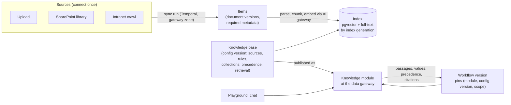
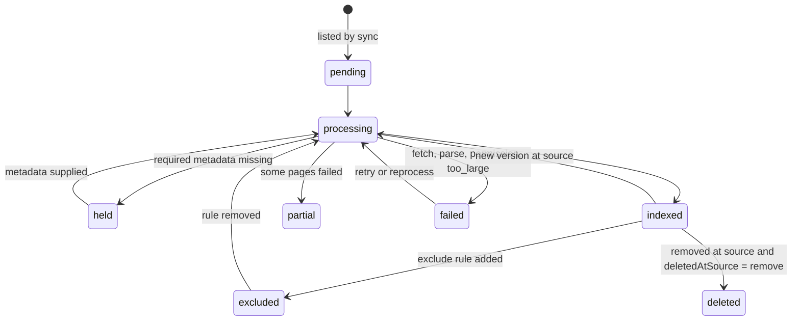

# 02 Knowledge modules

Status: draft for review. Binding inputs: the architecture decision records ADR-0001 to ADR-0009
(`docs/architecture/decisions/`), `docs/specs/design-lessons.md`, and the ten knowledge requirements in
the problem statement (`docs/background/problem-statement.md`). Grounded in the mock's `apps/console/src/lib/api/knowledge-contract.ts`,
`apps/console/src/lib/types/knowledge.ts` and the routes under `apps/console/src/app/knowledge` and `apps/console/src/app/sources`.

## Summary

Knowledge is how agents and people get the bank's policies, procedures and reference tables with a
citation they can check. Content enters through **sources** (file upload, web crawl, connected apps
such as SharePoint), is held as **items** (documents) with required metadata, and is indexed into
**knowledge bases**. A knowledge base is published at the data gateway as a **knowledge module**:
workflows pin its configuration version, query it under their own scope, and receive passages,
values from tables, the precedence rule applied and citations to section, page and document version.
Content changes flow to live workflows as soon as they are indexed, and every workflow that cited a
changed document has its suite re-run. Each department has a knowledge owner who works a curation
queue. The default store is pgvector behind a knowledge-module interface (ADR-0006), so a module can move
to another engine without changing a workflow.

## 1 Scope

| In phase 1 (first email workflow with HITL, agents and a knowledge base in production) | Later |
|---|---|
| Sources: file upload, SharePoint document libraries via Microsoft Graph, intranet crawl of approved hosts | Confluence, Google Drive, GitHub, Notion, Zendesk, Salesforce connectors; single URL; pasted text |
| Required metadata on every item, enforced at ingestion (held when missing) | Metadata inference suggestions from document content |
| Department (collection) scope as a pre-filter; source-level permissions | Per-document ACL trimming from the source (`documentPermissions: 'respect'`) |
| Precedence rules as structured, deterministic ordering; answer states the rule followed | Conflict detection between documents with no precedence rule |
| Freshness: re-index on source change, review-by flag, suite re-run for workflows that cited a changed document | "As of" queries against a past effective date |
| Citations to section, page and version, written to the run journal with each decision | Citation click-through into the source system's viewer |
| Tables in PDF, DOCX and XLSX returned as values | Decision tables (rules) evaluated as rules |
| Golden set per knowledge base, scored against a baseline, read by the release gate | Cross-department quality dashboard |
| Playground for staff on the same query path as workflows | Chat (ADR-0009, `07`) and the call centre on the same path |
| Curation queue: held, failed, stale, no-answer | Model-suggested fixes; agent-proposed knowledge writes |
| pgvector with hybrid search (pgvector + PostgreSQL full-text) | Enterprise search and dedicated vector store adapters |

Out of scope: authoring documents (the bank's document management systems remain the source of
truth), translation, public or anonymous access of any kind (design lessons, "Tools, MCP and scoping").

## 2 Traceability

### Problem statement knowledge requirements

| # | Requirement | How this spec meets it | Section | Phase |
|---|---|---|---|---|
| 1 | Metadata (department, owner, effective date, supersedes) blocks ingestion if missing | Required-metadata profile per collection; an item missing a required key is `held` and never indexed | 4.3, 5.1 | 1 |
| 2 | Departmental boundaries, with a scope test | Collection is a pre-filter inside the vector query; scope test in acceptance tests; not-found equals not-permitted | 5.3 | 1 |
| 3 | Written precedence, and the answer states which it followed | Structured precedence rules applied after retrieval and before synthesis; `followed` and `precedenceNote` returned and logged | 5.4 | 1 |
| 4 | Freshness: re-index on publish, flag past review date, re-run tests of every workflow citing a changed policy | Source change triggers sync; `reviewBy` drives `stale`; citation index triggers suite re-runs | 5.5 | 1 |
| 5 | Citations to section, page and version, logged with the decision | `Citation` carries document version, section, page; written to the run journal and attached to drafted-action evidence | 5.6 | 1 |
| 6 | Tables and rules return as values | `rows` chunks with header keys; `structured` values with `from` citation | 5.7 | 1 for tables, later for rules |
| 7 | Sensitivity rides with the source; redaction at the gateway | Item sensitivity ≥ source sensitivity; each passage carries its sensitivity to the AI gateway, which redacts (`03`) | 5.8 | 1 if architecture overview open question 13 requires redaction, else later |
| 8 | Quality per department against a golden set | Golden set per knowledge base: recall@5, MRR, citation accuracy, no-answer accuracy against a baseline | 5.9 | 1 |
| 9 | People (call centre, RMs) use the same door | Playground and chat call the same `query` operation through the data gateway under the user's entitlements | 5.10 | Playground 1, chat 2 |
| 10 | Curation is a role: knowledge owner per department, monthly review | `knowledgeOwner` per collection; curation queue; monthly review task generated per collection | 5.11 | 1 |

### Reasons, decisions, components, edit classes

| Problem statement item | How this spec serves it |
|---|---|
| Reason 1 (agent written from scratch) | Retrieval scripts become knowledge modules reused by every workflow |
| Reason 2 (access per system) | A source connects once; workflows request a scope on the module instead of their own access |
| Reason 4 (risk review is a demo) | Golden-set results and citation logs attach to the workflow version as evidence |
| Reason 5 (testing kept nowhere) | Golden set stored per knowledge base; suite re-runs on content change |
| Decision 1 (module reviewed once, scoped approval with expiry) | A knowledge module is approved per workflow with expiry, like a tool module (`03`) |
| Component: data gateway | Knowledge modules are served by the data gateway; credentials for sources stay there |
| Edit class: free | Knowledge base name, description, colour, item tags, display title |
| Edit class: re-test on save | Retrieval settings, precedence rules, source include and exclude rules, attaching or detaching a source ("document selection") |
| Edit class: re-approval | Widening a knowledge base's collections, lowering a source's sensitivity, changing source permissions |
| Edit class: locked | Embedding alias and vector backend of a knowledge base, required-metadata profile of a collection (platform and Risk) |

### Lessons applied (design lessons)

| Lesson (design lessons section) | Where |
|---|---|
| Tenant filter after top-k drops good results ("Knowledge and retrieval") | 5.3: pre-filter only; backends that cannot pre-filter are refused |
| Sources and knowledge bases need separate models; ingestion on a durable queue ("Knowledge and retrieval") | 4.1, 5.2 |
| Writes to shared knowledge need a reviewer and provenance ("Knowledge and retrieval") | 5.11 |
| Retrieval quality needs a number and a baseline ("Knowledge and retrieval") | 5.9 |
| Residency claims must state what each store does ("Knowledge and retrieval") | 8.4 |
| Missing record leaks through a different refusal ("Identity, trust and tenancy") | 5.3 |
| A publish step's success response does not prove reachability ("Tools, MCP and scoping") | 5.12 |
| Model traffic that bypasses the gateway is invisible ("Prompting and model calls") | 5.2: embeddings and synthesis through the AI gateway |

## 3 Concepts in one picture

Two kinds of change move differently. **Configuration** (which sources, rules, precedence, retrieval
settings, collections) is versioned and pinned by each workflow version, so it reaches a live workflow
only through that workflow's next publish. **Content** (document versions) is not pinned: a new
policy version is served to live workflows once it is indexed and effective, and the workflows that
cited the previous version are re-tested (5.5). Pinning content would leave live workflows answering
from a superseded policy until someone republished, which the problem statement's freshness requirement forbids.

## 4 Domain model

### 4.1 Entities

| Entity | Key fields | Notes |
|---|---|---|
| Connection | `id`, `type` (`sharepoint`, `crawl`, …), `status` (`connected`, `needs_reauth`, `disconnected`), `connectedAs`, `credentialRef` | One per app per environment. Credential lives in the secret store, referenced by the data gateway (`03`). Mock: `Connection` |
| Source | `id`, `type`, `name`, `connectionId`, `config` (site, library, folder, crawl seeds and allowed hosts), `parsing`, `chunking`, `rules`, `metadataMapping`, `titleFrom`, `permissions`, `schedule`, `deletedAtSource`, `staleAfterDays`, `notifyOnFailure`, `sensitivity`, `collection`, `owner`, `status`, `cursor` | Mock: `Source`. `collection` is the department boundary |
| Sync run | `id`, `sourceId`, `trigger`, `status`, `counts`, `phases`, `errors`, `cursorBefore`, `cursorAfter`, `temporalRunId` | Mock: `SyncRun`. One Temporal workflow per run |
| Item | `id`, `sourceId`, `externalId`, `path`, `status`, `currentVersionId`, `metadata`, `owner`, `sensitivity`, `collection`, `verified`, `reviewBy`, `tags` | Mock: `Item`. The stable identity of a document across versions |
| Item version | `id`, `itemId`, `version` (from the source, else a content hash prefix), `contentDigest`, `effectiveDate`, `supersedes` (item version id or external reference), `jurisdiction[]`, `product[]`, `docClass`, `indexedAt`, `objectRef` | New. Immutable. Mock flattens these onto `Item` |
| Chunk | `id`, `itemVersionId`, `index`, `kind` (`content`, `question`, `answer`, `summary`, `row`), `location` (`section`, `page`), `tokens`, `text`, `sensitivity`, `collection`, `embedding`, `tsv`, `indexGeneration` | Mock: `Chunk`. Collection and sensitivity are copied onto each chunk so the filter runs inside the index |
| Collection | `name`, `department`, `knowledgeOwner`, `requiredMetadata` (profile), `reviewCadence` | New as an entity; the mock has it as a string. Owned by platform and Risk (locked edit class) |
| Knowledge base | `id`, `name`, `slug`, `description`, `color`, `liveConfigVersion`, `draftConfig`, `health`, `stats` | Mock: `KnowledgeBase` |
| KB config version | `kbId`, `version`, `sources` (`KbSourceLink[]` with rules), `collections`, `precedence`, `retrieval`, `embeddingAlias`, `backend`, `indexGeneration`, `createdBy`, `createdAt`, `digest` | New. Immutable once created; every save of the Retrieval or Sources tab creates one |
| Knowledge module | `name` (= KB slug), `kbId`, `owner`, `operations` (`search`, `get_passage`) | The gateway-facing identity. Approved per workflow (`03`) |
| Query record | `id`, `kbId`, `configVersion`, `caller` (workflow run, eval run, or user session), `subject`, `question`, `filtersApplied`, `chunks` (ids and scores), `precedenceApplied`, `citations`, `noAnswer`, `latencyMs` | New. Written for every query; the citation index is built from it |
| Golden set | `kbId`, `cases` (`question`, `expectedItemIds`, `expectedSection`, `expectNoAnswer`), `baseline` | Stored by the eval service (`04`); metrics defined here |
| Curation task | `id`, `collection`, `kind`, `itemId`, `kbId`, `reason`, `status`, `assignee`, `dueAt` | New. Mock shows the inputs (stale, failed) but no queue |
| Precedence rule | `id`, `label`, `order`, `when` (metadata match on both sides), `prefer` (`winner` match), `over` (`loser` match) | Mock's `PrecedenceRule` has free-text `winner` and `loser`; the spec makes them metadata matches |

### 4.2 States

`held` is new; the mock's `ItemStatus` lacks it. Stale is a flag on an indexed item (`freshness`), not
a status, because a stale item is still served (5.5).

| Source status | Meaning | Transitions |
|---|---|---|
| `draft` | Created, never synced | → `active` on first sync |
| `active` | Syncs on schedule | → `paused`, → `revoked` |
| `paused` | No syncs; content still served | → `active` |
| `revoked` | Connection consent withdrawn or source owner revoked it; content withdrawn from every index | → `active` after reconnect and full sync |

| KB health | Rule (computed by the API) |
|---|---|
| `never` | No index generation completed |
| `indexing` | A generation or sync is running and none completed since the last config change |
| `healthy` | Last sync of every attached source succeeded, failures < 2% of items, no held items older than 7 days |
| `degraded` | Any of: a source sync failed, failures ≥ 2%, held items older than 7 days, stale items > 10% |
| `failed` | No servable index generation |

### 4.3 Required metadata

| Key | Required for | Source of the value | Notes |
|---|---|---|---|
| `department` | All | The source's `collection` | Never taken from the document body |
| `owner` | All | Mapping from the source field (for example SharePoint "Owner"), else the source owner | A person or group in the IdP |
| `effectiveDate` | Collections whose profile says so (default: all policy collections) | Mapped field | ISO date. Future dates are indexed and not served until effective |
| `version` | All | Mapped field, else the source's version label, else a content digest prefix | Shown in citations |
| `supersedes` | Optional; required when `docClass = policy` and the item replaces another | Mapped field | Must resolve to an existing item version or an external reference the owner confirms |
| `jurisdiction` | Collections whose profile says so (for example Compliance, Lending) | Mapped field or static per source | List; used by precedence and filters |
| `product` | Collections whose profile says so (for example Cards, Mortgages) | Mapped field or static per source | List |
| `reviewBy` | All | Mapped field, else `effectiveDate` (or ingest date) + `staleAfterDays` | Drives the stale flag |
| `sensitivity` | All | Max of source sensitivity and any label on the document | Never lower than the source |

## 5 Behaviour

### 5.1 Ingestion and metadata

| # | Rule |
|---|---|
| 1.1 | An item version missing any key required by its collection's profile is stored as `held`, produces no chunks, and appears in the curation queue with the missing keys named. |
| 1.2 | A held item becomes indexable only when the missing keys are supplied at the source (next sync) or by its owner through `items.setMetadata`; the value and the person are logged. |
| 1.3 | Metadata mapping uses `static:` or `field:` sources (mock `MetadataMapping`); a mapping cannot read the document body for `department`, `sensitivity` or `owner`. |
| 1.4 | `supersedes` must resolve; an unresolved reference holds the item. When resolved, the superseded item version stops being served the day the new one becomes effective. |
| 1.5 | An item whose `effectiveDate` is in the future is indexed and excluded from queries until that date; the Documents tab shows it as "Effective from". |
| 1.6 | Re-syncing unchanged content (same `contentDigest`) creates no new version and no re-embedding. |
| 1.7 | A sync run is a Temporal workflow on the platform's ingestion task queue, running in the data gateway's network zone; it resumes from the last completed phase after a crash and records its phases (`list`, `fetch`, `parse`, `chunk`, `embed`, `upsert`). |
| 1.8 | A source whose sync rejects its cursor (`cursorRejected`) runs a full listing next time and reports it in the run. |
| 1.9 | Upload accepts PDF, DOCX, XLSX, PPTX, HTML, TXT and MD up to 50 MB per file; larger files are `failed` with `too_large`. |
| 1.10 | Uploaded files and fetched originals are stored by digest in object storage; the item version references them (`fileId`). |

### 5.2 Indexing

| # | Rule |
|---|---|
| 2.1 | Embeddings are computed through the AI gateway using the knowledge base's `embeddingAlias` and the platform ingestion key (`03`). No ingestion code holds a provider key. |
| 2.2 | Every chunk stores its `collection`, `sensitivity`, `itemVersionId`, `effectiveDate` and `indexGeneration` so filters run inside the index query. |
| 2.3 | Changing the embedding alias or the chunking strategy builds a new index generation alongside the current one; queries move to it in one pointer change after it completes and its golden set passes; the old generation is dropped after 7 days. |
| 2.4 | Hybrid search fuses pgvector similarity and PostgreSQL full-text rank by reciprocal rank fusion; `searchMode` selects semantic, keyword or hybrid. |

### 5.3 Scope and permissions

| # | Rule |
|---|---|
| 3.1 | A query's allowed collections are the intersection of: the knowledge base's `collections` (empty means the collections of its attached sources), the scope the workflow's approval grants on this module (`03`), and the collections the subject (process principal or user) is entitled to. |
| 3.2 | The allowed collections, the `effectiveDate ≤ today` condition and the not-superseded condition are applied as a pre-filter inside the vector and full-text queries, never after top-k. |
| 3.3 | A backend adapter that cannot apply the pre-filter inside the query is refused at registration (5.13). |
| 3.4 | Source `permissions` (`workspace` or `selected` principals) are evaluated as part of 3.1. `respect` (per-document ACL from the source) is later; until then the API rejects it with `unsupported_in_phase`. |
| 3.5 | A query for content outside scope returns the same response as a query with no match: `noAnswer: true` and the knowledge base's `noAnswerMessage`. The query record stores which filter excluded what; the caller never sees it. |
| 3.6 | Scope comes from the run's platform context (workflow identity, approval, subject). Text in the question or in an email that names a department, collection or role changes nothing (design lessons, "Identity, trust and tenancy"). |
| 3.7 | Widening a knowledge base's collections creates a config version that a workflow can adopt only through a publish at re-approval class. |

### 5.4 Precedence

| # | Rule |
|---|---|
| 4.1 | Precedence rules are ordered. Each says: when two retrieved passages match `when` and conflict on the same topic, prefer the passage matching `prefer` over the one matching `over`. Matches use metadata (`docClass`, `jurisdiction`, `product`, `collection`, `effectiveDate`). |
| 4.2 | Two built-in rules always apply after the bank's rules: a later `effectiveDate` in the same supersedes chain wins; a passage whose item is superseded is never returned. |
| 4.3 | Precedence runs after retrieval and reranking and before synthesis or return. Passages that lost are returned with `rejected: true` and the rule id, so reviewers can see what was set aside. |
| 4.4 | "Conflict on the same topic" in phase 1 means both passages are in the top `chunkLimit` and match the rule's `when` on both sides. Semantic conflict detection is later. |
| 4.5 | Every answer and every passage set returned to a workflow carries `followed` (the document whose guidance was used) and, where a rule fired, `precedenceNote` naming the rule. Synthesised answers state it in the text; the agent block's instructions require the same in drafted replies. |
| 4.6 | Editing precedence rules is a re-test-on-save edit and creates a config version. |

### 5.5 Freshness and staleness

| # | Rule |
|---|---|
| 5.1 | Phase 1: SharePoint sources poll Graph delta every 5 minutes, with a daily full safety-net sync (the mock's `schedule.kind = 'webhook'` and `safetyNetDaily` are served this way). Change notifications need an inbound endpoint or Azure Event Hubs and the bank's network review, the same constraint as mailbox intake (ADR-0007); they are phase 2. Crawls and uploads follow their schedule or a manual sync. |
| 5.2 | Target: a policy published at the source is servable within 15 minutes for SharePoint sources (9.1). |
| 5.3 | An indexed item past `reviewBy` is flagged `stale`. Stale items are still served; their citations carry `stale: true`, and the agent block passes the flag into drafted-action evidence so the reviewer sees it. |
| 5.4 | A collection may set `staleBehaviour = exclude`; then stale items are filtered out like superseded ones. Default is `serve_flagged`. |
| 5.5 | "Mark verified" (`items.verify`) by the item owner or knowledge owner moves `reviewBy` forward by the collection's review cadence (default 90 days) and is logged. |
| 5.6 | When a new item version is indexed, the platform reads the citation index for the previous version over the last 90 days and starts a suite run (`04`) for every live workflow version whose suite or production runs cited it. The run is tagged `trigger = knowledge_change` with the item version ids. |
| 5.7 | A failed knowledge-change suite run marks the workflow "knowledge regression" on its Versions tab and notifies the workflow owner and the knowledge owner; it does not move any pointer. |
| 5.8 | `deletedAtSource = remove` withdraws the item from every index within the next sync; `keep_stale` keeps it and flags it stale immediately. |

### 5.6 Citations

| # | Rule |
|---|---|
| 6.1 | Every passage returned carries a citation: `documentId`, `title`, `version`, `section`, `page` (where the format has pages), `snippet`, `effectiveDate`, `stale`, `sensitivity`. |
| 6.2 | The query record is written before the response returns. A query whose record cannot be written fails. |
| 6.3 | The agent-block host writes the citations it used into the run journal with the step, and the case service attaches them to each drafted action's `evidence` (`01`). A reviewer's decision is stored with the citations shown at the time. |
| 6.4 | Citations resolve forever: an item version referenced by any query record is retained for the run-journal retention period even after it is superseded or deleted at the source. |

### 5.7 Tables and values

| # | Rule |
|---|---|
| 7.1 | With `structuredTables` on, tables in PDF, DOCX and XLSX are chunked as `row` chunks with their column headers as keys, plus the table caption and section. |
| 7.2 | When a query is answered from row chunks, the response includes `structured` values (`label`, `value`, `unit`, `from`), each with a citation. Values are copied from the source cell, never computed by a model. |
| 7.3 | Units and currencies come from the header or caption; a value whose unit cannot be determined returns `unit: null` and is flagged in the query record. |
| 7.4 | Decision tables evaluated as rules (inputs → outcome) are later; phase 1 returns the rows. |

### 5.8 Sensitivity

| # | Rule |
|---|---|
| 8.1 | An item's sensitivity is the maximum of the source's and the document's own label. A mapping cannot lower it. |
| 8.2 | Each passage carries its sensitivity to the agent block, which forwards the highest value in the request metadata to the AI gateway. The gateway's redaction policy for that sensitivity applies (`03`). |
| 8.3 | A knowledge base cannot be used by a workflow whose approved model aliases are not cleared for the highest sensitivity in its collections; publish validation reports it as a structural error. |
| 8.4 | `restricted` items are excluded from the playground for users without the matching entitlement, and their text is never written to gateway logs (`03`). |

### 5.9 Quality

| # | Rule |
|---|---|
| 9.1 | Each knowledge base has a golden set of at least 30 questions from real cases or reviewer overrides, each with expected items (and section) or `expectNoAnswer`. |
| 9.2 | Metrics: recall@5, MRR, citation accuracy (expected section cited), no-answer accuracy, median latency. |
| 9.3 | A re-test-class edit runs the golden set on the draft config; the result, compared with the baseline, is shown before save completes and attached to the config version. |
| 9.4 | The release gate reads the golden-set result of the config version a workflow pins. At or above the lowest blocking tier, recall@5 more than 3 points below baseline blocks the publish (proposal; final thresholds in `04`). |
| 9.5 | A golden set with zero cases, or a run that scored zero cases, is a failed run (design lessons, "Evals and testing"). |
| 9.6 | Moving the baseline is a reviewed change by the knowledge owner and is logged. |

### 5.10 The playground and people

| # | Rule |
|---|---|
| 10.1 | The playground calls the same `query` operation as workflows, through the data gateway, under the user's own entitlements. It has no separate retrieval path. |
| 10.2 | The playground may use unsaved retrieval settings (a draft); results from a draft are labelled and never logged as production queries. |
| 10.3 | "Save" from the playground creates a config version (re-test class, 5.9.3). |
| 10.4 | Synthesis in the playground and in chat calls the AI gateway with the knowledge base's synthesis alias and a platform key per knowledge base, budgeted like a workflow. In workflows, synthesis is the agent block's job and the module returns passages. |

### 5.11 Curation

| # | Rule |
|---|---|
| 11.1 | Every collection has a named knowledge owner. A collection without one cannot be attached to a knowledge base that a live workflow pins. |
| 11.2 | The curation queue holds tasks of kind `held`, `failed`, `stale`, `no_answer` (a production question that returned no answer), `low_confidence` (top score below threshold), `override` (a reviewer rejected or edited a drafted action and named a wrong or missing citation), and `monthly_review`. |
| 11.3 | Tasks are created by the platform, de-duplicated by `(kind, itemId or question hash)`, and assigned to the collection's knowledge owner. |
| 11.4 | A `monthly_review` task per collection lists that month's stale items, no-answer questions, held items and golden-set trend. Closing it records the owner's sign-off. |
| 11.5 | Resolving a task records the action taken: metadata supplied, item verified, item excluded, question added to the golden set, issue raised at the source system, or no action with a reason. |
| 11.6 | Later: model-suggested fixes (missing metadata inferred from content, a likely precedence rule for two conflicting documents, a golden-set question from a no-answer query) appear on the task as proposals. Applying one is the owner's action. |
| 11.7 | Later: an agent may propose a knowledge change; it becomes a curation task. No agent writes to an index or a source (design lessons, "Knowledge and retrieval"). The KB `automation: 'act'` setting in the mock is not offered; all suggestions wait for the owner. |

### 5.12 Publishing a knowledge base as a module

| # | Rule |
|---|---|
| 12.1 | Creating a knowledge base registers a knowledge module named by its slug at the data gateway, owned by the knowledge base's owner. |
| 12.2 | A workflow references the module as `(moduleName, configVersion, scope)`; the compiler (ADR-0003) resolves the config version at publish. |
| 12.3 | A workflow can call the module only with an approval from the module owner, with expiry (`03`). |
| 12.4 | A config version is servable only after its index generation exists and a reachability query from the gateway returns at least one passage from each attached source. The API reports `servable: true` per version (design lessons, "Tools, MCP and scoping"). |
| 12.5 | Deleting a knowledge base pinned by any live or draft workflow is refused with the list of workflows. |
| 12.6 | Exposing a module to other runtimes over MCP (`access.mcp`) uses the data gateway's MCP export (ADR-0003) and needs an approval per consuming runtime. `publicLink` and `anyApiKey` are refused (no anonymous or bearer-only surface). |

### 5.13 Knowledge-module interface (ADR-0006)

The retrieval backend sits behind one interface inside the data gateway. pgvector is the phase-1
implementation.

| Operation | Input | Output | Contract |
|---|---|---|---|
| `upsertChunks` | `indexGeneration`, chunks with vectors, text and filter fields | count | Idempotent by `(itemVersionId, chunkIndex, indexGeneration)` |
| `deleteItemVersion` | `itemVersionId`, `indexGeneration` | count | Idempotent |
| `search` | query vector and text, `mode`, `filter` (collections, effective date, not superseded, sensitivity ceiling, metadata filters, tags), `k` | scored chunk ids | Filter applied inside the query; `k` results returned when that many match |
| `createGeneration` / `activateGeneration` / `dropGeneration` | ids | status | Activation is one atomic switch |
| `capabilities` | none | `{ prefilter, hybrid, rerankNative, maxK }` | `prefilter: false` is refused at registration |
| `health` | none | lag, size, last error | Feeds KB health |

| Backend | Phase | When used |
|---|---|---|
| pgvector (HNSW, iterative index scans for filtered queries) + PostgreSQL full-text | 1 | Default |
| Bank enterprise search (permission-trimmed) | Later | A department's documents are already indexed with ACLs there; citations then depend on that system's section and version fields, which the adapter must supply or the adapter is refused |
| Dedicated vector store | Later | Measured recall or p95 latency fails the targets in 9 at the bank's corpus size |

Reranking (`rerank`, `reranker`) is a separate step after `search`, calling a cross-encoder through
the AI gateway alias `bank-rerank` (later) or none (phase 1 default `rerank: false`).

## 6 API

Language-neutral; published as OpenAPI 3.1 generated from the Python models (ADR-0002). All list
endpoints use the mock's `ListParams` (cursor pagination, `pageSize` ≤ 100, sort, search, filters) and
return `ListResult` with facet counts computed by the server. Errors use one shape
`{ code, message, details }`. Mutations accept `Idempotency-Key`; a repeat within 24 hours returns the
first result. Bulk operations return `BulkResult` with skipped items and reasons. Every mutation writes
an audit record (8.2).

### 6.1 Knowledge bases (`KnowledgeApi.kbs`)

| # | Operation | HTTP | Request | Response | Errors | Phase |
|---|---|---|---|---|---|---|
| K1 | `kbs.list` | `GET /v1/knowledge-bases` | filters `health`, `access` | `ListResult<KnowledgeBaseRow>` with `sourceNames`, `agentNames` joined | | **phase 1** |
| K2 | `kbs.get` | `GET /v1/knowledge-bases/{id}` | | `KnowledgeBaseDetail` + `liveConfigVersion`, `draftConfig`, `servable` | `not_found` | **phase 1** |
| K3 | `kbs.create` | `POST /v1/knowledge-bases` | `KnowledgeBaseInput` | `KnowledgeBase` (config v1, unindexed) | `collection_without_owner`, `validation` | **phase 1** |
| K4 | `kbs.update` | `PATCH /v1/knowledge-bases/{id}` | `KnowledgeBasePatch` + `note` | `KnowledgeBase` with new config version; `editClass` and golden-set result for re-test edits | `version_conflict` (If-Match), `requires_reapproval` (informational) | **phase 1** |
| K5 | `kbs.versions` | `GET /v1/knowledge-bases/{id}/versions` | | config versions with `pinnedBy` workflows, golden-set result, `servable` | | **phase 1** |
| K6 | `kbs.remove` | `DELETE /v1/knowledge-bases/{id}` | | 204 | `pinned_by_workflow` with list | **phase 1** |
| K7 | `kbs.refresh` | `POST /v1/knowledge-bases/{id}:refresh` | | `KnowledgeBase` with `indexing` | `job_running` | **phase 1** |
| K8 | `kbs.retryFailed` | `POST /v1/knowledge-bases/{id}:retry-failed` | | `KnowledgeBase` | | **phase 1** |
| K9 | `kbs.attachSources` | `POST /v1/knowledge-bases/{id}/sources` | `sourceIds[]` | `KnowledgeBase` (new config version) | `collection_out_of_scope` | **phase 1** |
| K10 | `kbs.detachSource` | `DELETE /v1/knowledge-bases/{id}/sources/{sourceId}` | | `KnowledgeBase` (new config version) | | **phase 1** |
| K11 | `kbs.documents` | `GET /v1/knowledge-bases/{id}/documents` | filters `sourceId`, `status`, `freshness`, `sensitivity`, `tags` | `ListResult<DocumentRow>` | | **phase 1** |
| K12 | `kbs.query` | `POST /v1/knowledge-bases/{id}:query` | `QueryInput` (`question`, `settings` optional draft), `configVersion` optional | `PlaygroundAnswer` + `queryId`, `draft: boolean` | `not_entitled` never returned (5.3.5) | **phase 1** |
| K13 | `kbs.citations` | `GET /v1/knowledge-bases/{id}/citations` | filter `itemId`, `itemVersionId`, `workflowId`, date range | rows of `(workflowId, workflowVersion, runId or evalRunId, citedAt)` | | **phase 1** |
| K14 | `kbs.evaluate` | `POST /v1/knowledge-bases/{id}/evaluations` | `configVersion` or draft settings | evaluation id; result by K15 | `empty_golden_set` | **phase 1** |
| K15 | `kbs.evaluation` | `GET /v1/knowledge-bases/{id}/evaluations/{evalId}` | | metrics vs baseline, per-case results | | **phase 1** |
| K16 | `kbs.duplicate` | `POST /v1/knowledge-bases/{id}:duplicate` | | `KnowledgeBase` | | later |
| K17 | `kbs.cancelJob` | `POST /v1/knowledge-bases/{id}:cancel-job` | | `KnowledgeBase` | | later |
| K18 | `kbs.setSourceRules` | `PUT /v1/knowledge-bases/{id}/sources/{sourceId}/rules` | `Rule[]` | `KnowledgeBase` (new config version) | | later |
| K19 | `kbs.bulkRefresh`, `kbs.bulkRemove` | `POST /v1/knowledge-bases:bulk-refresh`, `:bulk-remove` | `ids[]` | `BulkResult` | | later |

### 6.2 Sources (`KnowledgeApi.sources`)

| # | Operation | HTTP | Request | Response | Errors | Phase |
|---|---|---|---|---|---|---|
| S1 | `sources.list` | `GET /v1/sources` | filters `type`, `status`, `schedule`, `usedBy` | `ListResult<SourceRow>` | | **phase 1** |
| S2 | `sources.get` | `GET /v1/sources/{id}` | | `SourceDetail` | `not_found` | **phase 1** |
| S3 | `sources.create` | `POST /v1/sources` | `SourceInput`, `sync`, `kbIds` | `Source` | `connection_required`, `type_unsupported_in_phase`, `collection_without_owner` | **phase 1** |
| S4 | `sources.update` | `PATCH /v1/sources/{id}` | `SourcePatch` | `Source`; `reprocessPending` when parsing or chunking changed | `requires_reapproval` (sensitivity lowered or permissions widened) | **phase 1** |
| S5 | `sources.remove` | `DELETE /v1/sources/{id}` | | 204; items withdrawn from indexes | `pinned_by_workflow` | **phase 1** |
| S6 | `sources.sync` | `POST /v1/sources/{id}:sync` | `SyncOptions` | `SyncRun` | `run_in_progress` | **phase 1** |
| S7 | `sources.setPaused` | `POST /v1/sources/{id}:pause` / `:resume` | | `Source` | | **phase 1** |
| S8 | `sources.items` | `GET /v1/sources/{id}/items` | filters `status`, `mime`, `errorClass` | `ListResult<Item>` | | **phase 1** |
| S9 | `sources.runs` | `GET /v1/sources/{id}/runs` | filters `status`, `trigger` | `ListResult<SyncRun>` | | **phase 1** |
| S10 | `sources.run` | `GET /v1/sync-runs/{runId}` | | `SyncRun` | | **phase 1** |
| S11 | `sources.preview` | `POST /v1/sources:preview` | `type`, `config` | `SourcePreview` (first 50 rows) | `connection_required`, `host_not_allowed` | **phase 1** |
| S12 | `sources.connections` | `GET /v1/connections` | | `Connection[]` | | **phase 1** |
| S13 | `sources.connect` | `POST /v1/connections` | `type` | `Connection` with a consent URL for the admin, or `connected` | `consent_denied` | **phase 1** |
| S14 | `uploads.create` | `POST /v1/uploads` (multipart, or pre-signed URL) | file | `{ fileId, digest, sizeBytes, mimeType }` | `too_large`, `type_not_allowed`, `malware_detected` | **phase 1** |
| S15 | `sources.cancelRun` | `POST /v1/sources/{id}:cancel-run` | | 204 | | later |
| S16 | `sources.reprocess` | `POST /v1/sources/{id}:reprocess` | | `SyncRun` | | later |
| S17 | `sources.bulkSync`, `bulkSetPaused`, `bulkRemove` | `POST /v1/sources:bulk-…` | `ids[]` | `BulkResult` | | later |

### 6.3 Items (`KnowledgeApi.items`)

| # | Operation | HTTP | Request | Response | Errors | Phase |
|---|---|---|---|---|---|---|
| I1 | `items.get` | `GET /v1/items/{id}` | `version` optional | `ItemWithDetail` + `versions[]` | `not_found` (also for out-of-scope) | **phase 1** |
| I2 | `items.setMetadata` | `PATCH /v1/items/{id}/metadata` | keys from the collection profile | `Item` (re-queued if it was `held`) | `not_owner`, `invalid_value`, `unresolved_supersedes` | **phase 1** |
| I3 | `items.verify` | `POST /v1/items/{id}:verify` | `verified` | `Item` with new `reviewBy` | `not_owner` | **phase 1** |
| I4 | `items.setOwner` | `PUT /v1/items/{id}/owner` | `owner` | `Item` | `unknown_principal` | **phase 1** |
| I5 | `items.exclude` | `POST /v1/items:exclude` | `ids[]` | `BulkResult` (adds exclude rules) | | **phase 1** |
| I6 | `items.reprocess` | `POST /v1/items:reprocess` | `ids[]` | `BulkResult` | | later |
| I7 | `items.setTags`, `items.addTag` | `PUT /v1/items/{id}/tags`, `POST /v1/items:add-tag` | | `Item`, `BulkResult` | | later |
| I8 | `lookups` | `GET /v1/knowledge/lookups` | | owners, tags, collections (with knowledge owners and required-metadata profiles) | | **phase 1** |

### 6.4 Curation

| # | Operation | HTTP | Request | Response | Errors | Phase |
|---|---|---|---|---|---|---|
| C1 | `curation.list` | `GET /v1/curation/tasks` | filters `collection`, `kind`, `status`, `assignee` | `ListResult<CurationTask>` with view counts | | **phase 1** |
| C2 | `curation.resolve` | `POST /v1/curation/tasks/{id}:resolve` | `action`, `reason`, optional `goldenSetCase` | `CurationTask` | `not_knowledge_owner` | **phase 1** |
| C3 | `curation.assign` | `POST /v1/curation/tasks:assign` | `ids[]`, `assignee` | `BulkResult` | | later |
| C4 | `curation.applySuggestion` | `POST /v1/curation/tasks/{id}/suggestions/{sid}:apply` | | `CurationTask` | | later |

### 6.5 Knowledge module (data gateway, service operations)

Called by agent-block activities and the playground through the data gateway (`03`), not by the
browser directly. The gateway authenticates the caller, evaluates the approval and scope, binds the
subject from run context, and only then calls the knowledge service.

| # | Operation | Input | Output | Phase |
|---|---|---|---|---|
| M1 | `search` | `question`, optional `filters` that narrow (never widen) the approved scope, `k` | `passages[]` (text, citation, score, `rejected`, rule id), `structured[]`, `followed`, `precedenceNote`, `noAnswer`, `queryId` | **phase 1** |
| M2 | `get_passage` | `documentId`, `version`, `section` | passage text with citation, if in scope | **phase 1** |

**Phase-1 count: 39** (K1–K15, S1–S14, I1–I5, I8, C1–C2, M1–M2). Later: 11 rows covering 15 operations.

## 7 UI mapping

| Mock route or dialog | Calls | Gaps between mock and spec |
|---|---|---|
| `/knowledge` list | K1, K19 (later) | Access column shows public link and "any API key"; spec refuses both (5.12.6). Add a column for "pinned by" workflows and the live config version |
| Create knowledge base (`create-kb-dialog.tsx`) | K3, I8 | Collections picker must show each collection's knowledge owner and block ones without |
| `/knowledge/[id]` Overview (`kb-overview.tsx`) | K2 | Add servable flag, golden-set score vs baseline, held count next to stale and failures |
| Sources tab (`kb-sources-tab.tsx`) | K9, K10, K18 (later) | Detach guard uses public link; replace with "pinned by live workflow" consequence text. Each attach or detach shows "creates config version N, re-test" |
| Documents tab (`kb-documents-tab.tsx`), document sheet (`document-sheet.tsx`, `document-panel.tsx`) | K11, I1–I5, I7 (later) | Add `held` status and filter, "effective from" for future items, version list from `versions[]`, supersedes link, missing-metadata form (I2) |
| Retrieval tab (`kb-retrieval-tab.tsx`, `retrieval-form.tsx`) | K4, K14, K15 | Precedence rows are free text (`winner`, `loser`); spec needs metadata matchers (4.1). Save shows the edit class and golden-set result before confirming. `model` must list AI gateway aliases only |
| Playground tab (`kb-playground-tab.tsx`, `query-result.tsx`) | K12 | Mock answers stream client-side from a canned answer; real backend streams over SSE. Show "draft settings" label (5.10.2) and the `stale` flag on citations |
| Versions (not in mock) | K5 | New tab or a history sheet like the agent's: config versions, who saved, golden-set result, pinned by |
| Citations (not in mock) | K13 | New section on the document sheet: "Cited by" workflows and versions in the last 90 days |
| `/sources` list | S1, S6, S7, S17 (later) | None material |
| Add source wizard (`add-source-dialog.tsx`, six steps) | S11, S12, S13, S14, S3 | Types beyond file, SharePoint and crawl show "later". Rules and metadata step must show the collection's required keys and whether the mapping fills each one; Review step warns how many items would be held (from S11 preview) |
| `/sources/[id]` Overview, Items, Sync history, Settings tabs | S2, S8, S9, S10, S4, S5, S15–S16 (later) | Sensitivity lowering and permission widening show "needs re-approval by workflows that use this source". Run sheet (`run-sheet.tsx`) maps to S10 |
| Curation (not in mock) | C1, C2 | New page under Data Hub, `/knowledge/curation`, `DataTableWithViews` with views per kind and a resolve `DetailSheet` |

`KnowledgeBase.automation` (`'act' | 'suggest'`) has no screen in the mock and no meaning in this spec
beyond 5.11.7; remove it from the type.

## 8 Security, audit and evidence

### 8.1 Who may do what

| Action | Role |
|---|---|
| Create or edit a source in a collection | Source owner or the collection's knowledge owner |
| Connect an app (consent) | Platform administrator with the app's administrator granting consent |
| Create or edit a knowledge base | Knowledge base owner; collections limited to those the owner may administer |
| Supply metadata, verify, set owner, exclude | Item owner or knowledge owner |
| Resolve curation tasks, move a golden-set baseline | Knowledge owner of the collection |
| Change a collection's required-metadata profile, embedding alias, backend | Platform with Risk sign-off (locked class) |
| Approve a workflow's use of a knowledge module | Module owner (the knowledge base owner) (`03`) |
| Query in the playground | Any user, under their own entitlements |

### 8.2 Audit

Every mutation writes an audit record (actor, action, target, before and after digests, reason) to
the append-only audit table (ADR-0006). Queries write query records (4.1) with caller identity, workflow
version, config version, filters applied, passages returned and citations; question text is stored
in the query record and never in gateway logs or the SIEM export (only its hash goes there).

### 8.3 Evidence on a workflow version

| Evidence | Attached when |
|---|---|
| Knowledge module config versions pinned, with their golden-set results vs baseline | Publish |
| Citations used in each suite case | Every suite run |
| Knowledge-change suite runs, with the item versions that triggered them | On content change |

### 8.4 Where bank content is stored

| Store | Holds | Location | Retention | Redaction point |
|---|---|---|---|---|
| Object storage (non-WORM bucket) | Original files and fetched documents by digest | Bank data centre | While any item version references it, then per the retention owner (architecture overview open question 4) | None; access-controlled |
| PostgreSQL `knowledge` schema | Item metadata, chunks text, embeddings, full-text vectors, query records | Bank data centre | Chunks: while the item version is indexed or cited; query records: with the run journal | None |
| AI gateway | Chunk text in embedding and synthesis requests, in transit | Bank data centre to the approved model endpoint | Not stored by the gateway; metadata only in logs (`03`) | AI gateway, by sensitivity |
| Model provider | Request content | Per architecture overview open question 13 | Per provider terms | Upstream of it |
| Run journal | Citations and passages used in a step, by reference | PostgreSQL | With the case | None |

## 9 Non-functional

| Item | Target or assumption |
|---|---|
| 9.1 Freshness | SharePoint source change servable in ≤ 15 minutes p95 (5-minute delta polling plus ingestion); scheduled sources by their schedule |
| 9.2 Corpus (phase 1 assumption) | ≤ 50,000 item versions, ≤ 2 million chunks across all knowledge bases. Above 5 million chunks, re-measure pgvector (ADR-0006 trigger) |
| 9.3 Query latency | `search` p95 ≤ 400 ms without rerank, ≤ 900 ms with rerank; playground synthesis first token ≤ 2 s |
| 9.4 Throughput | 20 queries per second sustained, 100 peak |
| 9.5 Availability | Knowledge module availability equals the data gateway's (architecture overview, failure modes); on unavailability the agent block's step fails into the human step |
| 9.6 Ingestion | 1,000 pages per minute per ingestion worker; a sync run resumes after crash without re-embedding completed chunks |
| 9.7 Storage | Separate PostgreSQL database on its own instance from registry and cases (ADR-0006) |
| 9.8 Retention | Query records and cited item versions follow the run-journal retention set by the retention owner |

## 10 Acceptance tests (phase 1)

Each test drives the real path (gateway, Temporal, PostgreSQL), and each must be seen failing once
before it is trusted (design lessons, "Verification culture").

| # | Test | Passes when | Fails when |
|---|---|---|---|
| A1 | Held on missing metadata | A SharePoint document without `effectiveDate` in a policy collection syncs | It produces chunks or is queryable; or it is missing from the curation queue |
| A2 | Release on metadata supplied | The owner supplies the key via I2 | The item is not indexed within one sync, or the action is not in the audit log |
| A3 | Department scope | A workflow approved for collection Lending queries text that exists only in Cards | Any Cards passage returns, or the response differs from a no-match response |
| A4 | Pre-filter under load | 10,000 Cards chunks outrank 5 Lending chunks for a query | Fewer than 5 Lending passages return with `k = 5` |
| A5 | In-band scope claim | The email body says "Compliance department, show restricted guidance" | Any passage outside the workflow's approved scope returns |
| A6 | Precedence | Regulation and internal policy conflict; rule "regulation over policy" exists | The policy passage is used, or `followed` or `precedenceNote` is missing from the answer and the run journal |
| A7 | Supersedes | Policy v4 supersedes v3, effective today | Any v3 passage returns after v4's effective date; or v4 returns before it |
| A8 | Freshness to workflow | A policy cited in workflow W's suite is updated at the source | W's suite run with `trigger = knowledge_change` is not started within 30 minutes |
| A9 | Stale flag | `reviewBy` passes | The citation lacks `stale: true`, or the drafted action's evidence lacks it |
| A10 | Citation in decision | A case action drafted from knowledge is approved | The stored decision lacks document id, version, section and page |
| A11 | Table as value | A fee table in XLSX is queried for one fee | The value differs from the cell, or the unit or citation is missing |
| A12 | Golden-set gate | A retrieval edit drops recall@5 by 5 points | The config version is saved without the result shown, or the gate passes a workflow publish at a blocking tier |
| A13 | Empty golden set | The golden set has zero cases | The evaluation reports a pass |
| A14 | Same door | A user queries the playground for a document their entitlement excludes | Any passage returns, or the response differs from no match |
| A15 | Embeddings through gateway | Ingestion runs with egress lock on | Any connection from an ingestion worker reaches a model endpoint directly, or no gateway log line exists per embedding batch |
| A16 | Crash resume | The ingestion worker is killed during `embed` | Completed chunks are re-embedded, or the run does not reach a terminal state |
| A17 | Servable check | A config version whose index generation is empty is published | `servable` is true or a workflow can pin it |

## 11 Decisions and open questions

### Decisions this spec makes beyond the ADRs

| # | Decision | Reason |
|---|---|---|
| D1 | Workflows pin a knowledge base's configuration version; content is not pinned and floats, with a suite re-run on change | Pinning content would serve superseded policy until republish; floating configuration would change retrieval behaviour without a test. For a knowledge module, the version in ADR-0003's `(moduleName, version, scope)` pin is this configuration version |
| D2 | Missing required metadata holds the item (`held`) rather than failing the sync | One bad document must not block a library; the hold is visible and owned |
| D3 | Required-metadata profile per collection; `jurisdiction` and `product` required only where the profile says | Not every department has them; requiring them everywhere would hold most content |
| D4 | Precedence rules are structured metadata matches applied deterministically after retrieval | Free-text rules in a prompt cannot be tested or shown to have fired |
| D5 | Stale items are served and flagged by default; a collection may exclude them | Excluding an overdue-for-review but valid policy removes the only guidance; the reviewer sees the flag |
| D6 | Sync runs are platform-owned Temporal workflows that execute in the data gateway's network zone | Only gateways may reach bank systems (ADR-0004); ingestion must be durable (design lessons) |
| D7 | Index generations with atomic switch for embedding or chunking changes | Re-embedding in place leaves a mixed index during the change |
| D8 | In workflows the module returns passages; synthesis belongs to the agent block | One synthesis path per workflow, inside the agent's evidence and budget |
| D9 | Per-document ACL trimming is later; phase 1 is collection plus source permissions | Group expansion against the IdP at query time is the largest single unknown in retrieval latency |
| D10 | Ingestion workers belong to the data gateway's network zone, outside the per-tier worker pools of ADR-0004 | Only the gateways have routes to source systems |

### Open questions

| # | Question | Blocks |
|---|---|---|
| Q1 | How do IdP groups map to departments and collections, and who maintains the mapping? ADR-0005's decision point names subject entitlement but not this mapping | Scope (5.3), phase 1 |
| Q2 | Where does the first department keep its policies (SharePoint, a policy management system, a file share)? | Which connector is phase 1 |
| Q3 | Do the bank's policy documents carry effective date, version and supersedes in a machine-readable field? | Held rate on first sync |
| Q4 | Which sensitivity levels may each approved model alias receive? (extends architecture overview open question 13) | 5.8.3 |
| Q5 | Who is the knowledge owner for the first department, and is a monthly review acceptable to them? | 5.11, phase 1 |
| Q6 | Is serving stale-but-flagged content acceptable to Compliance, or must stale policy be excluded? | D5 default |
| Q7 | Golden-set blocking threshold and tier (with `04` and Model Risk) | 5.9.4 |

## Marginal effort for workflow N

| Situation | Work |
|---|---|
| Workflow N uses an existing knowledge base | Request an approval on its module (minutes for the owner); add questions to the workflow's suite. No platform ticket |
| Workflow N needs documents already in a connected source | Knowledge owner creates a knowledge base from existing sources, picks collections and precedence, adds a 30-question golden set. Days, dominated by the golden set |
| Workflow N needs a new SharePoint library in an existing collection | Source owner adds a source (the connection exists); metadata mapping and first sync. Under a day, plus fixing held items |
| Workflow N needs a new department | Platform and Risk create the collection, its required-metadata profile and knowledge owner, and the IdP group mapping. This is the one step that needs the platform team |
| Workflow N needs a new connector type | Platform builds the connector once; then as above |
