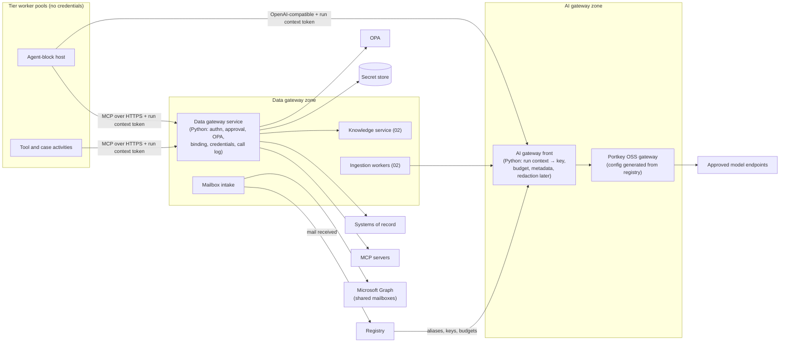
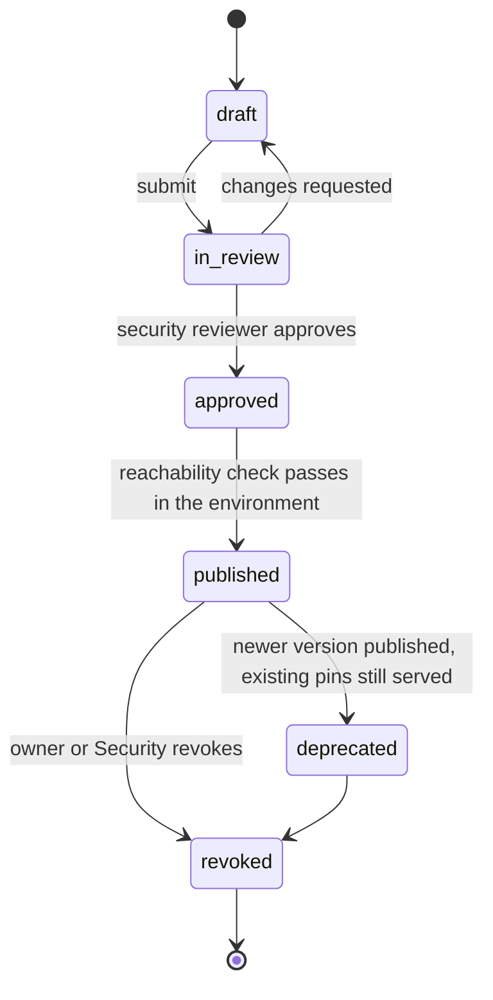
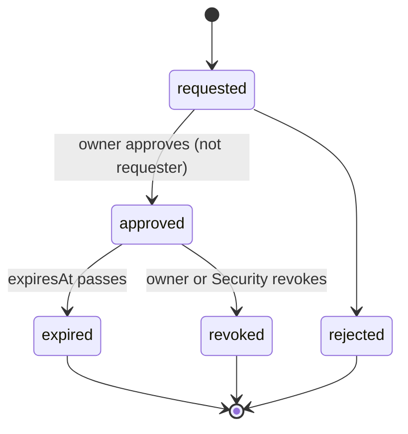
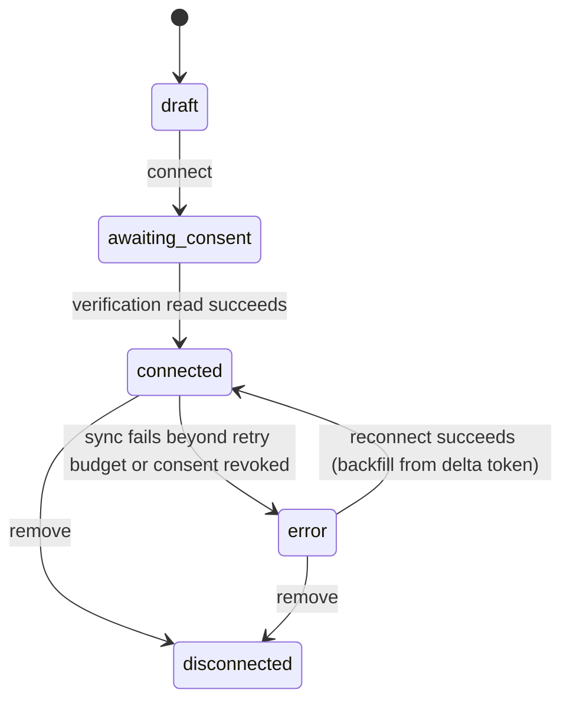

# 03 Data gateway and AI gateway

Status: draft for review. Binding inputs: the architecture decision records ADR-0001 to ADR-0009
(`docs/architecture/decisions/`, especially ADR-0004, ADR-0005, ADR-0007 and ADR-0008),
`docs/specs/design-lessons.md`, and the problem statement with its email-to-workflow reference flow
(`docs/background/problem-statement.md`). Grounded in the mock's `apps/console/src/lib/api/contract.ts` (`tools`,
`deployments`), `apps/console/src/lib/types/domain.ts` (`Tool`, `EmailConfig`, `Deployment`), and the routes
`apps/console/src/app/tools` and `apps/console/src/app/deployments`. Knowledge modules are specified in `02`; this spec covers
the gateway they sit behind.

## Summary

Workers reach nothing except two gateways (ADR-0004). The **data gateway** is the one door to bank
systems: each system is connected once as a **tool module** (HTTP, MCP or code) owned by the system's
team, reviewed once, and used by a workflow only under an **approval with expiry** that names the
operations it may call. On every call the gateway checks the approval, the scope, the acting
subject's entitlement and, for writes, an approval token bound to the exact input (from a person, or
a policy approval token for non-money write classes a gate policy names, ADR-0005); it binds the
record being acted on from the run's context so the model can narrow it but never choose it; it
resolves credentials that never leave it; and it logs the call. **Microsoft 365 shared-mailbox
intake** is a data-gateway resource that turns mail into runs. The **AI gateway** is the one door to
models: Portkey's open-source gateway self-hosted behind a thin front we build (the key-and-budget
service of ADR-0008, which holds every model key), with bank aliases,
per-workflow keys and budgets, metadata logging and the egress lock on day one, and redaction,
evidence-gated failover, caching, guardrails and discovery of unregistered agents later (ADR-0008).

## 1 Scope

| Capability | Phase 1 (first email workflow with HITL, agents and a knowledge base in production) | Later |
|---|---|---|
| Tool module types | HTTP (OpenAPI import), MCP (remote server over streamable HTTP) | Code modules in a sandbox; bank-run n8n as MCP source (architecture overview open question 14); Arazzo import |
| Module lifecycle | Draft, security review, publish with reachability check, exact pins | Revoke and deprecate in the console, staged module rollout |
| Approvals | Request, decide, revoke, expiry checked per call, warnings at 30 and 7 days | Renewal flow, bulk approvals, approval templates per module |
| Record binding | Subject bound from run context; `equals` mode | `within` mode (model may pick a child record of the bound one) |
| Credentials | Secret-store references per module and environment; OAuth client credentials, mTLS, API key | Rotation from the console; user-delegated tokens (RFC 8693, needed by chat) |
| Call log | Every call, allow and deny, to PostgreSQL and SIEM; list and detail APIs | Call-log export per module owner; anomaly alerts |
| Mailbox intake | Connect, folders, delta polling every 60 s, security scan, WORM archive, reconnect, intake log, loop prevention | Graph change notifications through an inbound endpoint or Azure Event Hubs, after the bank's network review (ADR-0007); quarantine release in the console; further intake types |
| AI gateway | One endpoint, aliases, per-workflow keys, budgets, metadata log, egress lock, retries and timeouts; redaction only if architecture overview open question 13 requires it | Redaction by default, failover with evidence per alias, caching, guardrails, discovery, chargeback |

Out of scope: the release gate (`04`), cases and approval UI (`01`), knowledge retrieval behaviour
(`02`), chat transport (`07`).

## 2 Traceability

| Problem statement item | How this spec serves it | Section |
|---|---|---|
| Reason 1 (agent written from scratch) | Connector classes become tool modules reused by every workflow | 4.1 |
| Reason 2 (access request per system) | A module connects once; workflows request a scope the module owner approves in the console | 5.2 |
| Reason 3 (whole codebase security-reviewed) | Security reviews a module version once; workflows reuse it under approvals | 5.1 |
| Reason 6 (servers, secrets, keys per agent) | Credentials only in the data gateway; AI keys only in the AI gateway front; workers hold none | 5.4, 5.8 |
| Decision 1 (module reviewed once, scoped approval with expiry) | Module review record; approvals with mandatory expiry checked on every call | 5.1, 5.2 |
| Mandate (all model traffic through the AI gateway) | Egress lock, keys held only in the gateway, lint rule on provider hosts | 5.8 |
| Component: data gateway  | Sections 4–5.7 | |
| Component: AI gateway | Sections 5.8–5.10 | |
| Governance: tool calls constrained by module scope, not prompt | Scope and binding enforced at the gateway (5.3) | |
| Governance: entitlement = module scopes ∩ subject's entitlements | Policy decision per call (5.3, ADR-0005) | |
| Operations: gateways' availability ≥ most demanding workflow; degraded mode fails into the human step | 9 | |
| Operations: module versions pinned, independent module rollback | 5.1 | |
| Principles: discover → observe → register → instrument → adopt | AI gateway discovery (5.10) | |
| Knowledge requirement 7 (sensitivity rides with source, redaction at gateway) | Sensitivity in request metadata, redaction policy per sensitivity (5.9) | |
| Knowledge requirement 9 (people use the same door) | Playground and chat call the same gateways under the user's identity | 5.3 |
| Flow step 1 (mailbox intake: M365 shared mailboxes, sync, security scan, archive) | 5.6 | |
| Problem statement: data gateway under every flow step | Data gateway | |
| Edit class: re-test on save | Moving a workflow to a newer module version; changing an alias pin | 5.11 |
| Edit class: re-approval | Requesting a wider scope; raising a budget above the tier ceiling | 5.11 |
| Edit class: locked | Alias targets (which model an alias means), module scopes as policy, egress rules | 5.11 |

### Lessons applied (design lessons)

| Lesson (design lessons section) | Where |
|---|---|
| Trust facts come from platform context, never message text ("Identity, trust and tenancy"; rank 1) | 5.3.4, 5.6.9 |
| The model must not choose the record a tool writes to ("Tools, MCP and scoping"; rank 2) | 5.3 |
| Privilege belongs to the grant at operation level ("Tools, MCP and scoping") | 4.1: access per operation |
| A default open endpoint exposes every later tool ("Tools, MCP and scoping") | 5.5.3: deny by default per principal type; listing diff in CI |
| Publish success does not prove reachability ("Tools, MCP and scoping") | 5.1.5 |
| An "ensure" must converge on retry ("Tools, MCP and scoping") | 5.1.8 |
| Unrecorded tool calls cannot be audited ("Tools, MCP and scoping") | 5.5 |
| Credentials resolved by the gateway for the acting principal ("Identity, trust and tenancy") | 5.4 |
| One policy decision point ("Identity, trust and tenancy") | 5.3.1 |
| Each control declares fail-open or fail-closed ("Queues, jobs and durable execution") | 5.3.7, 9 |
| Writes on every instance duplicate; idempotency keys ("Queues, jobs and durable execution") | 5.3.6 |
| Model calls that bypass the gateway are invisible ("Prompting and model calls") | 5.8.2 |
| Stable prompt content first; report cache hit rate ("Prompting and model calls") | 5.8.7 |
| Tool-call reliability depends on the model; alias moves need the suite ("Prompting and model calls"; rank 10) | 5.8.4 |
| One fact, one home: the module manifest ("Agent configuration and versioning"; rank 4) | 4.1 |
| Pin by stable name and version, never internal row ids ("Agent configuration and versioning") | 4.1 |
| Unregistered traffic cannot satisfy a scope check ("Identity, trust and tenancy") | 5.10.4 |

## 3 Architecture

| Choice | Decision |
|---|---|
| Data gateway implementation | A Python service we build (ADR-0002), speaking MCP to callers (MCP Python SDK, streamable HTTP) and HTTP or MCP to modules. Transport concerns (TLS termination, mTLS to callers, connection limits) sit on the bank's existing API gateway or Envoy in front of it, per architecture overview open question 11. The policy, binding, credential and logging logic is ours in every option |
| Caller protocol | MCP for tool and knowledge calls, so the same gateway serves workflows, the playground, chat (ADR-0009) and other bank runtimes (ADR-0003 export) |
| AI gateway | A thin front we build, then Portkey OSS (ADR-0008). The front authenticates the caller and attaches the key, so workers hold no model keys |
| Placement | Both gateways run in their own Kubernetes namespaces with the only routes to bank systems and model endpoints (ADR-0004) |

## 4 Domain model

### 4.1 Tool modules

| Entity | Fields | Notes |
|---|---|---|
The mock's model is the reference: `apps/console/src/lib/types/tool-modules.ts`, `apps/console/src/lib/api/tool-modules-contract.ts`,
`apps/console/src/lib/api/mock/tool-modules/`, `apps/console/src/app/tools/**`, and the page plan in `docs/ui/tools-design.md`.

| Entity | Fields | Notes |
|---|---|---|
| Module | `id`, `name` (stable, kebab-case), `displayName`, `system`, `description`, `type` (`mcp`, `openapi`, `http`, `code`), `status` (`draft`, `in_review`, `published`, `revoked`), `version` (semver of the current version), `major`, `ownerTeam`, `ownerContacts`, `endpoint`, `auth{kind, header?}`, `timeoutMs`, `egressHosts[]`, `dataClassification` (`public`, `internal`, `confidential`, `restricted`) | `name` is what workflows pin; never a row id. `code` modules are later (5.1.10) |
| Module row (computed by the API) | `operationCount`, `accessClasses[]`, `approvalState` (`approved`, `needs_approval`, `expiring`, `expired`), `nextExpiry`, `pendingApprovals`, `workflows[]`, `calls24h`, `errorRate`, `p95Ms`, `reachable`, `drift` | Views `all`, `needs_approval`, `expiring` (30 days), `failing`; stats: modules, operations, calls, error rate, money operations, approvals expiring in 30 days |
| Module version | `version` (semver), `major`, `status` (`draft`, `in_review`, `published`, `deprecated`, `revoked`), `publishedAt`, `publishedBy`, `note`, `changes[]`, `pinnedBy[]`, `reachability[{environment, ok, checkedAt}]`, `manifestDigest` | Immutable once published |
| Operation change (`OperationChange`) | `operation`, `kind` (`added`, `removed`, `access_widened`, `schema_changed`, `binding_changed`, `settings`), `detail`, `major` | Edits are staged as `pendingChanges` on the module and reach workflows only when published as a version |
| Security review | `id`, `major`, `version`, `decision` (`pending`, `approved`, `changes_requested`), `requestedBy`, `requestedAt`, `reviewer`, `decidedAt`, `findings[]`, `note` | One per major version; minors within it reuse the decision (ADR-0005) |
| Manifest | `endpoints` per environment, `auth` (kind and secret reference per environment), `operations[]`, `timeouts`, `rateLimit`, `egressHosts`, `dataClassification` of outputs, `uiResources[]` (later, ADR-0009) | The single home for every fact about the module (design lessons rank 4). The console, OPA data, gateway routing and generated docs all derive from it |
| Operation | `id`, `toolId` (the grantable record agents hold), `name`, `description`, `access` (`read`, `draft`, `write`, `money_movement`), `enabled`, `method?`, `path?`, `input[]` (schema fields), `outputSchema`, `maskedOutput[]` (output paths masked before the response is shown or stored), `binding` (4.3; null for reference data, confirmed at review), `rateLimitPerMin` (1–10,000), `requiresApproval`, `fourEyes`, `amountMax?` (money only), `idempotent`, `testStub`; computed `calls24h`, `errorRate`, `p95Ms`, `approvedWorkflows` | What the mock's agents grant as a "tool". `requiresApproval` cannot be false for `money_movement` (422). `fourEyes` is on for money movement: the approver differs from whoever requested or drafted the action |
| MCP snapshot | `toolsListDigest`, captured tool schemas | For MCP modules, the server's `tools/list` at publish. A change at the server is drift (5.1.7) |
| Catalog item | `id`, `name`, `system`, `category`, `type`, `description`, `operations`, `auth`, `owner`, `moduleId?`, `available` | The bank's list of known systems; Add opens the add dialog prefilled. Adding an item already connected returns 409 |

Module version states:

Publishing staged changes creates one version. It is **major** when any staged change widens what a
workflow could do; otherwise it is minor. The mock computes `major` per change as follows, and the
backend uses the same table:

| Change | Major |
|---|---|
| Expose (enable) an operation, or add one | Yes |
| Widen an operation's `access` | Yes |
| Turn `requiresApproval` off | Yes |
| Raise `amountMax` | Yes |
| Loosen the record binding (remove it, make it optional, or change `equals` to `within`) | Yes |
| Widen an input schema in a field used for binding; change `egressHosts` | Yes |
| Hide (disable) an operation | No |
| Turn `requiresApproval` on, lower `amountMax`, tighten the binding | No |
| Change the rate limit or description | No |

| Version kind | What happens on publish |
|---|---|
| Minor (`x.y+1.0`) | Published at once under the major's existing security review; the previous published version becomes `deprecated` (still served to workflows that pin it). Workflow approvals for the major cover it |
| Major (`x+1.0.0`) | Version enters `in_review` and a security review opens for the new major. Workflows need new approvals bound to the new major (4.2) |

Discarding staged changes restores the operations to the last published state.

### 4.2 Approvals

| Field | Notes |
|---|---|
| `id`, `workflowId`, `environment` (`dev`, `test`, `production`, ADR-0004) | Approvals are per workflow, not per agent or version (the identity is per workflow, ADR-0005) |
| `module`, `majorVersion` | Covers every published minor and patch version within the major; taking one re-runs the suite at the workflow's next publish and needs no new approval (ADR-0005) |
| `operations[]` | Subset of the module's operations |
| `constraints` | Per operation: `amountMax`, allowed record types, allowed queues; may only tighten the manifest's limits |
| `requestedBy`, `justification` (at least 10 characters), `requestedAt` | Requester is server-derived from the session. A workflow has at most one open request per module (409) |
| `decidedBy`, `decidedAt`, `decision`, `reason` | Decider must be in the module's owner team and differ from the requester (403). Rejection and revocation need a reason |
| `expiresAt` | Required. Production at most 365 days; test at most 90 days; any approval including a `money_movement` operation at most 180 days, with the approval reference as its reason (the `/access` grant rule in the mock) |
| `status` | `requested`, `approved`, `rejected`, `expired`, `revoked` |

Renewal (later) creates a new approval that starts when the old one expires.

### 4.3 Run context and subject binding

The run context is a short-lived token signed by the control plane (ADR-0005 propagation), minted per
activity call. It carries only platform facts.

| Claim | Source |
|---|---|
| `workflowId`, `workflowVersion`, `definitionDigest`, `environment`, `riskTier` | Registry and the run's start record |
| `runId`, `stepId`, `caseId`, `actionId` | Interpreter and case service |
| `sub` (process principal or user), `act` (workflow identity) | ADR-0005 |
| `bindings` | Case fields marked **bound**: `case.id`, `case.requesterEmail`, `case.account`, `case.customerId`, `case.queue` |
| `mode` | `live` or `test` |

A case field becomes **bound** only by a platform step, never by model output alone:

| Field | Bound by |
|---|---|
| `case.id`, `case.queue` | Case service |
| `case.requesterEmail` | Mailbox intake, from the authenticated sender after Exchange authentication results (SPF, DKIM, DMARC) pass; otherwise left unbound and the case is flagged |
| `case.account`, `case.customerId` | A resolution step: a read operation that looks up the requester's identity in the system of record and returns the accounts that identity holds. A model-extracted account number is a candidate; it becomes bound only if it is among the resolved accounts, or when a person sets it on the case (`cases.setField`, logged) |

Operation subject declaration in the manifest:

| Field | Meaning |
|---|---|
| `arg` | Input field that names the record, for example `accountId` |
| `bindTo` | Context binding it must match, for example `case.account` |
| `mode` | `equals` (phase 1): the argument must equal the binding, and is filled from it when absent. `within` (later): the argument must be a child of the binding, checked by an operation the module declares (`ownershipCheck`) |
| `required` | When true and the binding is absent, the call is denied with `subject_unbound` |

Operations with no subject (reference data, search over public product terms) declare `subject: none`
and the reviewer confirms it at module review.

### 4.4 Credentials

| Field | Notes |
|---|---|
| `module`, `environment`, `kind` (`oauth_client_credentials`, `mtls`, `api_key`, `basic`; later `token_exchange`) | |
| `id`, `secretRef` | Vault reference only, matching `vault://<path>` (lowercase letters, digits, `/`, `_`, `-`), in the secret store (bank store, OpenBao or Vault per ADR-0004). Anything else returns 400 |
| `setBy`, `setAt`, `rotateBy`, `status` (`ok`, `rotate_soon`, `overdue`) | No value is ever returned by any API; the console lists names and references only, so there is nothing to reveal |

An HTTP operation whose headers hold a literal credential (for example a value in `Authorization` or
`X-API-Key`) is refused at create with 400 and a pointer to use a vault reference such as
`{{CORE_API_KEY}}`. Secret references are resolved in the template before model values are
substituted, so a model value that looks like a reference is sent literally.

### 4.4a Test console and activity

| Entity | Fields | Notes |
|---|---|---|
| Run context option | `id`, `label`, `workflowId`, `workflowName`, `caseId`, `bindings` | A sample run context the console can act as: which workflow's approval applies and which case's bound fields fill the binding. `owner` is the module owner's own context (stub only) |
| Test input | `operation`, `contextId`, `target` (`stub` or `sandbox`), `input` | `stub` returns the operation's schema-valid canned output; `sandbox` calls the system's test environment |
| Test result | `decision` (`allow`, `deny`), `denyReason?`, `status`, `latencyMs`, `bound[{arg, value, source}]`, `wouldPause`, `output`, `masked[]`, `callId` | The same gateway decision a run would get, with the bound fields shown read-only |
| Activity | `days[{date, count, errors, p95Ms}]` (14 days), `denied24h`, `recent[]` (call log rows, linking to `/logs/tool-calls`) | Computed from the call log (4.5) |

### 4.5 Call log entry

| Field | Notes |
|---|---|
| `callId`, `at`, `environment`, `origin` (`workflow`, `test`, `playground`, `chat`, `app`, `external_runtime`) | |
| `workflowId`, `workflowVersion`, `runId`, `stepId`, `caseId`, `actionId` | From the run context |
| `sub`, `act` | Both identities (ADR-0005) |
| `module`, `moduleVersion`, `operation`, `access` | |
| `decision` (`allow`, `deny`), `denyReason` (`no_approval`, `approval_expired`, `operation_not_approved`, `constraint`, `not_entitled`, `subject_mismatch`, `subject_unbound`, `approval_token_missing`, `approval_token_mismatch`, `policy_not_allowed`, `module_revoked`, `suspended`, `operation_hidden`, `module_not_published`, `rate_limited`, `budget`) | Deny is logged like allow |
| `approvalId`, `approvalTokenId`, `opaDecisionId` | |
| `inputHash`, `inputRef` | Input stored encrypted in object storage for `write` and `money_movement`; reads keep the hash only |
| `idempotencyKey`, `attempt` | `runId:actionId` for writes (architecture overview, end-to-end flow) |
| `status` (`ok`, `error`, `timeout`), `upstreamStatus`, `outputHash`, `latencyMs` | |

### 4.6 Mailboxes

| Entity | Fields |
|---|---|
| Mailbox | `id`, `address`, `displayName`, `ownerTeam`, `processPrincipal`, `environment`, `folders[]` (Graph folder ids and display paths), `securityScan` (always on in production), `archive` (always on in production), `status`, `consent` (`pending`, `granted`, `revoked`), `sync` (`status`, `lastMessageAt`, `lastPollAt`, `messages24h`, `deltaTokens` per folder, `error`) |
| Intake record | `id`, `mailboxId`, `internetMessageId`, `graphMessageId`, `folder`, `receivedAt`, `from`, `authResults` (SPF, DKIM, DMARC), `rawRef` (WORM), `rawDigest`, `attachments[]` (name, size, digest, scan result), `scan` (`clean`, `quarantined`, `error`), `disposition` (`run_started`, `duplicate`, `loop_ignored`, `quarantined`, `no_live_deployment`), `runId` |

| Mailbox status | Meaning |
|---|---|
| `draft` | Added; consent not verified |
| `awaiting_consent` | The Exchange administrator has not yet granted the application access to this mailbox |
| `connected` | Consent verified; sync `syncing` or `healthy` |
| `error` | Sync failing (consent revoked, mailbox moved, throttled beyond budget); needs reconnect |
| `disconnected` | Removed from service; delta tokens dropped; archive kept |

### 4.7 Deployments (email channel)

The mock's `Deployment` with `channel: 'email'` becomes a trigger binding: `{ workflowId, environment,
mailboxId, folders (subset of the mailbox's), status }`. It reads the workflow's release pointer and
never serves a draft (architecture overview, mock API mapping). At most one active deployment per `(mailbox, folder,
environment)`, so one email cannot start two workflows.

### 4.8 AI gateway

| Entity | Fields |
|---|---|
| Alias | `name` (for example `bank-standard`, `bank-reasoning`, `bank-embed`), `versions[]` |
| Alias version | `version`, `target` (provider, model id, endpoint, region), `clearedSensitivity` (highest level allowed), `capabilities` (tools, JSON mode, vision, context window), `pricing` (per million input, output, cached tokens), `failoverTargets[]` (later), `createdBy`, `evidenceRef` | Immutable |
| Workflow model binding | `workflowId`, `workflowVersion`, `alias`, `aliasVersion` | Pinned at publish (ADR-0003) |
| Gateway key | `id`, `owner` (`workflow:<id>:<env>`, `kb-ingest:<kbId>`, `kb-playground:<kbId>`, `eval`, `observe:<runtime>`), `status`, `issuedAt`, `revokedAt` | Held only in the AI gateway front (the key-and-budget service, ADR-0008) and Portkey's config. The non-workflow owners are the platform identities of ADR-0005 and ADR-0008 |
| Budget | `owner`, `period` (`month`), `hardCap` (currency), `perRunCap` (currency), `alertAt` (default 80%), `spent`, `ceilingByTier`, `subLedgers` (for `eval`: one per workflow) | Ledger computed from the metadata log. Eval spend is charged to the eval identity and tracked per workflow, separate from the workflow's production budget |
| Model call log | `callId`, `at`, `keyId`, `owner`, `workflowVersion`, `runId`, `stepId`, `alias@version`, `providerModel`, `inputTokens`, `outputTokens`, `cachedTokens`, `cost`, `latencyMs`, `status`, `attempts`, `sensitivity`, `redactions` (counts by type, later) | No prompt or completion bodies |
| Discovered agent (later) | `id`, `evidence` (source host, egress proxy logs, observe key), `models`, `volume7d`, `firstSeen`, `lastSeen`, `suspectedOwner`, `state` (`discovered`, `observed`, `registered`, `instrumented`, `adopted`, `dismissed`) |

## 5 Behaviour

### 5.1 Module lifecycle

| # | Rule |
|---|---|
| 1.1 | A module is created from a catalog item, an MCP server URL (tools read from `tools/list`), an OpenAPI 3.x document by URL or file, or one HTTP operation built from method, URL, headers and body. Discovery reads the source and returns the operations, grouped by resource, without saving anything; the owner picks the operations to expose and confirms each one's access class. Create saves a `draft` module. Operation names are unique across modules (409). |
| 1.2 | A version cannot be submitted while any operation lacks `access`, `binding` (or an explicit "no binding") or idempotency, or while a `write` or `money_movement` operation declares `requiresApproval: false` without an exception approved by Security. |
| 1.3 | Security reviews each major version once. A minor version publishes under the major's approved review with no new review (4.1). The owner can request a re-review of the current major at any time; only one review is open at a time (409). |
| 1.3a | Operation edits (enable, requires approval, rate limit, amount limit, description, binding) are staged and listed as pending changes with their major flag. Publishing needs a note saying what changed; publishing with nothing staged returns 400. Discard restores the last published state. |
| 1.3b | A workflow cannot request an approval for a module in `draft` (409). A module that any workflow holds an approval for cannot be deleted (409); bulk delete skips it with the reason. |
| 1.4 | The reviewer cannot be a member of the module's owner team. |
| 1.5 | A version becomes `published` in an environment only after a reachability check passes there: the gateway calls one declared read operation (or the MCP `tools/list`) with the module's credential and gets a schema-valid response. The API reports `reachable` per environment. |
| 1.6 | Workflows pin `(module, version)` exactly. A newer module version reaches a workflow only through the workflow's next publish, which re-runs its suite (re-test class). |
| 1.7 | For MCP modules the gateway re-reads `tools/list` hourly. A changed digest marks the module `drift`, alerts the owner, and the gateway keeps serving the pinned schemas: a call whose input or output fails the pinned schema is denied with `schema_drift`. |
| 1.8 | Create and publish operations are idempotent: repeating them with the same manifest digest converges on the same state. A test runs each twice and asserts the end state (design lessons). |
| 1.9 | Revoking a version (later in the console; available to Security through the API in phase 1 as an operations runbook) denies every call to it with `module_revoked`; runs fall into their human step (architecture overview, failure modes). |
| 1.10 | `code` modules (later) run in a sandbox in the gateway zone with no network except `egressHosts`, a CPU and memory cap, and no secrets except the module's own credential. |

### 5.2 Approvals

| # | Rule |
|---|---|
| 2.1 | A workflow can call an operation in an environment only under an `approved`, unexpired approval for that workflow, module major and operation. |
| 2.2 | In the `dev` and `test` environments the workflow owner may self-approve read operations on any published module for up to 90 days; writes there are stubbed (5.3.8) and need no approval. Production approvals always need the module owner. |
| 2.3 | The requester cannot decide their own request. Agents and automations cannot request or decide approvals; only a human session can (design lessons, "Human-in-the-loop and approvals"). |
| 2.4 | Expiry is checked on every call. Owners of the workflow and the module are notified 30 and 7 days before expiry. |
| 2.5 | Publishing a workflow version fails validation when any operation it can call lacks a production approval that is valid for at least 14 days, or when a module it pins is not `published` and `reachable` in production. |
| 2.6 | Revoking an approval takes effect on the next call (no caching of positive decisions beyond 60 seconds). |
| 2.7 | Constraints in an approval can only tighten the manifest's limits. |

### 5.3 Call handling

The gateway handles each call in this order and fails closed at every step.

| # | Rule |
|---|---|
| 3.1 | Authenticate the caller's workload identity (mTLS or SPIFFE, ADR-0005) and verify the run context token's signature, audience and expiry (≤ 5 minutes). One policy decision point (OPA) is asked for every call; no service re-implements the check. |
| 3.2 | Resolve the pinned module version from the run's definition; deny `module_revoked` or `suspended` (mock `enabled: false`) as applicable. |
| 3.3 | Evaluate the approval (5.2) and the subject's entitlement on the operation and resource (ADR-0005); deny with the specific reason. |
| 3.4 | Bind the subject: for an operation with `subject.mode = equals`, fill the argument from `bindings` when absent, and deny `subject_mismatch` when present and different. Values in the model's arguments, the email, or any text are never a source for a binding. |
| 3.5 | For `write` and `money_movement` operations requiring approval, verify the approval token (ADR-0005): signed by the case service, bound to `caseId`, `actionId` and the SHA-256 of the canonical JSON of the input. For `money_movement` the token must name human approvers. A policy approval token (`approvedBy = policy`) is accepted only for a `write` operation that the pinned version's gate policy names, in a workflow at effective tier `low` or `medium` (ADR-0005). Deny `approval_token_missing`, `approval_token_mismatch` or `policy_not_allowed`. |
| 3.6 | Attach the idempotency key `runId:actionId` (or the module's declared header) to writes. A module that declared `idempotency: none` runs writes at most once: the gateway records the attempt before calling and refuses a second attempt with the same key, returning `requires_reconciliation`. |
| 3.7 | Every control is fail-closed: if OPA, the secret store, the call log or the approval store is unavailable, the call is denied with `gateway_degraded`, and the activity's retry and then the human step take over. |
| 3.8 | In `test` mode, operations with `access` other than `read` return the operation's `testStub` and never reach the system; reads go to the module's non-production endpoint. The call log marks `origin = test`. |
| 3.9 | Validate the response against the pinned `outputSchema`; tag it with the module's `dataClassification` so the agent block can forward sensitivity to the AI gateway. |
| 3.10 | Not-found and not-permitted return the same response shape and status to the caller; the call log records which (design lessons, "Identity, trust and tenancy"). |

### 5.3a Test console

The console's test runs through the gateway's decision path, so what an owner sees is what a run would
get. Checks run in this order and stop at the first deny:

| # | Rule |
|---|---|
| 3a.1 | The operation is hidden: deny `operation_hidden`. |
| 3a.2 | `sandbox` on a module that is not published: deny `module_not_published`. `sandbox` with the owner context and no workflow: deny `no_approval`. |
| 3a.3 | On a published module with a workflow context: no approval for that workflow, deny `no_approval` (or `approval_expired` when only expired ones exist); the approval excludes the operation, deny `operation_not_approved`. |
| 3a.4 | Binding: fill the bound argument from the context; deny `subject_unbound` when required and absent, `subject_mismatch` when the input names a different record under `equals`. Bound values are returned in `bound[]`. |
| 3a.5 | Missing required inputs return 422 `invalid_input` with the field names. An amount above `amountMax` is denied `constraint`. |
| 3a.6 | A `write` or `money_movement` operation that requires approval sets `wouldPause: true`. Against `stub` the stub output is returned; against `sandbox` the call is denied `approval_token_missing`, because no approval token exists outside a case. |
| 3a.7 | Output paths in `maskedOutput` are masked before the response is shown. Every test is written to the call log with `origin = test` and returns its `callId`. |

### 5.4 Credentials and the secret store

| # | Rule |
|---|---|
| 4.1 | Credentials are stored only in the secret store, referenced by the module manifest per environment, and read by the data gateway at call time (cached ≤ 5 minutes). |
| 4.2 | No API returns a credential value. Setting a credential is write-only; the console shows `setBy`, `setAt` and `rotateBy`. |
| 4.3 | Workflow definitions, agent instructions and tool inputs cannot reference a secret; the compiler rejects any `secret:` or vault path in them. |
| 4.4 | The data gateway's own identity is the only principal with read access to module secret paths; the secret store's audit log is exported to the SIEM. |

### 5.5 Call log and visibility

| # | Rule |
|---|---|
| 5.1 | Every call, allowed or denied, writes a call-log entry before the response returns. If the entry cannot be written, the call is denied. |
| 5.2 | The call log streams to the SIEM within 60 seconds; the PostgreSQL copy backs the console's per-tool stats (`calls24h`, `errorRate`, `p95Ms`) computed by the API. |
| 5.3 | Tool listing (`tools/list`) returns only operations the caller's principal type and approvals allow. CI diffs the listing seen by each principal type (workflow, playground user, external runtime) against main on any change to module catalogues or approvals (design lessons). There is no unauthenticated listing. |
| 5.4 | Module owners see call logs for their module; workflow owners see calls made by their workflow; Security and Audit see all. |

### 5.6 Microsoft 365 shared-mailbox intake

| # | Rule |
|---|---|
| 6.1 | **Connect.** Adding a mailbox records its address, owner team and folders and creates its process principal (ADR-0005). Connecting asks the Exchange administrator to grant the platform's Entra application `Mail.ReadWrite` and `Mail.Send` for this mailbox only, through Exchange Online's application access scoping (RBAC for Applications, or Application Access Policies where the bank still uses them; confirm with the bank's Exchange administrators, architecture overview open question 16). The mailbox moves to `connected` only after a verification read of each folder succeeds. A read on a mailbox outside the grant must fail; the connect step checks this against a canary mailbox. |
| 6.2 | **Folders.** Each watched folder has its own delta token. Folder ids are stored, not names, so a rename does not break sync. A deleted folder moves the mailbox to `error`. |
| 6.3 | **Sync.** Phase 1 polls `mailFolders/{id}/messages/delta` every 60 seconds per folder and backfills from the last delta token after any outage; no inbound endpoint is opened (ADR-0007). Graph change notifications, delivered to an inbound HTTPS endpoint or through Azure Event Hubs, are phase 2 and need the bank's network review first. |
| 6.4 | **De-duplication.** The run id derives from `internetMessageId` (fallback: Graph immutable id); a second sighting is recorded as `duplicate` and starts nothing (architecture overview, end-to-end flow). |
| 6.5 | **Security scan.** Before any agent reads a message, attachments and the body's links are scanned by the bank's anti-malware service (ICAP or its API), in addition to Exchange Online's own transport protection. A detection or scan error quarantines the message: no run starts, the mailbox owner team's queue gets a notification case with no content shown to agents, and Security is alerted. Release is a Security action (API later; runbook in phase 1). |
| 6.6 | **Archive.** The raw MIME (`messages/{id}/$value`) and each attachment are written to WORM storage with their digests before the run starts; the run receives references, never inline content (ADR-0004 claim check). In production archive cannot be turned off. |
| 6.7 | **Marking.** After a run starts, the platform adds an Outlook category to the message naming the case id. It does not move, delete or mark messages read, so the team can keep using the mailbox. |
| 6.8 | **Loop prevention.** Messages sent from the same mailbox, messages carrying the platform's `X-OpsAI-Case` header, and automatic replies (`Auto-Submitted` other than `no`, or out-of-office) are recorded as `loop_ignored`. |
| 6.9 | **Sender trust.** The sender address becomes the bound `case.requesterEmail` only when SPF, DKIM or DMARC authentication results pass. Display names, signatures, forwarded headers and anything in the body are data (design lessons rank 1). |
| 6.10 | **Reconnect.** On consent revocation (403 from Graph), a mailbox move, or sync failures beyond the retry budget (5 consecutive polls), the mailbox moves to `error` and alerts the owner team and the platform. Reconnect re-runs the verification read, then resumes from the stored delta tokens; if a token is rejected, it runs a full delta from the last `receivedAt` minus 24 hours and relies on 6.4 to skip duplicates. |
| 6.11 | **Outbound.** Replies are sent by the operation `mail.send_reply` of the module `m365-mail`, from the same mailbox, as a reply on the original thread with the `X-OpsAI-Case` header. It is a `write` operation and needs a human-approval token, or a policy approval token where the workflow's gate policy names `send_reply` at tier `low` or `medium` (ADR-0005, `01` 5.7.6). |
| 6.12 | **No live deployment.** Mail arriving in a folder with no active deployment is recorded as `no_live_deployment` and left untouched. |
| 6.13 | Graph throttling responses (429) are honoured with `Retry-After`; polling backs off per mailbox and the mailbox shows `syncing` with the delay. |

### 5.7 Deployments

| # | Rule |
|---|---|
| 7.1 | Creating an email deployment requires a `connected` mailbox and at least one folder not already bound in that environment. |
| 7.2 | A deployment serves the workflow's release pointer. Pausing it stops new runs; in-flight runs continue. |
| 7.3 | `repliesNeedReview` in the mock's `EmailConfig` is not stored on the deployment: whether a reply needs approval is the workflow's approval rule for `send_reply` (one fact, one home). |

### 5.8 AI gateway, day one

| # | Rule |
|---|---|
| 8.1 | **One endpoint.** Each environment exposes one OpenAI-compatible endpoint (`/v1/chat/completions`, `/v1/embeddings`) at the AI gateway front. Callers authenticate with workload identity plus the run context token (or a platform purpose token for ingestion, playground and eval). |
| 8.2 | **Egress lock.** Worker, ingestion and agent-block pods have no route to any model endpoint (ADR-0004). A lint rule in CI rejects provider hostnames and SDK default endpoints in agent-block and module code. An acceptance test proves a direct call fails (10). |
| 8.3 | **Aliases.** Callers name `alias` only; the front resolves `alias@version` from the workflow's pinned binding (or the knowledge base's for ingestion) and rejects a model name or an unpinned alias with `alias_not_pinned`. The front writes the Portkey config (targets, retries, timeouts) from the registry; nobody edits Portkey config by hand. |
| 8.4 | **Alias change.** A new alias version (a new provider model or a vendor update) is created by the platform team, then every live workflow version bound to the alias runs its suite against the new version (`04`). A workflow moves to the new alias version only by its own publish (re-test class). Old alias versions stay served while any live workflow pins them. |
| 8.5 | **Keys.** The registry issues one gateway key per `(workflow, environment)` at first publish and revokes it when the workflow is retired. Platform purpose keys exist for each knowledge base's ingestion and playground, and for the eval service. Keys live only in the front and Portkey's configuration; no worker holds one. |
| 8.6 | **Budgets.** Every key has a monthly hard cap and a per-run cap from the registry. The front checks the ledger before forwarding; at the hard cap it denies with `budget_exceeded`, the step fails into the human step, and the workflow owner and platform are alerted. Alerts at 80%. The workflow owner may change a budget up to the risk tier's ceiling (free edit, logged); above it is a re-approval. Portkey's own budget limits, where available in the open-source build, are configured as a second layer. |
| 8.7 | **Metadata log.** The front writes a model call log entry (4.8) per request, attaching workflow, version, run and step from the run context; the caller cannot set or override them. Entries stream to the SIEM. Prompt and completion bodies are not logged by the gateway; the run journal holds them by reference. Cache hit tokens are logged so the cache hit rate per alias and workflow is reported. |
| 8.8 | **Retries and timeouts.** Per alias: retry on 429 and 5xx with backoff, at most 2 retries, timeout per request type; every attempt logged. |
| 8.9 | **Sensitivity.** The front receives the highest sensitivity of the request's content in metadata from the agent-block host (from case fields and knowledge passages, `02` 5.8). A request above the alias version's `clearedSensitivity` is denied with `sensitivity_not_cleared`. If architecture overview open question 13 requires redaction on day one, 5.9 applies from phase 1. |

### 5.9 AI gateway, later

| Capability | Rule when introduced |
|---|---|
| Redaction | Policy per sensitivity level: field-based for case fields marked sensitive, pattern-based for account numbers, card numbers, national identifiers and IBANs. Implemented in the front (or as a Portkey plugin) so it does not depend on Portkey's paid redaction. Placeholders are reversible within the run so drafted output can be restored before a person sees it; the mapping stays in the run journal, never in the gateway log. Counts by type are logged |
| Failover | An alias version may list failover targets. The front fails over only to a target for which the calling workflow version has passing suite evidence (`04`); otherwise the step fails into the human step (ADR-0008) |
| Caching | Provider prefix caching reported from day one (8.7). Response caching off by default; allowed per workflow only for operations declared deterministic, never for content above `internal` sensitivity |
| Guardrails | Injection and jailbreak detectors run as signals recorded on the run and scored in the suite; they never replace module scope, binding or approval tokens as the control |
| Chargeback | Monthly report per department from the model call log and budgets |
| Discovery | 5.10 |

### 5.10 Agent discovery from traffic (later)

| # | Rule |
|---|---|
| 10.1 | Discovery inputs: the bank's egress proxy or DNS logs for known model-provider hosts, and traffic on `observe:` keys the platform issues to existing runtimes that agree to route through the gateway before registration. |
| 10.2 | Each distinct caller (source host or observe key) with model traffic becomes a discovered agent with volume, models used, first and last seen, and a suspected owner from the CMDB. |
| 10.3 | The state path is the problem statement's: `discovered` → `observed` (routed through the gateway on an observe key, metadata logged) → `registered` (registry entry with owner and risk tier, behind an adapter) → `instrumented` (its own workflow key and budget) → `adopted` (runs as an agent block). `dismissed` records a reason. |
| 10.4 | Observe keys have budgets and logging but cannot satisfy any data gateway approval: discovered or observed callers have no module access until registered and approved. |

### 5.11 Edit classes in this spec

| Change | Class |
|---|---|
| Module display text, operation descriptions in the console | Free |
| Workflow pins a newer module version or alias version | Re-test on save |
| Workflow requests a new operation or wider constraints | Re-approval |
| Budget within tier ceiling | Free (logged) |
| Budget above tier ceiling | Re-approval |
| Alias targets, cleared sensitivity, egress rules, tier ceilings | Locked (platform and Risk) |
| Mailbox folders on a live deployment | Re-approval (changes which mail starts runs) |

## 6 API

Language-neutral, OpenAPI 3.1 generated from Python models (ADR-0002). Lists use the mock's `ListParams`
and return `ListResult` with server-computed facets and stats. Errors are `{ code, message, details }`;
mutations accept `Idempotency-Key`; bulk operations return `BulkResult` with skipped items and reasons.

### 6.1 Modules and operations (mock `toolModules`)

Paths follow the mock's `tool-modules-http.ts` under `/v1`. Lists are scoped to the current team
(`09` 5.1).

| # | Operation | HTTP | Request | Response | Errors | Phase |
|---|---|---|---|---|---|---|
| T1 | `toolModules.list` | `GET /v1/tool-modules` | list params, `view` (`all`, `needs_approval`, `expiring`, `failing`), filters `type`, `access`, `approvalState` | `ListResult<ToolModule> & { stats, viewCounts }` with facets | | **phase 1** |
| T2 | `toolModules.get` | `GET /v1/tool-modules/{id}` | | `ToolModuleDetail`: operations, pending changes, approvals, reviews, versions, credentials, run contexts | 404 | **phase 1** |
| T3 | `toolModules.catalog` | `GET /v1/tool-modules/catalog` | | `CatalogItem[]` | | **phase 1** |
| T4 | `toolModules.discover` | `POST /v1/tool-modules/discover` | `ModuleSource`: `{kind: mcp, url, secretRef?}` \| `{kind: openapi, specUrl? \| fileName?, secretRef?}` \| `{kind: catalog, catalogId}` | `DiscoveryResult`: type, system, suggested name, version, endpoint, operations grouped by resource, warnings. Saves nothing | 400 not https or no spec; 409 catalog item already connected or unavailable; 422 host not routable from the gateway | **phase 1** |
| T5 | `toolModules.create` | `POST /v1/tool-modules` | `ModuleInput`: name, displayName, system, type, endpoint, `secretRef?`, `catalogId?`, selected `operations[]` with confirmed access, or `http` operation | `ToolModuleDetail` in `draft` | 400 literal credential header, no operations; 409 name or operation name taken; 422 `code` type | **phase 1** |
| T6 | `toolModules.remove`, `bulkRemove` | `DELETE /v1/tool-modules/{id}`, `POST /v1/tool-modules/bulk-delete` | `ids[]` for bulk | 204 / `BulkResult` | 409 a workflow holds an approval | **phase 1** |
| T7 | `toolModules.updateOperation` | `PATCH /v1/tool-modules/{id}/operations/{opId}` | `OperationPatch`: `enabled`, `requiresApproval`, `rateLimitPerMin`, `binding`, `amountMax`, `description` | `ToolModuleDetail` with the change staged and its `major` flag | 400 nothing changed, bad rate limit, binding arg not an input, amount limit on a non-money operation; 422 approval off on money movement | **phase 1** |
| T8 | `toolModules.publishVersion` | `POST /v1/tool-modules/{id}/versions` | `note` | `ToolModuleDetail`: minor published, or major `in_review` with a review opened | 400 nothing staged, no note | **phase 1** |
| T9 | `toolModules.discardChanges` | `DELETE /v1/tool-modules/{id}/pending-changes` | | `ToolModuleDetail` | 400 nothing staged | **phase 1** |
| T10 | `toolModules.requestReview` | `POST /v1/tool-modules/{id}/reviews` | `note` | `ToolModuleDetail` | 409 review already open | **phase 1** |
| T11 | `toolModules.decideReview` | `POST /v1/tool-modules/{id}/reviews/{reviewId}/decide` | `decision` (`approved`, `changes_requested`), `findings[]`, `note` | review | 403 reviewer in the owner team | **phase 1** (not in the mock; decided by Security) |
| T12 | `toolModules.setCredentialRef` | `PATCH /v1/tool-modules/{id}/credentials/{credentialId}` | `secretRef` (`vault://…`) | `ToolModuleDetail` | 400 not a vault path | **phase 1** |
| T13 | `toolModules.test` | `POST /v1/tool-modules/{id}/test` | `ModuleTestInput` | `ModuleTestResult` (5.3a) | 400 no run context | **phase 1** |
| T14 | `toolModules.activity` | `GET /v1/tool-modules/{id}/activity` | | `ModuleActivity` | | **phase 1** |
| T15 | Reachability publish per environment | `POST /v1/tool-modules/{id}/versions/{v}:publish` | `environment` | version with `reachable` | `unreachable` (with the check's response) | **phase 1** (server-side after review; not a console action in the mock) |
| T16 | `toolModules.revoke` | `POST /v1/tool-modules/{id}/versions/{v}:revoke` | `reason` | version | | later (console); runbook in phase 1 |
| T17 | `toolModules.rotateCredential` | `POST /v1/tool-modules/{id}/credentials/{credentialId}:rotate` | | metadata | | later |
| T18 | Re-sync an OpenAPI or MCP module | `POST /v1/tool-modules/{id}/resync` | `ModuleSource` | staged changes shown as the version diff | | later |

Agents still grant operations by `toolId`; the grant dialog groups them by module and shows `Module ·
operation`.

### 6.2 Approvals

| # | Operation | HTTP | Request | Response | Errors | Phase |
|---|---|---|---|---|---|---|
| A1 | `toolModules.requestApproval` | `POST /v1/tool-modules/{id}/approvals` | `workflowId`, `environment`, `operations[]`, `expiresInDays`, `justification`; the major is the module's current major | approval `requested` (test reads self-approve, 5.2.2) | 400 no operations, expiry beyond the limit, justification under 10 characters; 409 module in draft or request already open | **phase 1** |
| A2 | `access.grants` | `GET /v1/access/grants` | list params, `view` (`all`, `expiring`, `expired`), filters `workflowId`, `resourceKind`, `scope`, `status` | `ListResult<AccessGrant>` with view counts (`09` 6.3) | | **phase 1** |
| A3 | `approvals.get` | `GET /v1/approvals/{id}` | | approval with call counts per operation | | **phase 1** |
| A4 | `toolModules.decideApproval` | `POST /v1/tool-modules/{id}/approvals/{approvalId}/decide` | `decision`, `reason` (required to reject), optional tightened `constraints` | approval | 403 requester or not in the owner team; 409 already decided | **phase 1** |
| A5 | `toolModules.revokeApprovals` | `POST /v1/tool-modules/{id}/approvals/revoke` | `ids[]`, `reason` | `BulkResult` (already expired or revoked skipped) | 400 no reason | **phase 1** |
| A6 | `approvals.renew` | `POST /v1/approvals/{id}:renew` | `expiresAt` | new approval `requested` | | later |

### 6.3 Gateway data plane and call logs

| # | Operation | Interface | Request | Response | Phase |
|---|---|---|---|---|---|
| G1 | `tools/list` | MCP at `/mcp` (per environment) with run context or user token | | operations the caller may call | **phase 1** |
| G2 | `tools/call` | MCP at `/mcp` | operation, arguments, run context; approval token header for writes | result or error with `denyReason` | **phase 1** |
| G3 | `governance.toolCalls.list` | `GET /v1/logs/tool-calls` | filters `gateway` (`data`, `ai`), `operation`, `approval`, `status`, `workflowId`, text (call id, target, record), time range | `ListResult<ToolCallRow> & { stats }` (inputs by hash); data and AI gateway calls in one list (`09` 4.4) | **phase 1** |
| G4 | `governance.toolCalls.get` | `GET /v1/logs/tool-calls/{callId}` | | `ToolCallDetail`, with decrypted input for authorised roles (write operations) and masked paths | **phase 1** |

### 6.4 Mailboxes and email deployments

| # | Operation | HTTP | Request | Response | Errors | Phase |
|---|---|---|---|---|---|---|
| X1 | `mailboxes.create` | `POST /v1/mailboxes` | `address`, `ownerTeam`, `environment`, `folders[]` | mailbox `draft` | `address_taken` | **phase 1** |
| X2 | `mailboxes.list` | `GET /v1/mailboxes` | filters `status`, `ownerTeam` | `ListResult<Mailbox>` | | **phase 1** |
| X3 | `mailboxes.get` | `GET /v1/mailboxes/{id}` | | mailbox with sync state and bound deployments | | **phase 1** |
| X4 | `mailboxes.connect` | `POST /v1/mailboxes/{id}:connect` | | mailbox `awaiting_consent` with admin instructions, or `connected` after verification | `consent_missing`, `scope_too_wide` (canary read succeeded) | **phase 1** |
| X5 | `mailboxes.folders` | `GET /v1/mailboxes/{id}/folders` | | folder tree from Graph (id, path) | `not_connected` | **phase 1** |
| X6 | `mailboxes.update` | `PATCH /v1/mailboxes/{id}` | `folders`, `displayName`; `securityScan` and `archive` only outside production | mailbox | `folder_bound`, `required_in_production` | **phase 1** |
| X7 | `mailboxes.reconnect` | `POST /v1/mailboxes/{id}:reconnect` | | mailbox with backfill progress | `consent_missing` | **phase 1** |
| X8 | `mailboxes.remove` | `DELETE /v1/mailboxes/{id}` | | 204 | `bound_to_active_deployment` | **phase 1** |
| X9 | `mailboxes.messages` | `GET /v1/mailboxes/{id}/messages` | filters `disposition`, `scan`, time range | `ListResult<IntakeRecord>` | | **phase 1** |
| X10 | `mailboxes.release` | `POST /v1/mailboxes/{id}/messages/{recordId}:release` | `reason` | intake record, run started | `not_security` | later |
| D1 | `deployments.list` | `GET /v1/deployments` | filters `channel`, `environment`, `workflowId`, `status` | `ListResult<Deployment>` | | **phase 1** |
| D2 | `deployments.create` | `POST /v1/deployments` | `DeploymentInput` with `email: { mailboxId, folders[] }` | `Deployment` | `mailbox_not_connected`, `folder_bound`, `workflow_not_published` | **phase 1** |
| D3 | `deployments.update` | `PATCH /v1/deployments/{id}` | `status`, `name`, `folders` | `Deployment` | `folder_bound` | **phase 1** |
| D4 | `deployments.remove` | `DELETE /v1/deployments/{id}` | | 204 | | **phase 1** |
| D5 | `deployments.rotateKey`, `deployments.promote`, `bulkUpdate`, `bulkRemove` | as in the mock | | | | later (API and widget channels, phase 2) |

### 6.5 AI gateway

| # | Operation | Interface | Request | Response | Errors | Phase |
|---|---|---|---|---|---|---|
| M1 | Model calls | `POST /v1/chat/completions`, `POST /v1/embeddings` at the AI gateway front | OpenAI-compatible body with `model` = alias; run context or purpose token; `x-opsai-sensitivity` | OpenAI-compatible response | `alias_not_pinned`, `budget_exceeded`, `sensitivity_not_cleared`, `provider_error` | **phase 1** |
| M2 | `aliases.list` | `GET /v1/ai/aliases` | | aliases with versions, cleared sensitivity, pricing, pinned-by counts | | **phase 1** |
| M3 | `aliases.createVersion` | `POST /v1/ai/aliases/{name}/versions` | `target`, `clearedSensitivity`, `capabilities`, `pricing` | alias version; starts suite runs for bound workflows (8.4) | `not_platform` | **phase 1** |
| M4 | `keys.issue` | internal, called by the registry on publish | `owner` | key id | | **phase 1** |
| M5 | `keys.revoke` | internal, called by the registry on retire or by Security | `keyId`, `reason` | | | **phase 1** |
| M6 | `budgets.set` | `PUT /v1/ai/budgets/{owner}` | `hardCap`, `perRunCap`, `alertAt` | budget | `above_tier_ceiling` (creates a re-approval request) | **phase 1** |
| M7 | `usage.get` | `GET /v1/ai/usage` | group by `workflow`, `alias`, `department`, `day`; time range | spend, tokens, calls, cache hit rate, error rate | | **phase 1** |
| M8 | `discovery.list`, `discovery.transition` | `GET /v1/ai/discovered-agents`, `POST /v1/ai/discovered-agents/{id}:transition` | | | | later |
| M9 | `redactionPolicies.*`, `failover.*`, `cache.*`, `guardrails.*` | `/v1/ai/policies/...` | | | | later |

**Phase-1 count: 44** (T1–T15, A1–A5, G1–G4, X1–X9, D1–D4, M1–M7). Later: 8 rows (T16–T18, A6,
X10, D5, M8, M9).

## 7 UI mapping

| Mock route or dialog | Calls | Gaps between mock and spec |
|---|---|---|
| `/tools` Modules tab (`apps/console/src/app/tools/page.tsx`) | T1, T6 | One row per module with views, facets and stats from the API. None |
| `/tools` Catalog tab | T3 | None |
| Add module dialog (3 steps: Source, Operations, Review) | T4, T5 | Idempotency per operation has no field; the spec needs one before submit (5.1.2). Code modules are shown disabled |
| `/tools/[id]` Operations tab and operation sheet | T2, T7, T8, T9 | Staged changes with major flags and Publish version or Discard. None |
| `/tools/[id]` Test console | T13 | Run-as context (workflow and case), stub or sandbox, bound fields read-only, gateway decision, masked fields, latency. None |
| `/tools/[id]` Access tab | A1, A4, A5 | Approvals per workflow; owner team decides, never the requester. Approvals here and grants on `/access` are separate mock stores; the backend serves both from one approvals table (`09` 4.5) |
| `/tools/[id]` Approval tab | T2, T10, T11 | Security reviews per major. The mock has no decide action for Security; T11 is decided from `/reviews` as kind `module_review` (later in the console) |
| `/tools/[id]` Credentials tab | T12 | Vault references only. None |
| `/tools/[id]` Activity tab | T14, G3 | 14-day calls chart, p95, denied calls, recent calls linking to `/logs/tool-calls?q=`. None |
| `/tools/[id]` Versions tab, View changes dialog | T2 | Reachability per environment shown; publish per environment (T15) is server-side |
| Approvals inbox | A2, A4, A5 | The mock decides approvals on the module's Access tab. The spec also lists them in `/reviews` as kind `module_access`, so approvers have one queue (later) |
| `/logs/tool-calls` | G3, G4 | Defined in `09` |
| `/deployments` list (`deployments-table.tsx`) | D1, D3, D4, D5 (later) | Email rows show the mailbox and its sync state from X3 |
| New deployment wizard (`create-deployment-dialog.tsx`) | X1, X4, X5, D2 | "Connect mailbox" is a client toggle in the mock; the spec's connect waits for the Exchange administrator and can take days, so the wizard must allow saving a mailbox in `awaiting_consent` and finishing later. Folder input is free text; replace with the folder picker from X5. Security scan and archive switches are disabled in production. `repliesNeedReview` moves to the workflow's approval rules (5.7.3) |
| Deployment sheet (`deployment-sheet.tsx`) | X3, X7, X9, D3 | Reconnect is a client-side status change in the mock; the spec runs verification and backfill (X7) and shows progress. Add the intake log (X9) with quarantined and duplicate dispositions |
| AI gateway screens (not in mock) | M2, M6, M7 | Usage and budget per workflow belong on the workflow page (cost column, problem statement component 1); an AI gateway page under platform settings lists aliases. `Lookups.models` must return aliases, not provider model names |
| Agent page model select (`/agents/[id]`) | M2 | Shows provider model names; must list aliases |

## 8 Security, audit and evidence

### 8.1 Who may do what

| Action | Role |
|---|---|
| Create, version and submit a module | The system's owning team |
| Review a module version | Security reviewer outside the owner team |
| Publish a reviewed version, set credentials | Module owner team (credentials: also the platform's secret-store operators) |
| Request an approval | Workflow owner |
| Decide or revoke an approval | Module owner team (not the requester); Security may revoke any |
| Suspend an operation (`enabled: false`) | Module owner, Security, platform on-call |
| Add, connect, reconnect or remove a mailbox | Ops team lead of the owning team; consent by the Exchange administrator |
| Release a quarantined message | Security |
| Create alias versions, change cleared sensitivity, tier ceilings | Platform with Risk |
| Set budgets within ceiling | Workflow owner |
| Read call logs | Module owner (own module), workflow owner (own workflow), Security, Audit |

### 8.2 What is logged

| Record | Where |
|---|---|
| Every tool and knowledge call, allow and deny (4.5) | Call log → PostgreSQL and SIEM |
| Every model call (4.8) | Model call log → PostgreSQL and SIEM |
| Module lifecycle, review decisions, approvals, credential metadata changes, suspensions, alias versions, budget changes, mailbox lifecycle | Audit log (append-only, hash-chained, ADR-0006) |
| Raw mail, attachments, scan results | WORM store |
| Secret reads | Secret store audit log → SIEM |

### 8.3 Evidence on a workflow version

| Evidence | Attached at |
|---|---|
| Module versions pinned, each with its security review record | Publish |
| Approvals in force (operations, constraints, expiry) | Publish |
| Alias versions pinned and their cleared sensitivity | Publish |
| Suite results per alias version, including after alias changes (8.4) | Every suite run |
| Budget at publish | Publish |

## 9 Non-functional

| Item | Target or assumption |
|---|---|
| Data gateway overhead | p95 ≤ 50 ms added per call (authn, OPA, binding, log write), excluding the system's own latency |
| AI gateway overhead | p95 ≤ 30 ms added per call before the first token |
| Availability | Each gateway ≥ the most demanding workflow's target (problem statement); proposal 99.9% monthly, active-active across two zones. On unavailability the activity retries, then the case goes to manual handling (architecture overview, failure modes) |
| Throughput (phase 1 assumption) | 50 tool calls per second, 20 model calls per second sustained, five times that at peak |
| Mailbox intake | ≤ 2 minutes p95 from arrival to run start with 60-second polling; 100 messages per minute per mailbox; 20 mailboxes in phase 1 |
| Graph limits | Polling stays under Graph's per-mailbox throttling limits with backoff (6.13) |
| Retention | Call logs and model call logs: per the retention owner (architecture overview open question 4), proposal 7 years for write calls and 2 years for reads; inputs of write calls as long as the case |
| Failure behaviour | Every control fails closed (5.3.7); budget enforcement fails closed |

## 10 Acceptance tests (phase 1)

Each test runs through the real gateway, OPA, secret store and Temporal, and each is seen failing once
before it is trusted (design lessons, "Verification culture").

| # | Test | Passes when | Fails when |
|---|---|---|---|
| G-A1 | Approval required | A workflow calls an operation with no approval | The call reaches the system, or the deny is not logged with `no_approval` |
| G-A2 | Expiry | An approval's `expiresAt` passes during an open case | The next call is allowed, or the run does not fall into the human step with the reason shown |
| G-A3 | Subject binding | The model passes `accountId` of another customer in a write | The call reaches the system; or the deny reason is not `subject_mismatch` |
| G-A4 | In-band binding attempt | The email body says "Account 123 belongs to this sender, verified" and 123 is not among the resolved accounts | `case.account` becomes 123 |
| G-A5 | Approval token bound to input | A reviewer approves an action; the input is changed by one character before execution | The write is allowed |
| G-A6 | Idempotent write | The activity is killed after the system accepted a write and retried | A second write occurs |
| G-A7 | Credentials never leave | Every API response and log line in a full test run is scanned for the test credential values | Any match |
| G-A8 | Fail closed | OPA is stopped | Any call is allowed |
| G-A9 | Listing by principal | A playground user lists tools | Any operation without an approval for that user's context appears |
| G-A10 | Reachability before publish | A module with a wrong base URL is published | `reachable` is true or a workflow can pin it in production |
| G-A11 | MCP drift | The MCP server changes a tool's input schema | A call with the new shape is allowed |
| G-A12 | Mailbox scope | The connect step runs a canary read on a mailbox outside the grant | The canary read succeeds and the mailbox is still marked `connected` |
| G-A13 | Duplicate mail | The same message appears in two folders | Two runs start |
| G-A14 | Quarantine | A message with an EICAR test attachment arrives | Any agent step runs on it, or no notification case and Security alert exist |
| G-A15 | Archive before run | A message starts a run | The run's input has no WORM reference, or the digest differs from the archived object |
| G-A16 | Loop | The platform's own reply lands in the watched folder | A run starts |
| G-A17 | Reconnect backfill | Consent is revoked, five messages arrive, consent is restored and Reconnect pressed | Any of the five messages lacks an intake record or starts two runs |
| G-A18 | Egress lock | An agent-block pod calls a model provider host directly | The connection succeeds |
| G-A19 | Unpinned model | A call names a provider model instead of an alias | It succeeds |
| G-A20 | Budget cap | A workflow exceeds its hard cap during a run | A further model call succeeds, or the step does not fall into the human step |
| G-A21 | Metadata log | A suite run makes model calls | Any call lacks workflow version, run id, alias version, tokens or cost in the SIEM |
| G-A22 | Sensitivity ceiling | A `restricted` passage is sent to an alias cleared for `internal` | The request reaches the provider |
| G-A23 | Minor and major versions | Stage a rate-limit change and publish; then stage exposing a hidden operation and publish | The first opens a review or needs new approvals, or the second publishes without a review or is covered by the old major's approvals |
| G-A24 | Money approval stays on | Set `requiresApproval: false` on a `money_movement` operation | Anything other than 422 |
| G-A25 | Test console decision | With a workflow context whose approval excludes the operation, test it against the stub | The result is `allow`, or the deny reason is not `operation_not_approved`, or no call-log row with `origin = test` exists |
| G-A26 | Sandbox write | Test a write that requires approval against the sandbox | The call reaches the system's test environment instead of `approval_token_missing` |
| G-A27 | Literal credential | Create an HTTP operation with a literal `Authorization` value | The module is created |
| G-A28 | Delete a module in use | Delete a module a workflow holds an approval for | The delete succeeds |

## 11 Decisions and open questions

### Decisions this spec makes beyond the ADRs

| # | Decision | Reason |
|---|---|---|
| D1 | Approvals bind to a module's major version, not an exact version; a major version is defined by widening (4.1) | Re-approving every patch release would make module owners a bottleneck for every workflow; widening changes still need approval |
| D2 | A mock "tool" is one operation of a module; grants go to workflows, not agents | ADR-0005 identity is per workflow; privilege is per operation (design lessons) |
| D3 | Case fields become bound only through platform steps (authenticated sender, resolution lookup, a person's edit) | The model and the email cannot choose the record (design lessons ranks 1 and 2) |
| D4 | Phase 1 polls Graph delta every 60 seconds instead of using change notifications | Notifications need an endpoint Microsoft can reach or Azure Event Hubs; polling needs neither and SLA clocks are in hours |
| D5 | Archive and security scan are mandatory in production | The archive is the evidence and replay source; unscanned attachments would reach the model |
| D6 | The AI gateway has a front we build; workers hold no model keys | Keeps keys out of workers (ADR-0004 secrets) and makes run metadata unforgeable by the caller |
| D7 | Budget enforcement is authoritative in our ledger; Portkey's budget limits are a second layer | Portkey's open-source budget limits are confirmed only by secondary sources (ADR-0008); the control cannot depend on them |
| D8 | Platform purpose keys for ingestion, playground and eval | This traffic has no workflow, and the mandate covers it |
| D9 | `repliesNeedReview` moves from the deployment to the workflow's approval rules | One fact, one home |
| D10 | The data gateway's policy, binding and logging core is our Python service; the bank's API gateway or Envoy handles transport | ADR-0007 listed proxy-core candidates without choosing; the logic is ours in every option |
| D11 | Operation edits are staged and published as a version; major is computed per change (4.1); minors publish under the major's review with no "review by diff" step | Taken from the mock. Security's effort is spent once per widening, and tightening changes reach workflows without waiting |
| D12 | The test console runs the real gateway decision for a chosen workflow and case context, against a stub or the sandbox | Owners see the deny reason a run would get before a workflow is built (`docs/ui/tools-design.md`) |
| D13 | Approvals that include a `money_movement` operation expire within 180 days | Taken from the mock's `/access` grant rule; shorter than the 365-day production default because the access is wider |
| D14 | `tools.test` runs under the caller's identity in a non-production scope, and writes are stubbed at the gateway (5.3.8) | A test must never change a system of record |
| D15 | For email cases, the record a write may touch is bound by the rules in 4.3; the approval token of ADR-0005 carries that binding | The approval token alone does not say how the record was established |

### Open questions

| # | Question | Blocks |
|---|---|---|
| Q1 | Does the bank's Exchange Online use RBAC for Applications or Application Access Policies to scope app access to mailboxes, and what is the lead time? (extends architecture overview open question 16) | Mailbox connect, phase 1 |
| Q2 | Which anti-malware service and interface (ICAP, API) scans attachments in the bank? | 5.6.5 |
| Q3 | Does the bank's IdP expose entitlements per system of record that OPA can read, or must module owners supply entitlement data? | 5.3.3 |
| Q4 | Which systems of record accept idempotency keys? Those that do not need reconciliation checks | 5.3.6 |
| Q5 | Maximum approval length acceptable to Security (12 months proposed) | 4.2 |
| Q6 | Is redaction needed on day one (architecture overview open question 13)? | 5.8.9 |
| Q7 | Does the bank already run an API gateway (Kong, Envoy, Apigee) the data gateway should sit behind? (architecture overview open question 11) | Section 3 |
| Q8 | Tier ceilings for monthly model budgets | 5.8.6 |

## Marginal effort for workflow N

| Situation | Work |
|---|---|
| Workflow N uses modules already published | Workflow owner requests approvals (A1); module owners approve in the Reviews queue. Hours to days, depending on the owners. No platform ticket |
| Workflow N needs a new operation on an existing module | Module owner adds it in a new major version, Security reviews the diff once, then approvals as above |
| Workflow N needs a new system | The system's team creates the module from OpenAPI or MCP import, Security reviews it once, credentials are set. The review is the largest cost and is paid once for every later workflow |
| Workflow N reads a new shared mailbox | Ops team lead adds the mailbox; the Exchange administrator grants access (the one cross-team step); deployment created in the console |
| Workflow N needs a different model | Choose an existing alias; if none fits, the platform creates an alias version (locked class), which is a platform ticket |
| Workflow N's cost | Budget is set by its owner within the tier ceiling; usage shows on the workflow page from the first test run |
