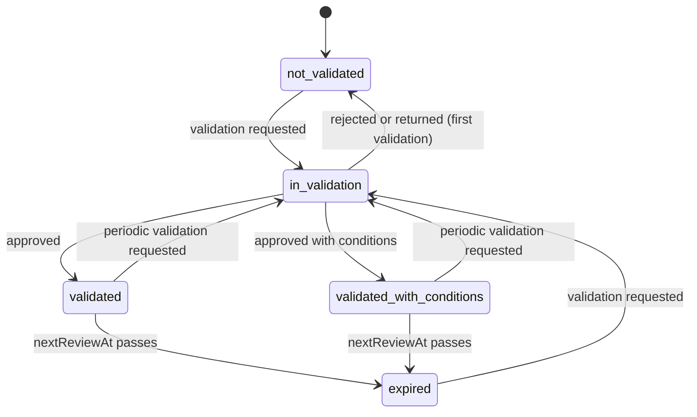

# 08 Model risk

Status: draft for review.

Builds on ADR-0001 to ADR-0009 in `../architecture/decisions/` (the phase-1 tier limits and the
`low`-tier deviation are in ADR-0004) and the requirements in `../background/problem-statement.md`.
Gate and evidence are defined in
`04-evals-and-release.md`; agents and workflows in `01-agent-builder.md`. The mock is the reference
for UI and API shape: `apps/console/src/lib/types/model-risk.ts`, `apps/console/src/lib/api/model-risk-contract.ts`,
`apps/console/src/lib/api/mock/model-risk/`, `apps/console/src/app/model-risk/**`, `apps/console/src/components/reviews/model-validation.tsx`.

## 1. Summary

Every agent and every workflow is an entry in a model inventory with an owner, a purpose, the data
and systems it touches, the model alias that serves it, a risk tier, a validation status and a next
review date. The tier drives the publish gate (`04` 5.5, 5.10.6). Model Risk, the second line,
validates entries through a review kind `model_validation` in the shared Reviews queue: only Model
Risk decides, nobody decides their own request, approval can attach conditions with owners and due
dates, and a tier change to or from `high` or `critical` takes effect only when Model Risk approves
it. Findings are tracked per entry. Monitoring v1 shows the eval pass rate per version and the
approver override rate over 30 days. Each entry's evidence is what the platform already produces:
agent eval results, the workflow suite run and the sealed evidence bundle per version. The platform
supplies the records a bank's model risk framework asks for; it does not decide whether an agent is a
"model" under the bank's policy or replace the validator's judgement.

## 2. Scope

| In | Phase |
|---|---|
| Inventory entry per agent and workflow, created on first read with `medium` tier and `not_validated` | 1 |
| Tier and tier reason; low and medium changes with a reason; changes to or from high or critical through a second-line review | 1 |
| Validation reviews (`initial`, `periodic`, `tier_change`) decided by Model Risk with conditions | 1 |
| Conditions: add, mark met or reopen with a reason, overdue computed | 1 |
| Next review dates, set per entry or in bulk; expired status | 1 |
| Evidence and monitoring v1 on the entry page | 1 |
| Inventory status shown on publish requests (`04` 5.10.6.5) | 1 |
| Findings: read in the console; raised and updated by Model Risk through the API | 1 (API), later (console) |
| Validation and inventory for the first workflow (lending servicing, `medium`) and its agents | 1, required before its production promote |
| Findings workflow (remediation evidence, closure approval), monitoring thresholds with alerts, drift and fairness metrics, decommissioning records, inventory export to the bank's model risk system | Later |

| Out | Spec |
|---|---|
| Gate steps, thresholds, evidence bundle contents | `04` |
| Effective tier computed from pinned actions (`01` 5.2) | `01` |
| Who is a member of Model Risk (role assignment) | `09` |

## 3. Traceability

| Problem statement item | How this spec serves it | Section |
|---|---|---|
| Reason 4: risk review is a demo | Validation decisions recorded against evidence the platform produced, not against a demo | 5.3, 5.6 |
| Decision 2: Model Risk accepts evidence on a version | Entry page links each version's sealed bundle and eval results; validation reviews carry them | 4.6, 5.6 |
| Component 3: Evals and testing, read by the gate | Tier from the inventory sets the gate and injection threshold | 5.2 |
| Governance: reviewer overrides feed the test set | Override rate per entry, 30 days | 5.5 |
| ADR-0004: `high` opens when the S8 group is named | The `model_validation` review kind is the S8 group's queue | 5.3 |
| ADR-0004: deviation at `low` reported to Model Risk | Override rate and advisory reasons visible per entry | 5.5 |

What the platform supplies toward supervisory expectations. The bank's Model Risk function decides
how its policy applies; this table only maps platform records to the expectation they support.

| Expectation | Source | Platform record |
|---|---|---|
| A model inventory with each model's purpose, use and restrictions | SR 11-7 (2011, superseded; see [Baker Tilly](https://www.bakertilly.com/insights/updated-interagency-guidance-on-model-risk-management)); OSFI E-23 requires a comprehensive inventory ([Blakes summary](https://www.blakes.com/insights/osfi-releases-final-guideline-e-23-for-model-risk-management-and-ai-use-by-frfis/)) | Inventory entry: purpose, owner, data, systems, knowledge bases, alias, conditions (4.1) |
| A risk rating per model that drives the intensity of controls | OSFI E-23 (inherent model risk rating per model) | Tier and tier reason; tier sets the gate (5.2) |
| Independent validation with effective challenge before use | SR 11-7; SR 26-2 keeps effective challenge by "objective, qualified reviewers" ([Abrigo summary](https://www.abrigo.com/blog/model-risk-management-what-sr-26-2-means-for-financial-institutions/)) | `model_validation` reviews decided only by Model Risk, never by the requester (5.3) |
| Ongoing monitoring and outcomes analysis | SR 11-7; E-23 adds drift monitoring for AI models | Pass rate per version, override rate (5.5); drift checks later (`04` 5.8.5) |
| Periodic review | SR 11-7 expected at least annual review; SR 26-2 lets frequency follow materiality | Next review date per entry: 6 months for `high` and `critical`, 12 months otherwise, editable (5.4) |
| Approval and documentation of use | E-23 lifecycle | Evidence bundle per version (`04` 4.6); audit of every inventory change (8.2) |

Two facts the bank should weigh. OSFI published final Guideline E-23 on 2025-09-11, effective
2027-05-01, and its model definition names AI and machine learning methods
([OSFI backgrounder](https://www.osfi-bsif.gc.ca/en/news/backgrounder-guideline-e-23-model-risk-management),
[Blakes](https://www.blakes.com/insights/osfi-releases-final-guideline-e-23-for-model-risk-management-and-ai-use-by-frfis/)).
In the United States, SR 26-2 (2026-04-17) superseded SR 11-7 and places generative and agentic AI
outside its scope ([Baker Tilly](https://www.bakertilly.com/insights/updated-interagency-guidance-on-model-risk-management),
[Abrigo](https://www.abrigo.com/blog/model-risk-management-what-sr-26-2-means-for-financial-institutions/)).
The mock's bank reports in CAD, so E-23 is the likely frame; the inventory is built so that either
reading works.

## 4. Domain model

### 4.1 Inventory entry

| Field | Notes |
|---|---|
| `id`, `type` (`agent`, `workflow`), `refId`, `name`, `href` | One entry per agent and per workflow |
| `owner`, `ownerTeam` | From the agent or workflow; team from `09` |
| `model`, `alias`, `provider` | Resolved from the AI gateway alias the agent pins; a workflow lists every alias its pinned agents use (the mock shows the first agent's) |
| `tier` (`low`, `medium`, `high`, `critical`), `tierReason` | Set by Model Risk or the owner (5.2) |
| `validationStatus` | `not_validated`, `in_validation`, `validated`, `validated_with_conditions`, `expired` (4.2) |
| `nextReviewAt` | `yyyy-mm-dd`; null when never validated |
| `purpose`, `dataTouched[]`, `systems[]`, `knowledgeBases[]` | `systems` from the modules the pinned tools belong to; knowledge bases from pinned agents |
| `openFindings`, `lastEvalPassRate` | Computed |
| `pendingReview?` | `{id, scope, toTier?}` of the open second-line review |

List views: `all`, `needs_validation` (not validated or in validation), `due_30d` (next review in the
next 30 days), `open_findings`, `expired`. Stats: total, high or critical, not validated, due in 30
days, open findings. Facets: type, tier, validation status, owner team, provider.

### 4.2 Validation status

`in_validation` and `expired` are derived, not stored: `in_validation` while an open review exists
whose scope is not `tier_change`; `expired` when the stored status is validated and `nextReviewAt`
is before today. A rejected periodic validation leaves the stored status unchanged and the record
shows the rejection (open question 5).

### 4.3 Second-line review (`model_validation`)

A review in the shared Reviews queue (`01` 4.6) with `kind: model_validation` and body:

| Field | Notes |
|---|---|
| `entryId`, `entryName`, `entryType`, `scope` (`initial`, `periodic`, `tier_change`) | `initial` when the entry has no validations, else `periodic` |
| `tier`, `fromTier?`, `toTier?` | Tier changes only for from and to |
| `requestedBy`, `note` | |
| `evidence[]` | Built at request time: each pinned agent's eval result and injection score, open findings and open conditions |
| `outcome?` (`approved`, `approved_with_conditions`, `rejected`), `conditions?[]` | Set on decision |

The review's policy: reviewers Model Risk, SLA 5 business days, on timeout it stays pending and the
owner is notified, no four-eyes. Its risk is `toTier` when that is `high` or `critical`, else the
entry's tier.

### 4.4 Validation record, condition, finding

| Entity | Fields |
|---|---|
| `ValidationRecord` | `id`, `validator`, `date`, `outcome`, `conditions[]` (text), `reason?`, `reviewId?` |
| `ModelCondition` | `id`, `text`, `owner`, `dueDate`, `status` (`open`, `met`, `overdue`), `createdBy`, `createdAt`. `overdue` is computed: open and past due |
| `ModelFinding` | `id`, `title`, `severity` (`low`, `medium`, `high`, `critical`), `status` (`open`, `remediating`, `closed`), `raisedBy`, `raisedAt`, `dueDate?` |

### 4.5 Monitoring v1

| Series | Definition |
|---|---|
| `passRateByVersion[{version, passRate}]` | Agents: the newest completed agent eval run per version (`04` 5.10.5). Workflows: the workflow suite run per version (`04` 4.3) |
| `overrideRate30d[{date, rate}]` | Per day, the share of reviewed actions where the approver changed or rejected what the workflow proposed (`01` 5.7 decisions) |

### 4.6 Evidence on the entry

| Item | Source |
|---|---|
| `evals[{name, version, summary}]` | Agent: its own latest eval. Workflow: the latest eval of each pinned agent (`04` 5.10.5) |
| `workflowSuite` | Workflow only: the latest suite run summary and its time (`04` 4.3) |
| `bundles[{version, bundleId, sealedAt}]` | Sealed evidence bundles of recent versions (`04` 4.6) |

## 5. Behaviour

### 5.1 Inventory

1. Every agent and workflow has an entry. An entry is created the first time the inventory is read
   after the record exists, with tier `medium`, tier reason "Not assessed yet; medium until Model Risk
   sets a tier.", and status `not_validated`.
2. Entries are scoped to the current team like every list (`09` 5.1). Model Risk works from the
   Platform scope, which sees every team.
3. Deleting or archiving an agent or workflow keeps its entry and history (later: a decommissioned
   status with date and reason).

### 5.2 Tiering and tier changes

1. The entry's tier is the workflow's tier for the gate: it sets the steps of `04` 5.5, the agent
   rules of `04` 5.10.6 and the injection threshold (95%, 98%, 100%, 100%).
2. A tier change needs a reason (400 without one) and must differ from the current tier (400).
3. Between `low` and `medium` the change applies at once and is audited with before, after and
   reason.
4. A change to or from `high` or `critical` opens a `tier_change` review and applies only when Model
   Risk approves; the audit shows the pending value. Only one tier change can wait at a time (409).
   The change-tier button is disabled while one waits.
5. The effective tier computed from pinned actions (`01` 5.2) is a floor: an inventory tier below it
   is refused at publish (issue 1 below).

### 5.3 Validation (second line)

1. Requesting validation opens one `model_validation` review per entry; entries with an open review
   are skipped with a reason (bulk request).
2. Only Model Risk decides. A decision by anyone else returns 403 naming the role. The requester
   cannot decide their own request (409, "Another Model Risk validator must decide it").
3. Reject and return need a reason (400). Approve may attach conditions; each needs text, an owner
   and a due date (400 otherwise). Tier changes take no conditions.
4. Approving a validation sets status `validated` (no conditions) or `validated_with_conditions`,
   sets `nextReviewAt` to 6 months for `high` and `critical`, 12 months otherwise, adds a validation
   record, and adds each condition to the entry.
5. Approving a tier change sets the tier and takes the request's note as the tier reason.
6. A decided review cannot be decided again (409). Bulk decide in the Reviews queue skips model
   validations with "Model validations need an individual decision".
7. Every decision is audited with its diff and reason (8.2).

### 5.4 Periodic review dates

1. Model Risk sets `nextReviewAt` per entry or in bulk; the date must be today or later (400), and
   an entry already on that date is skipped.
2. The `due_30d` view lists entries due in the next 30 days; `expired` lists entries past their date.
3. Later: the owner and Model Risk are notified 30 and 7 days before the date (`09` notifications).

### 5.5 Monitoring v1

1. The entry page shows pass rate per version and override rate per day for 30 days, both computed by
   the API (no client-side aggregation).
2. `lastEvalPassRate` in the list is the sum of passed over the sum of total across the entry's
   agents' latest eval summaries.
3. Later: thresholds per tier that raise a finding automatically, drift results (`04` 5.8.5), and
   the low-tier override alert of `04` 5.6 shown on the entry.

### 5.6 Conditions and findings

1. Anyone with the Model Risk role or the entry's owner can add a condition (text, owner, due date).
2. Marking a condition met or reopening it needs a reason; both are audited.
3. Findings in phase 1 are raised and updated by Model Risk through the API and shown read-only in the
   console. The publish request does not read findings in phase 1 (open question 4).

### 5.7 On publish requests

The publish request shows the workflow's entry (tier, validation status) and, at `medium` and above,
warns the approver when it is not validated (`04` 5.10.6.5). It does not block. The lending servicing
workflow is validated before its first production promote by the implementation plan rather than by the gate.

## 6. API

Conventions of `01` section 6. Paths follow the mock's `model-risk-http.ts` under `/v1`.

| # | Operation | Request | Response | Errors | Phase |
|---|---|---|---|---|---|
| R1 | `GET /v1/model-risk` | list params, `view`, filters `type`, `tier`, `validationStatus`, `ownerTeam`, `provider` | `ListResult<ModelEntry> & { viewCounts, stats }` with facets | | 1 |
| R2 | `GET /v1/model-risk/{id}` | | `ModelEntryDetail` (4.1–4.6, validations, conditions, findings, monitoring, pending review) | 404 | 1 |
| R3 | `POST /v1/model-risk/request-validation` | `ids[]`, `note?` | `BulkResult` | | 1 |
| R4 | `POST /v1/model-risk/next-review` | `ids[]`, `date` | `BulkResult` | 400 bad or past date | 1 |
| R5 | `POST /v1/model-risk/{id}/tier` | `tier`, `reason` | `ModelEntryDetail` | 400 no reason, same tier; 409 tier change pending | 1 |
| R6 | `POST /v1/model-risk/{id}/conditions` | `text`, `owner`, `dueDate` | `ModelEntryDetail` | 400 | 1 |
| R7 | `PATCH /v1/model-risk/{id}/conditions/{conditionId}` | `status` (`met`, `open`), `reason` | `ModelEntryDetail` | 400 no reason; 404 | 1 |
| R8 | `GET /v1/model-risk/options` | | `{owners[], validators[]}` | | 1 |
| R9 | `POST /v1/reviews/{id}/decision` for `kind: model_validation` | `decision` (`approved`, `rejected`, `returned`), `reason`, `conditions[]`, `actingAsId?` | `Review` with `modelValidation.outcome` | 403 not Model Risk; 409 own request or already decided; 400 reason or condition fields | 1 (`01` operation 35, extended) |
| R10 | `POST /v1/model-risk/{id}/findings`, `PATCH .../findings/{findingId}` | `title`, `severity`, `dueDate?`; `status` | `ModelEntryDetail` | 403 not Model Risk | 1 (API only) |
| R11 | `GET /v1/model-risk/export` | `format` (`csv`, `json`) | inventory with validations, conditions, findings | | Later |

**Phase-1 count: 10 operations** (R1–R10).

## 7. UI mapping

| Route or dialog | API | Gaps between mock and spec |
|---|---|---|
| `/model-risk` list (`apps/console/src/app/model-risk/page.tsx`) with views, facets, stats; bulk Request validation and Set next review | R1, R3, R4, R8 | None |
| `/model-risk/[id]` entry page: attributes, tier, what it touches, evidence, monitoring, conditions, validation history, findings | R2 | Findings have no create or edit action (R10 is API only in phase 1) |
| Change tier dialog | R5 | None |
| Add condition, condition status dialogs | R6, R7 | None |
| Request validation, next review dialogs | R3, R4 | None |
| `/reviews` model validation body and decision form (`ModelValidationBody`, `ModelValidationDecisionForm`) | R9 | "Deciding as" uses the run-as principals to show who may not decide; the backend decides from the session's role, and `actingAsId` is only a preview |
| Publish request "Model risk" section (`PublishEvalSection`) | `04` operation 19 | None |

## 8. Security, audit and evidence

### 8.1 Who may do what

| Action | Role |
|---|---|
| Read the inventory | Every member, scoped to their team; Model Risk, Audit and Platform see all |
| Request validation | Entry owner, Model Risk |
| Decide a validation or tier change | Model Risk only, never the requester |
| Change tier between `low` and `medium` | Entry owner or Model Risk (open question 1) |
| Set next review dates; raise and update findings | Model Risk |
| Add a condition; mark it met or open | Model Risk or the entry owner, with a reason for status changes |

### 8.2 Audit

Target type `model` in the audit log (`09` 4.3): tier changed or requested, validation requested,
approved, rejected or returned (with reason), condition added (with owner and due date), condition
status changed (with reason), next review set, finding raised or updated.

### 8.3 Evidence

The validation record references the review id; the review's evidence list is frozen at request
time. The workflow's sealed evidence bundle records the inventory entry at decision (`04` 8.3).

## 9. Non-functional

| Concern | Target (phase 1 assumption) |
|---|---|
| Inventory size | Up to 500 entries |
| List and entry latency | p95 under 500 ms, monitoring series computed server-side |
| Retention | Entries, validations, conditions and findings kept for the life of the record plus the retention owner's period (architecture overview open question 4) |
| Availability | Inventory outage blocks validation decisions and tier changes; it never blocks production runs |

## 10. Acceptance tests (phase 1)

| # | Test | Fails if |
|---|---|---|
| MR1 | Create a workflow and open the inventory | No entry, or it is not `medium` and `not_validated` |
| MR2 | Request validation, then decide it as the requester | The decision succeeds |
| MR3 | Decide a validation as a principal without the Model Risk role | Anything other than 403 |
| MR4 | Approve with a condition missing its owner | The approval succeeds |
| MR5 | Approve a `high` entry's validation | `nextReviewAt` is not 6 months out, or no validation record and audit entry exist |
| MR6 | Change a `medium` entry to `high` | The tier changes before Model Risk approves, or no `tier_change` review opens |
| MR7 | Change `low` to `medium` without a reason | The change succeeds |
| MR8 | Set `nextReviewAt` of a validated entry to yesterday through the store | The entry is not `expired` in the list and the `expired` view |
| MR9 | Bulk decide a model validation with other reviews | The validation is decided |
| MR10 | Lower a workflow's tier to `low` and request publish | The gate reads any tier but `low`, or the injection threshold is not 95% |
| MR11 | Save an agent so its eval pass rate drops | The entry's pass-rate series does not show the new version |
| MR12 | Mark a condition met with no reason | The change succeeds |

## 11. Decisions and open questions

### How the inventory tier relates to the gate

| Topic | Decision |
|---|---|
| Two tiers | `01` 5.2 computes an effective tier from pinned actions; this spec stores a tier Model Risk sets. The gate uses the higher of the two, and a publish is refused while the inventory tier is lower than the effective tier, until Model Risk raises it. The mock reads the inventory tier only |
| S8 and validation | `04` S8 requires second-line approval of each `high` and `critical` publish. Inventory validation is per entry and periodic. They are separate controls, decided by the same Model Risk group (the "S8 group" in ADR-0004) |

### Open questions for the bank's Model Risk function

| # | Question | Blocks |
|---|---|---|
| Q1 | Who may change a tier between `low` and `medium`: the owner, Model Risk, or both? | Tier changes |
| Q2 | Must a `medium` entry be validated before its workflow can publish, rather than the approver being warned? | First `medium` production publish |
| Q3 | Does the bank classify agents and workflows as models under its policy (E-23's AI-inclusive definition), or as AI systems under a separate standard? The inventory works either way | Inventory scope |
| Q4 | Should open `high` or `critical` findings block publishing? | Gate data |
| Q5 | After a rejected periodic validation, should the entry become `not_validated` (blocking at `high`) or keep its status with the rejection recorded? | Status rules |
| Q6 | Review frequency: 6 and 12 months by tier, or a materiality-based schedule as SR 26-2 allows? | Next review defaults |
| Q7 | Which monitoring metrics and thresholds should raise findings automatically? | Monitoring v2 |
| Q8 | Must the inventory feed the bank's existing model risk system, and in what format? | R11 |
