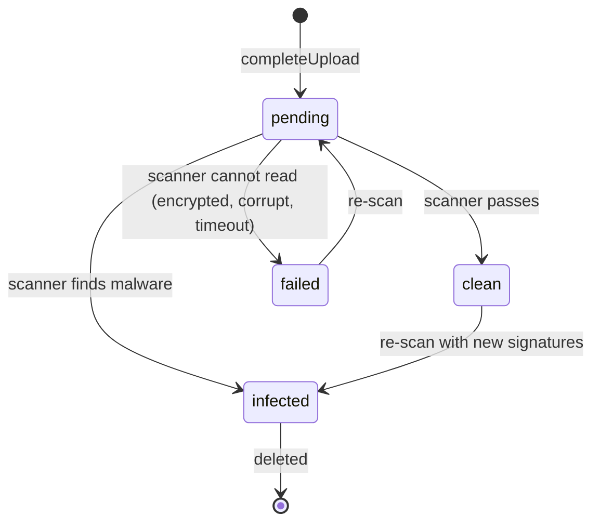

# 10 Files

Status: draft for review.

Builds on ADR-0006 (WORM object storage for evidence, mail and payloads) and ADR-0010 (storage adapter
over Amazon S3 and Azure Blob Storage) in `../architecture/decisions/`, and the requirements in
`../background/problem-statement.md`. The mock is the reference for UI and API shape:
`apps/console/src/lib/types/files.ts`, `apps/console/src/lib/api/files-contract.ts`,
`apps/console/src/lib/api/files-http.ts`, `apps/console/src/lib/api/mock/files/`,
`apps/console/src/hooks/file-queries.ts`, `apps/console/src/components/shared/file-upload.tsx`,
`apps/console/src/app/files/page.tsx`, `apps/console/src/app/settings/storage/page.tsx`. The service
library is `services/files/`.

## 1. Summary

Every file byte the platform stores goes through one Files API. Other APIs never accept or return raw
bytes: they take and return a `fileId`. A browser upload is three calls: `createUpload` returns a
presigned URL for one object key, the browser PUTs the bytes straight to object storage, and
`completeUpload` checks size and digest and starts the malware scan. Nobody, person or agent, can read a
file until the scan passes; an infected file is quarantined and every record that uses it shows it as
blocked. Identical content within a team is stored once and lists every record that uses it. Each file
has a purpose, an owning team, a sensitivity classification, a retention class with a delete-after
date, an optional legal hold, and its versions. Evidence bundles are written immutable (WORM). Storage
is Amazon S3 (or an S3-compatible store with Object Lock) or Azure Blob Storage behind one adapter,
chosen per environment. The console's Data Hub → Files page lists every file; Settings → Storage
configures backends, limits, scanning, retention and link lifetime.

## 2. Scope

| In | Phase |
|---|---|
| Presigned direct-to-storage upload (S3 PUT, Azure SAS), completion with size and sha256 checks | 1 |
| Malware scan before any read; quarantine; blocked references | 1 |
| Dedupe by digest within a team | 1 |
| References: sources, cases, chats, eval and test sets, evidence, exports, tool modules | 1 |
| Short-lived signed download links, each audited | 1 |
| Retention classes, delete-after dates, keep-until-end (minimum) classes, scheduled deletion | 1 |
| Legal hold, place and release with a reason | 1 |
| WORM storage for evidence bundles (S3 Object Lock compliance mode or a locked Azure immutability policy) | 1 |
| Sensitivity classification suggested from purpose, confirmed by a person | 1 (suggestion from purpose), later (content classifier) |
| Previews: first page of PDF text, first CSV rows, text, image metadata | 1 |
| Files page with views, facets, bulk retention, hold and delete; Storage settings page | 1 |
| Every upload point in the console routed through the shared upload component | 1 |
| One backend: the bank's cloud of choice (ADR-0010) | 1 |
| Second backend in production, cross-backend migration | Later |
| Versioned upload of a new file version from the console | Later (versions are created by sources and re-uploads through the API) |
| Content-based sensitivity classifier, DLP integration | Later |
| Resumable multipart uploads above 100 MB | Later |

| Out | Spec |
|---|---|
| What a knowledge source does with its files (parsing, chunking, citations) | `02` |
| What a chat does with an attachment | `07` |
| Mail intake and archive of the original message | `03` 4.6 |
| Evidence bundle manifest | `04` 8.3 |
| Audit log retention and export to SIEM | `09`, ADR-0006 |

## 3. Traceability

| Problem statement item | How this spec serves it | Section |
|---|---|---|
| Reason 6: each agent gets its own servers, secrets and logging | One file store, one scanner and one audit trail for every workflow; no workflow keeps its own bucket | 1, 5.1 |
| Decision 2: test evidence attached to a version is acceptable to model risk | Evidence bundles are files sealed under WORM; the export a reviewer downloads is the sealed object | 5.7 |
| Component 3: evals and testing, results become evidence | Imported test sets and sealed bundles are file records with references to the version | 5.3, 5.7 |
| Knowledge requirement 7: sensitivity is a property of the source | Every file has a classification; a knowledge source inherits it from its files | 4.1, 5.5 |
| Flow step 1: every attachment is read, with a security scan and archive | Mail attachments are stored once, scanned before the agent reads them, and kept under the case retention class | 5.2, 5.3 |
| Governance 6: log retention and legal hold have a named owner | Retention classes and legal hold are first-class, owned by Platform admins acting for Legal and Records | 5.6 |
| Operations 1: gateways at least as available as the workflows | Downloads and uploads go straight to storage, so the control plane is not in the byte path | 5.1, 9 |

## 4. Domain model

### 4.1 File

| Field | Type | Rules |
|---|---|---|
| `id` | string | Assigned at `createUpload`; stable for the life of the file |
| `name` | string | Display only. Never part of the storage key |
| `mime`, `size` | string, bytes | Declared at `createUpload`; checked against the stored object at completion |
| `digest` | sha256 hex | Computed by the service from the stored bytes; a declared digest that differs fails completion |
| `purpose` | `knowledge_source`, `chat_attachment`, `case_attachment`, `test_import`, `evidence_bundle`, `export`, `tool_spec`, `avatar` | Sets the limits and the default retention class |
| `team` | owner group | From the caller's context, never from the request body when the caller is not a Platform admin |
| `uploadedBy`, `uploadedAt` | person or service identity, timestamp | Mailbox intake and the eval runner upload as service identities |
| `scan` | `{status, engine, at, detail}` | 4.2 |
| `sensitivity` | `public`, `internal`, `confidential`, `restricted` | Suggested from purpose; `sensitivitySuggested` stays true until a person confirms |
| `retention` | `{classId, className, deleteAfter}` | `deleteAfter` = `uploadedAt` + class days; null when the class keeps files until deleted |
| `legalHold` | `{by, at, reason}` or null | 5.6 |
| `immutable` | boolean | True for every file in a WORM class; storage enforces it |
| `references` | `FileReference[]` | 4.3 |
| `versions` | `FileVersion[]` | Each version is its own object and digest; the newest is current |
| `storage` | `{backend, environment, container, key, region, encryption, locked}` | Returned to Platform admins only |

### 4.2 Scan states

| State | Readable | Downloadable | References |
|---|---|---|---|
| `pending` | No | No (423) | May not be added |
| `clean` | Yes | Yes | Normal |
| `infected` | No | No (423) | Shown blocked with the signature name |
| `failed` | No | No (423) | Shown blocked; the uploader is asked for a readable copy |

### 4.3 Reference

| Field | Rules |
|---|---|
| `type` | `source`, `case`, `chat`, `eval_set`, `test_set`, `evidence`, `export`, `tool_module` |
| `id`, `name`, `href` | The using record; `href` opens it in the console |
| `addedAt` | When the record started using the file |
| `blocked` | Set while the file is quarantined, with the reason the using record shows |

A reference is added by the service that owns the using record, at the moment that record accepts the
`fileId` (a source is created, a chat message is sent, a case receives mail, an import runs). It is
removed when that record stops using the file.

### 4.4 Retention class

| Field | Rules |
|---|---|
| `name` | Unique |
| `days` | 1 to 36,500, or null (kept until deleted by a person) |
| `purposes` | Which purposes it may apply to |
| `keepUntilEnd` | A minimum: deleting before the period ends is refused |
| `worm` | Storage-enforced: Object Lock compliance mode or a locked immutability policy. Implies `keepUntilEnd` |

Seeded classes in the mock: Knowledge content (until deleted), Case records 7 years (minimum), Chat
attachments 1 year, Test imports 2 years, Model evidence 10 years (WORM), Exports 30 days.

## 5. Behaviour

### 5.1 Upload

| # | Rule |
|---|---|
| 5.1.1 | A browser never sends file bytes to the control plane or to any service's API. Bytes go to object storage on a presigned URL returned by `createUpload`. |
| 5.1.2 | A presigned URL is valid for one object key, one method (PUT), at most 15 minutes, and the headers it was signed with (content type, `x-amz-checksum-sha256` or the Azure blob type, server-side encryption). A PUT with another key, method or checksum is refused by storage. |
| 5.1.3 | `createUpload` refuses a type not in the purpose's allowed list (415), a size above the purpose's limit (413) and an empty file (400). The upload component checks the same limits first, so the user sees the reason before any request. |
| 5.1.4 | The storage key is `{team}/{purpose}/{yyyy}/{mm}/{fileId}`, or `evidence/...` for WORM classes. The display name never reaches the key. |
| 5.1.5 | `completeUpload` reads the stored object's size and computes its sha256. If either differs from the declaration, the object is deleted and completion returns 409. |
| 5.1.6 | A completed upload is `pending` until the scanner reports. No reference can be added to a `pending` file. |
| 5.1.7 | If an upload is not completed within 24 hours, the object is deleted by a storage lifecycle rule on the `uploads/` staging state and the ticket expires. |
| 5.1.8 | Only `components/shared/file-upload.tsx` and the files layer (`lib/api/files-*.ts`, `lib/api/mock/files/`, `hooks/file-queries.ts`) send file bytes; `apps/console/scripts/check-standards.mjs` rule 13 fails the build when any other file uses `FormData`, `XMLHttpRequest` or a `fetch` PUT/POST with a `File` or `Blob` body. |

### 5.2 Dedupe

| # | Rule |
|---|---|
| 5.2.1 | When a completed upload's digest matches a non-quarantined file in the same team, the new object is deleted and `completeUpload` returns the existing file with `deduplicated: true`. The caller passes on the existing `fileId`, and its record becomes one more reference. |
| 5.2.2 | Dedupe never crosses teams. Two teams uploading the same bytes get two files, so one team's retention, hold or delete never touches the other's. |
| 5.2.3 | Mail attachments dedupe the same way within the owning team of the mailbox's workflow. |

### 5.3 Scanning and quarantine

| # | Rule |
|---|---|
| 5.3.1 | Scanning runs on every completed upload when scanning is on. With scanning off (development only), files are `clean` at completion and the Storage page says so. |
| 5.3.2 | An infected file is not readable by any person, agent, knowledge ingestion or download link. `downloadUrl` returns 423 with the signature name. |
| 5.3.3 | Records that reference a quarantined file show it as blocked: a case shows the attachment with the reason instead of its summary, a source marks the item failed, and a chat message shows the attachment as blocked. |
| 5.3.4 | A source, chat or import that receives the `fileId` of a `pending`, `infected` or `failed` file is refused with 409; nothing is created. |
| 5.3.5 | Files are re-scanned when signatures update; a file that turns infected moves to quarantine and its references to blocked. |

### 5.4 Download

| # | Rule |
|---|---|
| 5.4.1 | `downloadUrl` returns a signed GET for one object, valid for the Storage setting `signedUrlMinutes` (default 5, at most 60). The console shows how long the link lasts. |
| 5.4.2 | Every link issued writes an audit entry with the file, the person and the team. Links are never stored or reused; each download asks for a new one. |
| 5.4.3 | A person may download a file only when their team owns it or owns a record that references it. |

### 5.5 Classification

| # | Rule |
|---|---|
| 5.5.1 | Sensitivity is suggested from purpose (evidence and exports `restricted`, case and chat attachments `confidential`, knowledge `internal`, logos `public`) and marked suggested until a person confirms or changes it. |
| 5.5.2 | A knowledge item's sensitivity is at least the sensitivity of its file (`02` knowledge requirement 7). |

### 5.6 Retention and legal hold

| # | Rule |
|---|---|
| 5.6.1 | Each file gets the retention class configured for its purpose unless the upload names another class that applies to that purpose. |
| 5.6.2 | A retention change may only make retention longer or stricter. A shorter class, or one that drops `keepUntilEnd` or `worm`, is skipped with "Retention can only be made longer or stricter". |
| 5.6.3 | A file past `deleteAfter`, with no references and no hold, is deleted by the nightly retention run, with an audit entry per file. |
| 5.6.4 | A legal hold stops every delete and retention change on the file, whatever its class says, until released. Placing and releasing a hold both need a reason. |
| 5.6.5 | Only Platform admins acting for Legal place or release holds (403 otherwise). Storage-level legal hold (S3 Object Lock legal hold, Azure legal hold tag) is set as well, so a hold holds even against a storage administrator. |
| 5.6.6 | `remove` refuses, with 409 naming the reason, a file that is referenced, held, or inside a `keepUntilEnd` period. Bulk delete skips such files and names each with its reason. |

### 5.7 Evidence bundles (WORM)

| # | Rule |
|---|---|
| 5.7.1 | An evidence bundle (`04` 4.6) is written as a file with purpose `evidence_bundle` in a WORM class. Storage enforces compliance-mode retention: no user, including the root or storage account owner, can change or delete it before the period ends. |
| 5.7.2 | `exportEvidence` for a model entry version or a publish request returns the sealed file. Exporting again returns the same file; it never seals a second copy. |
| 5.7.3 | Production cannot be saved with Object Lock (S3) or the immutability policy (Azure) off for evidence (400). |

### 5.8 Data residency

| # | Rule |
|---|---|
| 5.8.1 | Each environment's storage target names its region; buckets and containers are created in that region only, and replication, if configured, stays in the same jurisdiction. |
| 5.8.2 | Presigned URLs use the regional endpoint, so bytes never transit another region. |

## 6. API

Conventions of `01` section 6. Paths follow `files-http.ts` under `/v1`. Every list is server-paged with
facets.

| # | Operation | Request | Response | Errors | Phase |
|---|---|---|---|---|---|
| F1 | `POST /v1/files/uploads` (`createUpload`) | `{name, size, mime, purpose, team?, retentionClass?, digest?}`; `Idempotency-Key` | `UploadTicket {fileId, uploadUrl, method, headers, expiresAt}` | 400, 413, 415, 403 team | 1 |
| F2 | `PUT {uploadUrl}` (storage, not the API) | bytes with `headers` | storage response | 403 expired or mismatched signature | 1 |
| F3 | `POST /v1/files/uploads/{fileId}/complete` | `{digest}` | `CompletedUpload {file, deduplicated}` | 404, 409 size or digest mismatch | 1 |
| F4 | `GET /v1/files` | list params, `view` (`all`, `quarantined`, `legal_hold`, `unreferenced`, `expiring`), filters `purpose`, `team`, `sensitivity`, `scan`, `retention` | `ListResult<FileRecord> & {viewCounts}` | | 1 |
| F5 | `GET /v1/files/{id}` | | `FileDetail` (preview, versions, references, audit, `deleteBlockedBy`) | 403, 404 | 1 |
| F6 | `POST /v1/files/{id}/download-url` | | `DownloadLink {url, expiresAt, ttlSeconds}` | 423 pending or quarantined | 1 |
| F7 | `GET /v1/files/{id}/versions` | | `FileVersion[]` | 404 | 1 |
| F8 | `GET /v1/files/{id}/references` | | `FileReference[]` | 404 | 1 |
| F9 | `POST /v1/files/retention` | `{ids[], classId}` | `BulkResult` with skip reasons | 404 class | 1 |
| F10 | `POST /v1/files/legal-hold` | `{ids[], hold, reason}` | `BulkResult` | 400 no reason, 403 | 1 |
| F11 | `DELETE /v1/files/{id}` | | 204 | 409 referenced, held or retained | 1 |
| F12 | `POST /v1/files/bulk-delete` | `{ids[]}` | `BulkResult` | | 1 |
| F13 | `POST /v1/files/evidence-exports` | `{kind: 'model', entryId, version?}` or `{kind: 'publish_request', reviewId}` | `FileRecord` | 404, 403 | 1 |
| F14 | `POST /v1/audit/exports` | audit list params | `FileRecord` (purpose `export`) | 400 empty | 1 |
| F15 | `GET /v1/files/limits` | | `UploadLimits` | | 1 |
| F16 | `GET`, `PUT /v1/settings/storage` | `StorageSettingsInput` with `version` | `StorageSettings` | 403, 409 version, 400 | 1 |
| F17 | `POST /v1/settings/storage/{environment}/test` | | `ConnectionTest {ok, steps[]}` | 404 | 1 |
| F18 | Internal `POST /internal/files/{id}/references`, `DELETE .../references/{type}/{id}` | service identity | `FileRecord` | 409 pending or quarantined | 1 |
| F19 | Internal server-side write for service-produced files (evidence, exports, mail attachments) | service identity, bytes from inside the platform network | `FileRecord` | | 1 |
| F20 | Upload a new version, multipart upload above 100 MB, content classifier | | | | Later |

APIs that use files change from bytes to ids: sources take `fileIds[]` (`02` S14), chat messages take
`attachments[{fileId}]` (`07`), eval and test imports take `fileId`, tool modules take a spec `fileId`.

**Phase-1 count: 19 operations** (F1, F3 to F19; F2 is a storage call).

## 7. UI mapping

| Route or dialog | API | Gaps between mock and spec |
|---|---|---|
| Data Hub → `/files`: table, views All, Quarantined, Under legal hold, Unreferenced (older than 30 days), Expiring; facets; bulk Set retention, Place or Release legal hold, Delete | F4, F9, F10, F12 | Sensitivity cannot be confirmed or changed from the console yet |
| File `DetailSheet` (`?file=`): preview, details, used by, versions, audit, storage (admins), Download, Legal hold, Delete | F5, F6, F10, F11 | The mock's download is a local object URL of the preview text |
| `LegalHoldDialog` | F10 | None |
| Settings → `/settings/storage`: backend per environment with the Integrations connection, upload limits, scanning, retention classes, signed link lifetime, Test connection | F16, F17 | Adding an environment is not offered; environments are fixed at dev, test and prod |
| `FileUpload` (`components/shared/file-upload.tsx`) in Add source, chat composer, eval import, workflow test import, tool module spec | F15, F1, F2, F3, F5 (scan poll) | No resumable upload |
| Case conversation attachments (`case-thread.tsx`) | `GET /cases/{id}` carries `fileId`, scan state and `blocked`; F6 | None |
| Knowledge document sheet, Download original | F6 | None |
| Model risk evidence table, Export; review sheet, Export evidence bundle | F13, F6 | None |
| Audit log Export | F14, F6 | None |

## 8. Security, audit and evidence

### 8.1 Who may do what

| Action | Who |
|---|---|
| Upload | Any member, into their own team |
| Download, view | Members of the owning team or of a team that owns a referencing record |
| Delete, set retention | Members of the owning team, within the rules of 5.6 |
| Place or release legal hold | Platform admins acting for Legal |
| Storage settings, Test connection | Platform admins |
| See storage location | Platform admins |

### 8.2 Controls

| Control | Rule |
|---|---|
| Presigned URLs | One object key, one method, at most 15 minutes for uploads and `signedUrlMinutes` for downloads, signed headers including the checksum |
| Encryption | Server-side with the bank's key: SSE-KMS with the configured alias on S3, an encryption scope backed by Key Vault on Azure. A PUT without the encryption header is refused by bucket policy |
| Scanning | Before any reader, person or agent, can access the bytes (5.3) |
| Bytes through the control plane | None. Every browser upload, including small files, goes straight to storage. Service-produced files are written by the files service inside the platform network (F19). A size-gated exception would be a second upload path to secure, scan and test, and the presigned path already works for one-byte files |
| Storage credentials | Held only by the files service, through the Integrations connection named in Settings → Storage; no other service can sign URLs |
| Network | Buckets and containers deny public access; the bank's private endpoint or VPC endpoint policy limits who can reach them |

### 8.3 Audit

Every upload, download link issued, delete, retention change, legal hold placed or released, quarantine
and storage settings save writes an audit entry (`09`) with the file name, the person or service, the
team, and the before and after values. Audit actions added: `uploaded`, `downloaded`, `legal_hold`;
target types `file` and `storage`.

## 9. Non-functional

| Item | Target |
|---|---|
| Upload size | Purpose limits up to 500 MB; single PUT up to 5 GB on S3 and Azure; multipart later |
| `createUpload` and `completeUpload` latency | p95 under 300 ms, excluding scan |
| Scan latency | p95 under 30 s for files up to 50 MB |
| Download link issue | p95 under 150 ms |
| Availability | Uploads and downloads depend on the files service only for signing; bytes do not pass through it |
| Retention run | Nightly; a missed run is caught up on the next |
| Scale assumption | 50,000 files a day across teams in phase 1, mostly mail attachments |

## 10. Acceptance tests (phase 1)

| # | Test | Passes when | Fails when |
|---|---|---|---|
| A1 | Upload a PDF to a file source in the console | The request log shows the PUT to the storage host and no request carrying the bytes to any `/v1` path; the source is created with the `fileId` | Any `/v1` request carries a multipart or binary body |
| A2 | `pnpm verify` with a probe component that PUTs a `File` with `fetch` | Rule 13 fails naming the probe | The check passes |
| A3 | Complete an upload with a declared digest that differs from the bytes | 409, object deleted, no file record | A file record exists |
| A4 | Upload the EICAR test file as a chat attachment | The chip shows quarantined, Send is blocked, F6 returns 423, the file is in the Quarantined view | The message sends or a link is issued |
| A5 | Upload the same PDF twice in one team | The second completion returns `deduplicated: true` with the first `fileId`; the file lists both references | Two files exist |
| A6 | Upload the same PDF in two teams | Two files, each team sees only its own | One file is shared |
| A7 | Request a download link and wait past `signedUrlMinutes` | The link works before and is refused by storage after | It works after expiry |
| A8 | Delete a file referenced by a case | 409 naming the case; bulk delete names it as skipped | The file is deleted |
| A9 | Place a legal hold and try to delete through the API and directly in storage with an admin credential | Both refused | Either deletes |
| A10 | Export an evidence bundle and try to overwrite or delete the object with the storage account owner's credential | Refused by Object Lock or the immutability policy | Changed or deleted |
| A11 | Save production storage with Object Lock off | 400 | Saved |
| A12 | Shorten a file's retention class | Skipped with "Retention can only be made longer or stricter" | Applied |
| A13 | Every audited action in 8.3 | One entry each in the audit log with file, actor, team | Missing entry |

## 11. Decisions and open questions

### Decisions this spec makes

| Decision | Choice | Why |
|---|---|---|
| Where bytes travel | Browser to storage on presigned URLs, never through any API | The control plane stays out of the byte path (availability, cost, attack surface), and one path is one set of controls |
| Dedupe scope | Within a team | Retention, holds and deletes stay team decisions |
| Retention changes | Only longer or stricter | A shorter class would undo what an earlier owner promised Records and Legal |
| Small files | No exception through the control plane | See 8.2 |

### Open questions

| # | Question |
|---|---|
| Q1 | Whether the bank's network allows browsers to reach the storage endpoint (private endpoint, proxy). If not, the files service fronts storage with a streaming proxy that keeps the same tickets and checks |
| Q2 | Which scanner the bank already runs (Defender for Storage, an ICAP gateway, ClamAV) and its throughput |
| Q3 | Who in Records owns the retention class catalogue, and whether case records must follow the bank's existing schedule per product |
| Q4 | Whether evidence retention is 7 or 10 years under the bank's model risk policy (`08`) |

## Marginal effort for workflow N

A new workflow that takes files adds nothing to the files layer: it uses the shared upload component
with an existing purpose, or adds a purpose with its limits and retention class in Settings → Storage.
